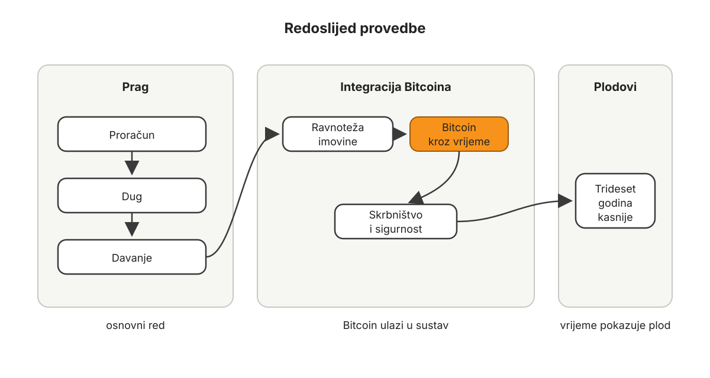

# Zašto Bitcoin kao novac

Postoje trenuci u povijesti kada se pojavi nova tehnologija i isprva izgleda kao alat za usku skupinu ljudi. Zatim se s vremenom pokaže da nije riječ samo o alatu, nego o novom sloju civilizacije.

Pismo je u početku moglo izgledati kao način bilježenja robe, dugova i dogovora. Kasnije je postalo način prenošenja znanja kroz stoljeća. Tiskarski stroj je mogao izgledati kao učinkovitija metoda umnažanja knjiga. Kasnije je promijenio obrazovanje, znanost, vjeru, politiku i odnos običnog čovjeka prema znanju. Električna energija je mogla izgledati kao način da se noću upali svjetlo. Kasnije je preoblikovala industriju, gradove, domove, medicinu i komunikaciju. Internet je mogao izgledati kao mreža za akademike, programere i čudake. Kasnije je postao globalna infrastruktura za komunikaciju, trgovinu, učenje, rad i koordinaciju.

Bitcoin na početku izgleda kao cijena na ekranu.

Netko ga prvi put vidi kao graf. Netko kao špekulaciju. Netko kao digitalnu imovinu. Netko kao “nešto što je nekad bilo jeftino, a sada je skupo”. Netko kao opasnost. Netko kao priliku. Netko kao još jednu internetsku modu.

Ali takav pogled promašuje najvažnije pitanje.

Najvažnije pitanje nije: “Koliko Bitcoin danas vrijedi u eurima ili dolarima?”

Najvažnije pitanje je: što se događa kada čovječanstvo prvi put dobije novac koji nije ničiji dug, nije pod ničijim dekretom, nema središnjeg izdavatelja, ne može se proizvoljno umnožiti i može se prenositi preko svijeta bez dopuštenja?

To pitanje nije samo investicijsko. Nije samo tehničko. Nije samo političko. To je civilizacijsko pitanje.

Jer novac nije sporedna stvar.

Novac je jedan od glavnih načina na koji ljudi međusobno surađuju kroz vrijeme. On povezuje radnika s kupcem, štedišu s budućom potrošnjom, roditelja s djecom, poduzetnika s projektom, proizvođača s tržištem, sadašnjost s budućnošću. Novac je jezik kojim društvo svakoga dana govori što je vrijedno, što je rijetko, što se traži, što se nudi, što treba čuvati, što treba proizvesti i što treba prestati raditi.

Kada je novac loš, cijeli taj jezik postaje mutniji.

Kada se novac stalno stvara kroz dug, ljudi sve teže razlikuju stvarno bogatstvo od kreditne ekspanzije. Kada novac gubi kupovnu moć, štednja postaje kazna, a zaduživanje se počinje činiti razumnim. Kada cijene više ne nose jasne informacije, ljudi se sve teže orijentiraju. Kada se budućnost stalno diskontira, kratkoročne odluke postaju normalne. Kada ljudi osjećaju da novac “mora raditi” samo zato da ne bi nestajao, počinju kupovati stvari koje ne razumiju, ulaziti u rizike koje ne bi inače preuzeli i pretvarati život u stalnu obranu od propadanja kupovne moći.

Bitcoin nije rješenje za svaku ljudsku slabost. Ne čini čovjeka automatski mudrim, discipliniranim, poštenim, velikodušnim ili strpljivim.

Ali Bitcoin mijenja nešto temeljno: vraća mogućnost novca koji ne ovisi o obećanju izdavatelja.

## Za koga je ova knjiga?

Ova knjiga je za dvije vrste čitatelja.

Prvi je čitatelj koji još nema Bitcoin ili ga ima vrlo malo, ali naslućuje da se tu događa nešto važno. Možda ga je strah. Možda misli da je Bitcoin isto što i ostatak “kripto” tržišta. Možda ne zna odakle početi.

Drugi je čitatelj koji Bitcoin već ima, ali oko njega nema red. Možda ga drži kao štednju, ali i dalje živi u dugu. Možda vjeruje u Bitcoin, ali nema proračun. Možda zna čuvati ključ, ali ne zna objasniti obitelji što učiniti ako ga sutra nema. Možda ima snažno uvjerenje, ali nema sustav.

Obje vrste čitatelja trebaju isto početno pitanje: ne samo kako doći do Bitcoina, nego kako urediti život tako da Bitcoin u njemu može postati dobar novac.

Bitcoin je snažan novac. Kao i svaka snažna stvar, ne postaje dobar ili loš samo po sebi, nego prema sustavu u koji ulazi. Električna energija može osvijetliti kuću ili ozlijediti čovjeka. Problem nije u snazi, nego u načinu uporabe. Tako i Bitcoin može biti izvor mira ili pojačivač nereda.

## Kako čitati ovu knjigu

Ova knjiga nije napisana samo da se pročita. Napisana je da se provede.

Najbolje ju je prvo pročitati cijelu, od početka do kraja. Prvo čitanje daje mapu. Pokazuje zašto proračun dolazi prije duga, zašto dug dolazi prije davanja, zašto davanje dolazi prije ravnoteže imovine i zašto se Bitcoin kao primarni novac ne uvodi u život koji još nema osnovni red.

*Redoslijed knjige nije dekoracija. Prvi dio postavlja prag, drugi dio integrira Bitcoin, a zaključak pokazuje plodove ponovljenih odluka.*

Nakon prvog čitanja vratite se na prvo mjesto gdje vaš život još nije usklađen s redoslijedom. Ako ne vodite proračun, ne počinjete od skrbništva. Ako još živite u dugu kao normalnom stanju, ne počinjete od punog Bitcoin standarda. Ako davanje nema svoju kategoriju i stvarne transakcije, drugi dio knjige još nema dovoljno zdrav temelj.

Redoslijed je namjeran. Možete se ne složiti sa svakom tvrdnjom u ovoj knjizi. To je u redu. Ali okvir knjige ne može se provesti preskakanjem koraka. Bitcoin možete imati i prije nego što provedete prvi dio. Možete imati mali iznos za učenje, naviku i razumijevanje. Ali ozbiljan osobni Bitcoin standard počinje tek kada proračun postoji, dug izlazi iz života, a davanje prestaje biti samo dobra ideja.

Ova knjiga je zato namjerno čvrsta u redoslijedu. Ne zato da bi bila oštra prema čovjeku, nego zato da bi bila oštra prema neredu koji čovjeku krade vrijeme.

Novac prije cijene

Da bismo razumjeli Bitcoin, ne treba početi s tehnologijom. Treba početi s novcem.

Novac nastaje zato što ljudi žele surađivati. Svaki čovjek ne može sam proizvesti sve što mu treba. Netko zna uzgojiti hranu. Netko zna popraviti motor. Netko zna graditi kuću. Netko zna programirati. Netko zna liječiti. Netko zna učiti djecu. Netko zna organizirati posao. Netko zna prodati. Netko zna čuvati.

Kada ljudi razmjenjuju dobra i usluge, pojavljuje se problem: nije uvijek lako pronaći osobu koja ima ono što vama treba i kojoj baš u tom trenutku treba ono što vi nudite. Ako pekar treba cipele, a postolar ne treba kruh, razmjena se zaustavlja. Novac rješava taj problem. On je dobro koje ljudi prihvaćaju ne zato što ga nužno žele potrošiti odmah, nego zato što znaju da ga drugi ljudi također prihvaćaju.

Novac zato nije samo “sredstvo plaćanja”. On je most između različitih ljudi, različitih potreba i različitih trenutaka u vremenu.

Dobar novac mora biti utrživ. To znači da ga se lako može prodati, odnosno zamijeniti za druga dobra. Što je novac utrživiji, to ga više ljudi želi držati. Dobar novac je prepoznatljiv, djeljiv, prenosiv, trajan, rijedak i teško ga je proizvoljno umnožiti. Ali najvažnije od svega: dobar novac mora dobro čuvati kupovnu moć kroz vrijeme.

Ako novac ne čuva kupovnu moć, čovjek bježi od novca. Troši ga, ulaže ga, zadužuje se, kupuje imovinu, kupuje stvari, kupuje “za svaki slučaj”, kupuje jer se boji da će sutra isti novac vrijediti manje. Takav novac ne potiče mirno planiranje. On potiče žurbu.

Ako novac dobro čuva kupovnu moć, čovjek može čekati. Može štedjeti. Može odgoditi potrošnju. Može planirati dalje. Može reći “ne” lošem poslu, lošoj investiciji, lošem dugu, lošoj kupnji i lošem trenutku. Dobar novac ne uklanja potrebu za radom. Naprotiv, on rad čini smislenijim jer plod rada ne propada tako lako kroz vrijeme.

Zato pitanje Bitcoina nije samo pitanje jedne digitalne imovine.

Pitanje Bitcoina je pitanje može li čovjek ponovno imati novac koji ga ne tjera u stalni bijeg od novca.

Što je Bitcoin?

Bitcoin je monetarna mreža i novac te mreže.

To znači da riječ “Bitcoin” označava nekoliko povezanih stvari. Označava pravila sustava. Označava mrežu računala koja ta pravila provjeravaju. Označava digitalni novac koji se prenosi unutar te mreže. Označava javnu knjigu transakcija u kojoj se vidi povijest vlasništva. Označava i globalni dogovor milijuna ljudi da ta pravila vrijede.

Najkraće rečeno: Bitcoin je novac s unaprijed poznatim pravilima koji se može primati, slati i čuvati bez središnje institucije.

Nitko ne može jednostavno odlučiti da će sutra postojati dvostruko više Bitcoina. Nitko ne može promijeniti vašu transakciju zato što mu se ne sviđa. Nitko ne može proizvoljno poništiti pravila mreže bez toga da ga drugi sudionici odbiju. Nitko ne mora vjerovati središnjem uredu da vodi knjigu pošteno, jer pravila mogu provjeravati korisnici.

Bitcoin je prvi globalni digitalni novac koji se ne oslanja na povjerenje u izdavatelja.

To zvuči jednostavno, ali posljedice su ogromne.

Do Bitcoina je digitalni novac uvijek bio nečija obveza. Novac na bankovnom računu je zapis u bankarskom sustavu. Elektroničko plaćanje je prijenos potraživanja unutar mreže financijskih institucija. Kartica, aplikacija i internetsko bankarstvo mogu biti praktični, ali ne uklanjaju činjenicu da je sustav hijerarhijski: netko vodi račun, netko odobrava, netko može blokirati, netko ima konačnu riječ.

Bitcoin uvodi drukčiju arhitekturu.

On ne pita tko ste, gdje živite, kojoj banci pripadate, tko vam je poslodavac, imate li račun, jeste li poželjni klijent, jeste li dovoljno važni i slaže li se netko s vama. Bitcoin pita jednostavnije pitanje: je li transakcija valjana prema pravilima mreže?

Ako jest, mreža je može prihvatiti.

Zašto je ograničena ponuda važna?

Jedno od najpoznatijih svojstava Bitcoina je ograničena ponuda: maksimalno može postojati 21 milijun bitcoina.

Ali sama rijetkost nije dovoljna. Mnogo stvari je rijetko, pa nisu dobar novac. Važna je kombinacija: rijetkost, provjerljivost, prenosivost, djeljivost, sigurnost i rastuće prihvaćanje.

Kod državnog novca, ponuda se mijenja političkim i bankarskim procesima. Novi novac najčešće ulazi u sustav kroz kredit, dug, državne programe, financijska tržišta i bankarski sustav. Većina ljudi ne vidi izravno kako se to događa. Osjete posljedice kasnije: veće cijene, skuplje stanovanje, veća potreba za ulaganjem, normaliziran dug, pritisak da novac ne stoji, sve veći osjećaj da običan rad teško hvata korak s imovinom.

Kod Bitcoina su pravila izdavanja javna, poznata i provjerljiva.

Novi bitcoin nastaje kroz rudarenje. Rudari ulažu stvarnu energiju i računalnu snagu kako bi sudjelovali u sigurnosti mreže i predlagali nove blokove transakcija. Za to mogu dobiti nagradu prema pravilima protokola. Ta nagrada se približno svake četiri godine prepolavlja. Taj događaj zove se prepolavljanje. Kroz vrijeme se izdavanje novog bitcoina smanjuje, sve dok ukupna ponuda ne dođe do konačne granice.

Ovdje je važan princip: Bitcoin ne prilagođava ponudu ljudskim željama. Ljudi se moraju prilagoditi njegovim pravilima.

U državnom novcu, kada se pojavi pritisak, sustav često pokušava stvoriti više novca, više kredita, više likvidnosti, više odgode. U Bitcoinu nema odbora koji može reći: “Ovaj put ćemo povećati ponudu jer okolnosti to zahtijevaju.”

To mnogima zvuči kruto.

Ali upravo je ta krutost izvor povjerenja.

Dobro pravilo nije dobro zato što se svaki put savija prema trenutnom pritisku. Dobro pravilo je dobro zato što ljudi znaju da ih neće izdati baš onda kada bi ga najviše željeli promijeniti.

Bitcoin kao energetski novac

Jedna od najdubljih stvari kod Bitcoina jest to što digitalni novac povezuje s fizičkim svijetom kroz energiju.

Na internetu je gotovo sve lako kopirati. Slika, tekst, datoteka, poruka, pjesma, kod — sve se može umnožiti gotovo bez troška. To je čudesno za komunikaciju i znanje, ali je problem za novac. Ako digitalni novac možete kopirati kao datoteku, onda on ne može biti novac. Novac mora biti rijedak. Mora biti jasno tko ga ima i ne smije se moći potrošiti dvaput.

Bitcoin taj problem rješava dokazom rada.

Dokaz rada znači da je za dodavanje novih blokova u povijest Bitcoina potrebno uložiti stvarni računalni rad, a taj rad troši energiju. Rudari se natječu u rješavanju teškog računalnog problema. Taj problem nije “koristan” u svakodnevnom smislu kao izgradnja kuće ili proizvodnja hrane. Njegova je korisnost u tome što napad na povijest mreže čini skupim, a provjeru pravila jeftinom.

To je iznimno važno.

Bitcoin nije siguran zato što netko obećava da će biti pošten. Siguran je zato što je varanje skupo, a provjera je dostupna.

Svaki korisnik može pokrenuti puni čvor. Puni čvor je program koji provjerava pravila Bitcoina: jesu li transakcije valjane, jesu li blokovi valjani, je li ponuda u skladu s pravilima i pokušava li netko napraviti nešto što mreža ne dopušta. Čvor ne mora vjerovati rudaru. Čvor provjerava.

Rudarenje je skupo. Provjera je jeftina.

To je jedna od najljepših asimetrija Bitcoina.

Napadač mora uložiti ogromnu količinu energije, opreme, koordinacije i novca kako bi pokušao promijeniti povijest. Obični korisnik može s relativno malo resursa provjeriti da pravila nisu prekršena.

U tom smislu Bitcoin pretvara energiju u vremenski poredak. Rudari ne “stvaraju vrijednost” magično. Oni sudjeluju u izgradnji sigurnosnog zida oko povijesti transakcija. Što više rada stoji iza povijesti mreže, to je skuplje vratiti se unatrag i pokušati je prepisati.

To je razlog zašto Bitcoin nije samo digitalni zapis. On je digitalni novac čija je povijest zaštićena stvarnim troškom u fizičkom svijetu.

Vrijeme, energija i rad

Da bismo razumjeli zašto je to važno, treba razlikovati energiju, snagu, rad i vrijeme.

Energije u svemiru ima mnogo. Ali ljudsko vrijeme je ograničeno. Nitko ne može proizvesti dodatne sate vlastitog života. Možemo bolje koristiti vrijeme. Možemo pomoću alata, znanja i energije povećati što u tom vremenu možemo napraviti. Ali samo vrijeme ne možemo umnožiti.

Civilizacija napreduje kada ljudi sve bolje koriste energiju kako bi povećali korisnost svog ograničenog vremena. Vatra, kotač, plug, vodeni mlin, parni stroj, elektrana, motor, računalo, internet — sve su to načini da ljudski rad postane produktivniji. Više korisnog rada u manje vremena znači viši životni standard.

Novac se tu pojavljuje kao sredstvo koordinacije. On pomaže ljudima odlučiti gdje usmjeriti rad, vrijeme, kapital i energiju. Ako je novac dobar, koordinacija je jasnija. Ako je novac loš, koordinacija je iskrivljena.

Bitcoin u tu sliku unosi nešto novo: digitalni novac koji se ne oslanja na povjerenje u središnju instituciju, nego na kombinaciju energije, kriptografije, mrežnog konsenzusa i dobrovoljne provjere pravila.

To ne znači da je svaka potrošena jedinica energije automatski dobra. Energija uvijek ima oportunitetni trošak. Ali pitanje Bitcoina nije: “Troši li Bitcoin energiju?” Naravno da troši. Svaka ozbiljna civilizacijska infrastruktura troši energiju. Pitanje je: što dobivamo zauzvrat?

Ako Bitcoin omogućuje globalni novac koji ne može proizvoljno biti razvodnjen, koji može čuvati kupovnu moć kroz vrijeme, koji može prenijeti vrijednost preko prostora bez dopuštenja i koji milijuni ljudi mogu provjeravati, tada njegova potrošnja energije nije slučajna mana. Ona je dio sigurnosnog modela.

Bitcoin koristi energiju kako bi novac postao teže pokvarljiv.

Što Bitcoin čini drukčijim od “kripta”

U javnosti se Bitcoin često stavlja u istu košaru s “kriptom”. To je razumljivo, ali zbunjujuće.

Bitcoin je nastao kao pokušaj stvaranja elektroničkog gotovinskog sustava bez središnje strane. Njegov glavni problem je monetarni: kako imati digitalni novac koji nije ničiji dug, koji se ne može proizvoljno umnožiti i koji se može prenositi bez dopuštenja.

Velik dio šireg kripto svijeta ima drukčiji karakter. Tamo često postoje osnivači, zaklade, kompanije, prethodno izdani tokeni, česti eksperimenti, promjenjiva pravila, marketing, rizični financijski proizvodi, obećanja visokih prinosa i stalna potraga za “sljedećom velikom stvari”.

Ova knjiga nije knjiga o kriptu.

Ova knjiga je o Bitcoinu kao novcu.

To ne znači da se u svijetu drugih digitalnih projekata ne mogu pojaviti korisne ideje. Ali za osobni novčani standard potrebno je nešto drugo od stalnog eksperimentiranja. Potreban je novac čija pravila nisu podložna raspoloženju osnivača, trendovima tržišta, novim rundama financiranja ili obećanjima o budućoj korisnosti.

Ako nešto želite držati kao novac, ne želite da sutra morate pratiti glasanje tima, promjenu politike izdavanja, novu upravljačku odluku, novu marketinšku kampanju i novu tehničku migraciju. Želite pravila koja možete razumjeti i provjeriti. Želite stabilnost protokola, ne uzbuđenje novog proizvoda.

Bitcoin nije zanimljiv zato što se najbrže mijenja.

Zanimljiv je zato što se, u najvažnijim monetarnim pravilima, ne mijenja lako.

Zašto je Bitcoin civilizacijski važan?

Civilizacija nije samo skup zgrada, zakona, institucija i tehnologija. Civilizacija je dugoročna suradnja velikog broja ljudi. A dugoročna suradnja traži sposobnost planiranja.

Planiranje traži vrijeme. Vrijeme traži štednju. Štednja traži novac koji može prenijeti vrijednost iz sadašnjosti u budućnost.

Kada novac slabi, ljudi sve više moraju misliti kratkoročno. Ne zato što su loši, nego zato što ih sustav gura u taj smjer. Ako novac gubi kupovnu moć, štednja u novcu postaje neugodna. Ako je dug normaliziran, budućnost se prodaje unaprijed. Ako cijene imovine rastu brže od plaća, ljudi osjećaju da moraju žuriti. Ako se životni standard održava kreditom, mir postaje krhak. Ako je novac stalno političko pitanje, tada i osobni život postaje sve više izložen tuđim odlukama.

Dobar novac ne rješava sve te probleme preko noći.

Ali dobar novac mijenja poticaje.

S tvrdim novcem, štednja ponovno postaje razumna. Strpljenje ponovno dobiva smisao. Dug se vidi jasnije. Potrošnja dobiva stvarniji oportunitetni trošak. Kapital se mora pažljivije ulagati. Proizvodnja postaje važnija od financijskog inženjeringa. Obitelj može planirati dalje. Poduzetnik može mjeriti ulaganje u odnosu na novac koji ima vlastiti dugoročni standard. Radnik može čuvati plod rada u obliku koji ne traži stalni bijeg.

U takvom svijetu ljudi još uvijek griješe. I dalje postoje rizici. I dalje postoje loši poslovi, loše odluke, bolesti, nesreće, sukobi, pohlepa i neznanje. Bitcoin nije kraj ljudske prirode.

Ali bolji novac može smanjiti količinu nereda koji nastaje iz lošeg novca.

To je civilizacijska važnost Bitcoina: on otvara mogućnost da novac ponovno bude neutralniji temelj suradnje, a ne stalni izvor iskrivljenja.

Zašto onda ova knjiga ne počinje kupnjom Bitcoina?

Ako je Bitcoin toliko važan, zašto ova knjiga ne kaže odmah: kupite Bitcoin, čuvajte ga i čekajte?

Zato što dobar novac ne uklanja potrebu za dobrim odlukama.

Naprotiv, povećava je.

Ako čovjek nema proračun, ne zna što njegov novac treba raditi. Ako nosi dug, dio njegove budućnosti već pripada drugima. Ako ne daje, tvrd novac može lako zatvoriti srce i pretvoriti svaki trošak u unutarnju borbu. Ako ne razumije neto imovinu, može imati Bitcoin i svejedno biti nelikvidan, neuravnotežen ili izložen riziku koji ne razumije. Ako ne razumije volatilnost, rast cijene može ga učiniti neopreznim, a pad cijene uplašenim. Ako nema sigurnosni plan, njegova obitelj može ovisiti o jednoj osobi, jednoj lozinki, jednom uređaju ili jednoj neprovjerenoj pretpostavci.

Dobar novac u neuređenom životu može pojačati neuređenost.

Zato ova knjiga ne počinje pitanjem: “Koliko Bitcoina trebate imati?”

Počinje pitanjem: “Što vaš sadašnji novac treba raditi?”

To je skromnije pitanje. Ali je temeljno.

Jer prije nego što Bitcoin postane vaš primarni novac, morate znati što je novac uopće radio u vašem životu do sada. Je li služio miru ili panici? Je li služio obitelji ili statusu? Je li služio slobodi ili dugu? Je li služio stvaranju vrijednosti ili bijegu od straha? Je li služio dugoročnom planu ili kratkoročnom impulsu?

Bez tih pitanja, Bitcoin lako ostaje samo pozicija u aplikaciji.

S tim pitanjima, Bitcoin može postati dio sustava odluka.

Bitcoin kao novac, ne kao bijeg

Mnogi ljudi u Bitcoin dolaze kroz nezadovoljstvo.

Nezadovoljni su inflacijom. Nezadovoljni su bankama. Nezadovoljni su državnim novcem. Nezadovoljni su tržištima. Nezadovoljni su politikom. Nezadovoljni su osjećajem da rade sve što “treba”, a ipak im budućnost izmiče.

To nezadovoljstvo može biti korisno jer otvara oči.

Ali ne smije ostati glavni izvor odluka.

Ako Bitcoin postane samo bijeg od sustava, čovjek može postati gorak, nestrpljiv, zatvoren i opsjednut cijenom. Ako Bitcoin postane novac oko kojega se gradi red, tada nezadovoljstvo može sazreti u disciplinu.

Razlika je velika.

Bijeg kaže: “Sustav je loš, zato ću sve staviti u Bitcoin i čekati da se svijet promijeni.”

Red kaže: “Sustav ima ozbiljne probleme, zato ću urediti svoj proračun, izaći iz duga, davati, mjeriti neto imovinu, razumjeti Bitcoin kroz vrijeme, čuvati ga odgovorno i prenositi pravila onima za koje sam odgovoran.”

Prvo je reakcija.

Drugo je standard.

Ova knjiga govori o drugome.

Što znači da Bitcoin postane primarni novac?

Bitcoin kao primarni novac ne znači da se svaki račun odmah plaća Bitcoinom. Ne znači da morate odbaciti bankovni račun, prestati koristiti euro ili sve prodati. Ne znači da se stvarni život mora nasilno prilagoditi ideji.

Bitcoin kao primarni novac znači da Bitcoin postaje glavni novčani standard u vašem razmišljanju.

To se događa postupno.

Prvo počnete razlikovati novac od investicije. Zatim počnete vidjeti da euro nije neutralna mjerna jedinica, nego državni novac koji se mijenja kroz vrijeme. Zatim počnete promatrati svoju neto imovinu kao cjelinu. Zatim shvatite da svaka velika potrošnja ima oportunitetni trošak u Bitcoinu. Zatim počnete pitati: je li ova kupnja, ovo ulaganje, ovaj dug, ova poslovna odluka i ovaj način života bolji od držanja boljeg novca?

To pitanje nije jednostavno. Ne znači da nikada ne treba trošiti. Ne znači da nikada ne treba ulagati. Ne znači da je svaki satoshi svetinja koju se ne smije dotaknuti. Takav odnos bi stvorio novu vrstu straha.

Dobar novac ne treba obožavati.

Treba ga koristiti mudro.

Bitcoin kao primarni novac znači da vaš novac više nije samo ostatak nakon potrošnje. On postaje središnji dio plana. Potrošnja se usklađuje s njim. Dug se mjeri protiv njega. Davanje se uključuje u njega. Imovina se ravna prema njemu. Volatilnost se čita kroz njega. Sigurnost se gradi oko njega. Obitelj uči jezik koji ga može razumjeti.

Tada Bitcoin prestaje biti samo nešto što imate.

Postaje nešto oko čega donosite odluke.

Zašto je potreban osobni Bitcoin standard?

Globalni Bitcoin standard, ako se ikada dogodi u širokom smislu, neće doći svima odjednom. Ljudi neće istog dana promijeniti način na koji zarađuju, štede, troše, računaju, ulažu i čuvaju vrijednost. Svijet se ne mijenja ravnom crtom.

Ali pojedinac može početi prije svijeta.

Obitelj može početi prije države.

Poduzetnik može početi prije tržišta.

Osobni Bitcoin standard ne znači da je sve oko vas već na Bitcoinu. Znači da vi počinjete graditi pravila oko najboljeg novca koji poznajete. Ne čekate da svijet postane savršen. Ne čekate da volatilnost nestane. Ne čekate da svi razumiju. Ne čekate da svaki trgovac prima Bitcoin. Ne čekate da sve bude jednostavno.

Počinjete tamo gdje imate stvarnu kontrolu.

U svom proračunu.

U svom dugu.

U svom davanju.

U svojoj neto imovini.

U svojim pravilima za volatilnost.

U svom sigurnosnom planu.

U razgovoru s obitelji.

To je dovoljno skromno da se može početi danas i dovoljno ozbiljno da kroz desetljeća može promijeniti cijeli život.

Što ova knjiga želi napraviti

Ova knjiga ne pokušava dokazati sve što se o Bitcoinu može dokazati. Ne pokušava zamijeniti tehničke knjige, monetarnu teoriju, pravni savjet, porezni savjet ili osobnu odgovornost. Ne pokušava vam reći koliko će Bitcoin vrijediti određenog datuma. Ne pokušava vas natjerati na jednu univerzalnu odluku.

Ova knjiga želi napraviti nešto drugo.

Želi vam pomoći da Bitcoin prestane biti maglovita ideja i postane uređen sustav odluka.

Zato redoslijed nije slučajan.

Prvo dolazi proračun, jer bez proračuna ne znate što novac radi.

Zatim dug, jer dug znači da je dio budućnosti već potrošen.

Zatim davanje, jer tvrdi novac bez otvorene ruke može stvoriti tvrdog čovjeka.

Zatim ravnoteža imovine, jer Bitcoin ne živi u praznini, nego u ukupnoj bilanci čovjeka, obitelji ili posla.

Zatim Bitcoin kroz vrijeme, jer Bitcoin se ne može razumjeti samo kroz današnju cijenu.

Zatim skrbništvo i sigurnost, jer novac koji se ne može sigurno prenijeti kroz vrijeme i obitelj nije dovršen sustav.

Na kraju dolaze priče iz budućnosti, ne kao obećanje, nego kao slika. Slika onoga što se može dogoditi kada se mala pravila primjenjuju dugo.

Bitcoin je velik zato što otvara mogućnost boljeg novca.

Ali vaš život se ne mijenja samim postojanjem boljeg novca.

Mijenja se kada bolji novac dobije bolja pravila.

Zato ova knjiga počinje jednostavno: ne s prognozom, ne s uzbuđenjem, ne s panikom, nego s redom.

Ako Bitcoin vrijedi ozbiljno shvatiti kao novac, tada prvo pitanje nije što će tržište napraviti sutra.

Prvo pitanje je:

Što će vaš sadašnji novac napraviti danas?
