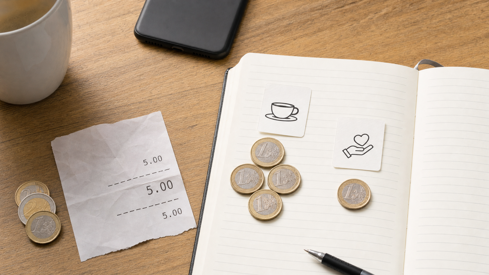
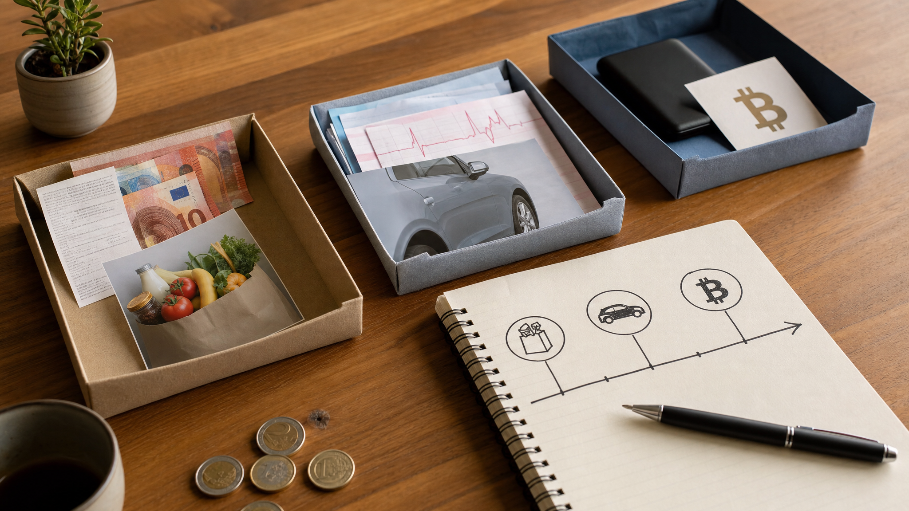

# Proračun

## Zašto uopće vodimo proračun?

Proračun vodimo zato da bismo prestali donositi novčane odluke samo prema stanju na računu i počeli ih donositi prema stvarnim namjenama novca koji već imamo. Stanje na računu govori samo gdje se novac nalazi i koliko ga ima u tom trenutku, ali ne govori što taj novac mora napraviti prije sljedeće uplate, koje obveze već čekaju, koji su troškovi predvidivi, koliko novca doista možemo potrošiti bez posljedica i postoji li stvarni višak koji se može usmjeriti u štednju, Bitcoin, davanje, otplatu duga ili neku drugu odluku.

*Proračun pretvara stanje na računu u skup namjena, podataka i odluka.*

Ako osoba na računu vidi 1.200 eura, taj iznos može izgledati kao slobodan novac, ali nakon raspodjele može se pokazati da 450 eura pripada stanarini, 140 eura režijama, 300 eura hrani, 80 eura prijevozu, 60 eura zdravlju, 100 eura otplati duga i 70 eura trošku koji je već dogovoren, ali još nije plaćen. Iznos na računu se nije promijenio, ali se promijenilo njegovo značenje. Prije proračuna to je bio jedan broj. Nakon proračuna to je skup konkretnih namjena.

*Iznos na računu dobiva značenje tek kada se rasporedi u kategorije.*

Svrha proračuna nije da život postane savršeno predvidiv. Troškovi će se mijenjati, prihodi mogu kasniti, neki mjeseci će biti skuplji, neke procjene će biti pogrešne, a neke kategorije će se morati prilagoditi. Proračun ne uklanja promjene, nego daje način da se promjene provedu jasno. Ako neka kategorija nema dovoljno novca, proračun ne mora značiti da se kupnja ne smije dogoditi, nego traži da se vidi iz koje druge kategorije novac dolazi. Time svaka odluka postaje konkretnija, jer se vidi što se dobiva i čega se odriče.

Drugi razlog za proračun jest stvaranje podataka. Bez evidencije, osoba se najčešće oslanja na dojam: otprilike zna koliko zarađuje, otprilike zna koliko troši, otprilike zna što bi trebalo ostati i otprilike zna zašto novac nestane. Takav dojam ponekad može biti blizu istine, ali nije dovoljno precizan za ozbiljnije odluke. Nakon nekoliko mjeseci redovitog vođenja proračuna počinju se vidjeti obrasci: koliko stvarno odlazi na hranu, koliko na auto, koliko na izlaske, koliko na zdravlje, koliko na dug, koliko na davanje i koliko novca u prosjeku ostaje nakon osnovnih troškova.

Treći razlog je planiranje unaprijed. Većina problema s novcem ne nastaje zato što se dogodilo nešto potpuno nepoznato, nego zato što poznati ili vjerojatni troškovi nisu dobili mjesto u planu. Registracija auta, osiguranje, školske stvari, Božić, rođendani, gume, servis, zdravstveni pregledi, godišnji odmor, popravci u stanu, zamjena mobitela i veći kućanski uređaji nisu svakomjesečni troškovi, ali nisu ni potpuno neočekivani. Proračun ih pretvara iz povremenog pritiska u mjesečnu pripremu.

Četvrti razlog je odvajanje kratkoročnog novca od dugoročnog novca. Novac koji mora platiti najam, hranu, režije ili poznati trošak u sljedećih nekoliko mjeseci nema istu ulogu kao novac koji može čekati više godina. To je posebno važno kada se u život uvodi Bitcoin. Bitcoin može u kratkom roku znatno mijenjati kupovnu moć, a istodobno ga se u ovoj knjizi promatra kao novac s dugoročnim potencijalom rasta kupovne moći. Upravo zato treba znati koji novac ima kratak rok, koji novac je rezerva, koji novac je dugoročna imovina i koji se iznos može usmjeriti u Bitcoin bez narušavanja svakodnevnih obveza.

Proračun, dakle, vodimo zato da sadašnji novac dobije namjenu, da transakcije ostave trag, da odluke ne ovise samo o osjećaju, da se budući troškovi počnu pripremati prije nego što dođu i da Bitcoin ne ulazi u neuređen novčani sustav kao još jedna nejasna odluka. Kada je proračun postavljen, on ne služi samo kontroli potrošnje, nego i boljem razumijevanju vlastitog novčanog života.

## Što proračun zapravo jest

Proračun je sustav u kojem se novac koji stvarno postoji raspoređuje u namjene, a zatim se kroz redovito bilježenje transakcija provjerava je li plan ostao usklađen sa stvarnim stanjem na računima. On nije prognoza budućih prihoda, nije popis želja i nije pokušaj da se unaprijed pogodi svaka pojedinost idućih nekoliko mjeseci, nego način da se vidi koliko novca trenutno postoji i što taj novac treba napraviti.

Proračun počinje sadašnjim novcem. Ne počinje plaćom koja treba sjesti za pet dana, očekivanom uplatom klijenta, bonusom, rastom cijene Bitcoina ili pretpostavkom da će se neki trošak možda ipak odgoditi. Takvi događaji mogu kasnije promijeniti proračun, ali nisu dio početne raspodjele dok se stvarno ne dogode. U proračun se najprije unosi ono što je već dostupno: gotovina u novčaniku, novac na tekućem računu, novac na štednom računu iz kojeg će se plaćati poznate obveze i drugi novčani računi koji su dio svakodnevnog novčanog toka.

Temeljno pravilo proračuna nulte osnove jednostavno je: svaki euro koji postoji dobiva zadatak. To ne znači da svaka kategorija mora biti savršeno pogođena, niti znači da se plan tijekom mjeseca ne smije mijenjati, nego znači da novac ne ostaje neodređen. Ako se prihod pojavi kasnije, tada se raspoređuje kasnije. Ako se trošak pokaže većim od očekivanog, proračun se prilagođava tako da se jasno vidi iz koje se druge kategorije novac prebacuje.

Veći iznos na računu ne mijenja ovo pravilo. Račun na kojem se nalazi 10.000 eura ne govori sam po sebi koliko je novca slobodno, jer dio može pripadati budućem servisu auta, školi, najmu, pričuvu, zdravstvenim troškovima, poslovnim obvezama, rezervi, davanju ili planiranoj kupnji Bitcoina. Veći iznos bez kategorija daje samo grubi osjećaj sigurnosti, dok raspodjela po kategorijama pokazuje koje su odluke već donesene, koje obveze čekaju i gdje se nalazi stvarni višak.

## Računi i kategorije

Jedna od prvih razlika koju treba usvojiti jest razlika između računa i kategorije. Račun govori gdje se novac nalazi, a kategorija govori čemu je novac namijenjen. Tekući račun, gotovina, štedni račun, poslovni račun, račun na mjenjačnici i Bitcoin novčanik su mjesta na kojima se može nalaziti novac ili imovina. Hrana, stanovanje, prijevoz, zdravlje, dug, davanje, budući troškovi, rezerva i Bitcoin su namjene.

*Račun i kategorija daju dvije različite, ali jednako važne informacije.*

U YNAB-u se ta razlika može uredno postaviti kroz dvije cjeline: gotovina i praćenje. Gotovina obuhvaća račune na kojima se nalazi novac koji se može rasporediti u proračun, primjerice novac u novčaniku, tekući račun, štedni račun ili drugi račun iz kojeg se plaćaju troškovi. Praćenje služi za imovinu i obveze koje su važne za ukupnu sliku, ali se ne koriste kao svakodnevni novac za raspodjelu po kategorijama. U praćenju se mogu voditi vrijednost nekretnine, dugoročni Bitcoin koji ne planirate trošiti, udio u poslu, ulaganja, zajam koji ste dali, kredit, kartica, minus ili druga obveza.

*Gotovina upravlja svakodnevnim odlukama, a praćenje pokazuje širu bilancu.*

Ova razlika sprječava miješanje likvidnosti i ukupne imovine. Nekretnina može povećavati neto imovinu, ali ne plaća račun za hranu idući tjedan. Kredit smanjuje neto imovinu, ali nije kategorija iz koje se plaća gorivo. Bitcoin može biti dugoročna imovina, ali dok ga ne želite koristiti za svakodnevne obveze, nije dobro da u proračunu glumi novac za režije. Ako se Bitcoin jednoga dana koristi kao primarni novac za redovita plaćanja, tada se može tretirati kao dio gotovine, ali dok je primarno dugoročna imovina, urednije ga je voditi u praćenju.

Na primjer, osoba može imati 2.300 eura na tekućem računu. Bez proračuna taj iznos govori samo da novca ima. Nakon raspodjele isti iznos može značiti 700 eura za stanovanje, 250 eura za režije, 420 eura za hranu, 180 eura za prijevoz, 150 eura za zdravlje, 200 eura za dug, 100 eura za davanje, 180 eura za buduće troškove i 120 eura za slobodnu potrošnju. Saldo je isti, ali odluka više nije ista, jer se prije svake kupnje ne gleda samo stanje računa, nego i stanje kategorije iz koje se kupnja plaća.

Ako kategorija ima dovoljno novca, kupnja je već pokrivena planom. Ako kategorija nema dovoljno novca, kupnja nije nužno zabranjena, ali tada treba odlučiti iz koje druge kategorije se novac prebacuje. To je važan dio proračuna, jer svaka promjena plana pokazuje oportunitetni trošak odluke: novac koji ide u jednu stvar više ne može istodobno ići u drugu.

## Osobni i poslovni proračun

Ako osoba vodi posao, obrt ili firmu, osobni i poslovni proračun ne treba miješati u isti sustav. Poslovanje treba imati svoj zaseban proračun, a privatni život svoj zaseban proračun. To vrijedi i kada je vlasnik ista osoba, jer novac firme i novac kućanstva nemaju istu funkciju, isti ritam, iste obveze ni iste odluke.

*Poslovanje i kućanstvo trebaju odvojene proračune, račune i kategorije.*

U praksi to znači da firma ima vlastite račune, vlastite kategorije i vlastiti tjedni ili mjesečni pregled. Privatni proračun počinje tek onim novcem koji je stvarno isplaćen vlasniku ili zaposleniku kao osobni prihod. Novac koji stoji na poslovnom računu ne treba se doživljavati kao osobni višak samo zato što mu vlasnik može pristupiti. Taj novac prije svega pripada poslovanju dok se ne donese jasna odluka o isplati.

Poslovni proračun može biti postavljen na višoj razini od osobnog proračuna, osobito na početku. Nije nužno odmah razraditi svaku sitnu poslovnu stavku, ali treba jasno vidjeti glavne namjene poslovnog novca. Kategorije mogu biti plaće, vanjski suradnici, dobavljači, najam prostora, oprema, računalni programi, alati, zalihe, marketing, prodaja, razvoj proizvoda, održavanje, edukacija, putovanja, povrati kupcima, pričuva za slabije mjesece, otplata poslovnog duga, ulaganje u rast poslovanja i vlasnička isplata.

Neke firme će trebati vrlo malo kategorija, dok će druge trebati detaljniji sustav po projektima, klijentima, odjelima ili linijama prihoda. Važno je da poslovni proračun pokaže može li firma redovito podmirivati svoje obveze, financirati rad, podnijeti slabiji mjesec i planirati veće odluke bez oslanjanja na privatni novac.

Privatni proračun tada ima svoje kategorije: stanovanje, režije, hrana, prijevoz, zdravlje, obitelj, djeca, dug, davanje, budući troškovi, slobodna potrošnja, likvidna rezerva i Bitcoin. Takav privatni proračun ne pokušava upravljati firmom, nego kućanstvom. U njega ne ulaze svi poslovni prihodi, nego samo osobni prihod koji je stvarno prebačen iz poslovanja u privatni život.

Ovo razdvajanje posebno je važno kod promjenjivih prihoda. Dobar poslovni mjesec ne znači automatski da je i privatni proračun dobio višak. Prvo se mora vidjeti što taj novac treba napraviti u poslovanju, a tek zatim koliko se može isplatiti vlasniku. Ako se ta razlika ne poštuje, poslovni račun lako postane produžetak privatne potrošnje, a privatni proračun počne računati na novac koji je zapravo trebao ostati u firmi.

## Prve kategorije

Prvi proračun ne treba imati previše detalja, ali treba imati dovoljno kategorija da pokazuje stvarne obrasce potrošnje. Ako kategorija ima premalo, sve se sakrije u nekoliko širokih skupina i proračun ne pomaže u odlučivanju. Ako ih ima previše, sustav se može početi doživljavati kao administrativni teret. Početak treba biti dovoljno jednostavan da ga je moguće održavati i dovoljno konkretan da se iz njega nešto može naučiti.

Osnovni skup osobnih kategorija može uključivati stanovanje, režije, hranu, prijevoz, zdravlje, obitelj ili djecu, dug, davanje, buduće troškove, slobodnu potrošnju, likvidnu rezervu i Bitcoin. Nakon toga se kategorije prilagođavaju stvarnom životu. Osoba koja živi s roditeljima možda treba posebne kategorije za auto, izlaske, uređaje, edukaciju i odlazak od doma. Podstanar treba najam, polog, selidbu i opremanje stana. Osoba koja radi samostalno treba poseban poslovni proračun, a u osobnom proračunu treba jasno vidjeti koliko si redovito isplaćuje za privatni život. Obitelj koja živi između dvije države treba putovanja, pomoć roditeljima, račune u dvije države i troškove održavanja imovine. Vlasnik nekretnine treba pričuvu, popravke, osiguranje i održavanje.

Kategorije se kasnije mogu razdvajati kada podaci pokažu da je to korisno. Hrana se može podijeliti na trgovinu i restorane. Prijevoz se može podijeliti na gorivo, javni prijevoz, servis, registraciju i gume. Zdravlje se može podijeliti na lijekove, preglede i stomatologa. Djeca mogu imati vrtić, školu, odjeću, aktivnosti, izlete i poklone. Takvo razdvajanje ima smisla kada pomaže u odlučivanju, ali ne treba ga uvoditi samo zato da bi proračun izgledao detaljno.

Posebnu pažnju treba dati budućim troškovima. Registracija auta, osiguranje, školske stvari, Božić, rođendani, gume, servis, zdravstveni pregledi, godišnji odmor, popravci u stanu, zamjena mobitela i veći kućanski uređaji nisu iznenađenja u punom smislu riječi, jer se većina njih može očekivati. Možda ne znate točan iznos ili datum, ali znate da će takvi troškovi doći. Proračun ih pretvara iz povremenog pritiska u mjesečni ritam. Trošak od 600 eura za šest mjeseci može postati 100 eura mjesečno, a godišnji odmor od 1.200 eura može postati 100 eura mjesečno tijekom godine.

## Raspodjela novca

Kada su računi uneseni i kategorije postavljene, sljedeći korak je raspodijeliti sav novac koji trenutno postoji. To znači da se ukupni iznos raspoloživ u gotovinskim računima namjenjuje kategorijama dok ne ostane ništa neraspoređeno. Ostatak od nula ne znači da nemate novca, nego da sav novac ima posao.

Ako se pojavi kategorija za koju ne znate koliko joj treba, počnite s procjenom i kasnije je ispravite na temelju stvarnih transakcija. Proračun se ne uspostavlja zato što već znate sve odgovore, nego zato da biste ih s vremenom dobili. Prvi mjesec često pokazuje osnovnu sliku, tri mjeseca već pokazuju obrasce, šest mjeseci bolje pokazuje stvarni višak, a godina dana otkriva sezonske troškove koji se ne vide u jednom mjesecu.

Kod promjenjivih prihoda treba biti oprezniji. Dobar mjesec ne treba odmah proglasiti uobičajenim mjesecom. Prvo treba pokriti slabije mjesece, osnovne troškove, poslovne obveze ako ih imate, rezervu i buduće troškove, a tek zatim govoriti o stvarnom višku. U suprotnom se lako dogodi da se najbolji mjesec potroši kao da će se ponavljati, dok se slabiji mjesec kasnije pokriva dugom ili prodajom imovine.

## Kako se unosi transakcija

Proračun nije samo plan na početku mjeseca. Plan postaje koristan tek kada se svaka stvarna transakcija redovito unosi u evidenciju. Svaka transakcija treba imati datum, primatelja, kategoriju, napomenu, račun i iznos. Datum govori kada se transakcija dogodila, primatelj govori kome je novac plaćen ili tko je novac uplatio, kategorija govori kojoj namjeni transakcija pripada, napomena kratko opisuje što se dogodilo, račun pokazuje odakle je novac izašao ili kamo je ušao, a iznos se vodi kao odljev ili priljev.

Primjer je jednostavan. Ako ste platili kavu 5 eura iz gotovine, otvorite račun gotovine i unesete novu transakciju. Datum je dan kada ste platili, primatelj je kafić, kategorija može biti izlasci, kafići i restorani, napomena može biti “kava”, a iznos je 5 eura kao odljev, jer je novac izašao iz gotovine. Nakon tog unosa stanje gotovine smanjuje se za 5 eura, a kategorija iz koje je kava plaćena također se smanjuje za isti iznos.

Ako je ista transakcija od 5 eura zapravo sadržavala 4 eura za kavu i 1 euro napojnice, transakciju je bolje podijeliti po stvarnoj namjeni. Četiri eura idu u kategoriju izlasci, kafići i restorani, a jedan euro ide u kategoriju davanja. Ukupni odljev s računa gotovine i dalje je 5 eura, ali kategorije pokazuju precizniju sliku: 4 eura potrošena su na izlazak, a 1 euro je davanje. Takva podjela je korisna jer kasniji izvještaji neće napojnicu prikazivati kao običan trošak kafića, nego kao ono što ona u vašem sustavu jest.

*Transakcija treba pokazati i mjesto novca i stvarnu namjenu troška.*

Ista struktura vrijedi za priljeve. Kada sjedne plaća, honorar, uplata klijenta, poklon, povrat novca od kupnje ili bilo koji drugi primitak, unose se datum, primatelj odnosno uplatitelj, napomena i iznos kao priljev. Takav priljev najčešće se ne smješta odmah u hranu, stanovanje, prijevoz ili Bitcoin, nego ulazi u preostalo za raspodjelu. Tek nakon toga novac se raspoređuje u kategorije. Plaća zato nije slobodan novac samim time što je sjela na račun; ona najprije postaje novac koji čeka raspored, a tek nakon raspodjele postaje novac za hranu, stanovanje, dug, davanje, buduće troškove, rezervu ili Bitcoin.

Treba razlikovati i prijenos između računa od stvarnog prihoda ili rashoda. Ako podignete 100 eura s tekućeg računa i stavite ih u novčanik, to nije trošak, nego prijenos iz jednog gotovinskog računa u drugi. Ukupni proračun se ne mijenja, jer novac nije potrošen, nego je promijenio mjesto. Isto vrijedi ako prebacite novac sa štednog računa na tekući račun. Kategorije se mijenjaju samo kada se novac stvarno potroši, primi ili namjenski preraspodijeli.

Najvažnije pravilo kod transakcija jest da se ne odgađaju predugo. Transakcija unesena istoga dana najčešće je točna, dok transakcija unesena nakon tri tjedna često postaje pogađanje. Što je dulji razmak između potrošnje i unosa, to proračun više ovisi o sjećanju, a manje o evidenciji. U praksi je dovoljno stvoriti naviku da se transakcije unose odmah nakon plaćanja ili barem jednom dnevno, a računi poravnaju jednom tjedno.

## Poravnanje računa

Poravnanje znači da se stanje u proračunu uspoređuje sa stvarnim stanjem na računu, kartici, gotovini ili drugom izvoru podataka. Ako bankovna aplikacija pokazuje 842,30 eura, a proračun pokazuje 847,30 eura, razliku treba pronaći. Možda nedostaje transakcija od 5 eura, možda je transakcija unesena dvaput, možda je iznos pogrešan, možda je novac prebačen između računa, a nije označen kao prijenos. Poravnanje nije poseban financijski događaj, nego provjera da brojevi kojima se služite za odlučivanje odgovaraju stvarnosti.

Gotovina se također treba poravnavati, iako je kod nje dopušteno više praktičnosti. Ako u proračunu piše da u novčaniku imate 63 eura, a stvarno imate 59 eura, razliku treba objasniti ili ispraviti. Kod gotovine se male razlike mogu dogoditi zbog zaokruživanja, sitnih kupnji ili zaboravljenih napojnica, ali ako se to ponavlja, sustav ne pokazuje stvarnu potrošnju i treba ga pojednostaviti ili ažurnije voditi.

Poravnanje je posebno važno prije većih odluka. Ako razmišljate o kupnji Bitcoina, većoj otplati duga, putovanju, popravku auta ili većem daru, korisno je najprije poravnati račune, jer odluka donesena na netočnim brojevima može izgledati razumno samo zato što dio potrošnje još nije unesen.

## Što podaci počnu pokazivati

Kada se proračun vodi redovito, nakon nekoliko mjeseci nastaje skup podataka koji omogućuje bolje planiranje. U početku je najvažnije samo rasporediti novac i unositi transakcije, ali s vremenom postaje jednako važno gledati što ti podaci pokazuju. U YNAB-u i u sličnim sustavima korisni su pregledi potrošnje, kretanja potrošnje, neto imovine, prihoda naspram rashoda i starosti novca.

*Proračun postaje korisniji kako se u njemu skuplja više stvarnih podataka.*

Raščlamba potrošnje pokazuje koliko je potrošeno po kategorijama u određenom razdoblju. Možete gledati zadnja tri mjeseca, šest mjeseci, dvanaest mjeseci, tekuću godinu, prošlu godinu ili razdoblje koje sami odaberete. Takav pregled pokazuje koliko je novca otišlo u svaku kategoriju, koliki je udio pojedine kategorije u ukupnoj potrošnji te kolika je prosječna mjesečna ili dnevna potrošnja. Ako se, primjerice, čini da restorani nisu veliki trošak, raščlamba potrošnje može pokazati da su u šest mjeseci postali jedna od većih kategorija, što tada omogućuje konkretniju odluku.

Kretanje potrošnje pokazuje kako se potrošnja mijenja kroz vrijeme. Kada proračun postoji dovoljno dugo, moguće je vidjeti koliko je ukupno potrošeno u pojedinom mjesecu i kako se taj mjesec uspoređuje s prosjekom. U jednom mjesecu potrošnja može biti 18 posto viša od prosjeka zbog registracije auta, ljetovanja ili opremanja stana, dok drugi mjesec može biti 12 posto niža jer nije bilo većih troškova. Isti pregled može se gledati i za pojedinu kategoriju, primjerice hranu, prijevoz, zdravlje ili restorane, pa se vidi raste li neka kategorija postupno ili je samo jedan mjesec odstupao.

Neto imovina pokazuje odnos ukupne imovine i ukupnih obveza. Imovina uključuje gotovinu, novac na računima, Bitcoin, ulaganja, nekretnine i drugu praćenu imovinu, dok obveze uključuju kredite, dugove na karticama, minuse, zajmove i druge dugoročne ili kratkoročne obveze. Neto imovina je razlika između toga dvoje. Ako postoje dugovi, oni smanjuju ukupnu sliku; ako se dugovi otplate, neto imovinu čine novac i imovina koja ostaje. Praćenje neto imovine kroz vrijeme pomaže vidjeti povećava li se stvarna financijska pozicija ili samo raste saldo na jednom računu dok se obveze drugdje povećavaju.

Prihodi i rashodi prikazuju novac koji ulazi i novac koji izlazi. Na strani prihoda može se vidjeti koliko je došlo iz plaće, honorara, poslovnih uplata, najma, darova ili drugih izvora, i to po mjesecima. Koristan je i prosjek prihoda po izvoru, kao i ukupni prosječni prihod u razdoblju koje promatrate. Na strani rashoda vide se troškovi po kategorijama i po mjesecima, prosjek po kategoriji, ukupni trošak po kategoriji i ukupni rashodi. Kada se od prihoda oduzmu rashodi, dobiva se neto prihod u smislu proračuna, odnosno razlika između onoga što je ušlo i onoga što je izašlo u promatranom razdoblju.

Starost novca pokazuje koliko dugo novac u prosjeku ostaje u sustavu prije nego što se potroši. U praksi se taj podatak može gledati po mjesecima, primjerice za zadnjih šest mjeseci, pa se vidi kreće li se broj dana prema gore ili prema dolje. Ako novac odlazi čim sjedne, starost novca je niska i proračun vjerojatno još nema dovoljno prostora. Ako novac ostaje dulje u kategorijama prije nego što se potroši, to može značiti da se obveze bolje pripremaju unaprijed. Taj pokazatelj nije cilj sam po sebi, ali pomaže u razumijevanju tempa kojim novac ulazi i izlazi.

Svi ovi pregledi postaju korisniji što se proračun dulje vodi. Jedan mjesec daje početnu sliku, ali nije dovoljan za zaključke o godišnjem životu. Tri mjeseca otkrivaju ponavljanja. Šest mjeseci bolje pokazuje što je stvarni višak. Godina dana uključuje sezonske troškove, blagdane, odmore, registracije, veće račune i druge stavke koje se ne pojavljuju svaki mjesec. Zato proračun nije samo alat za kontrolu današnje potrošnje, nego i način da buduće planiranje ima bolju osnovu.

## Bitcoin u proračunu

Bitcoin u proračunu treba voditi prema ulozi koju stvarno ima. Ako ga trenutno držite kao dugoročnu imovinu, može biti dio praćenja imovine i ulaziti u izračun neto imovine. Ako ga koristite za redovita plaćanja ili ako želite dio svakodnevnog novca držati u Bitcoinu, tada se može postaviti kao račun u gotovini, ali to ima smisla tek kada ste spremni prihvatiti da se iz tog računa stvarno plaćaju kratkoročne obveze.

Nova kupnja Bitcoina treba imati svoju kategoriju. Time se jasno vidi kupuje li se Bitcoin iz stvarnog viška ili iz novca koji je bio potreban za druge obveze. Ako postoji potrošački dug, minus, dug na kartici ili nepoznati mjesečni trošak, kupnja Bitcoina mora se promatrati zajedno s tim obvezama, jer proračun ne pita samo vjerujete li u Bitcoin, nego iz kojeg novca ga kupujete. Učenje, mala redovita kupnja ili tehničko upoznavanje s novčanikom mogu imati smisla i ranije, ali iznosi moraju biti takvi da ne narušavaju hranu, stanovanje, otplatu duga, rezervu i druge osnovne kategorije.

Ovo je posebno važno zato što Bitcoin može znatno mijenjati kupovnu moć u kratkom roku. U okviru teze ove knjige Bitcoin ima očekivani dugoročni trend rasta kupovne moći, ali taj dugoročni pogled ne uklanja kratkoročnu volatilnost. Novac koji treba platiti najam idući mjesec, registraciju za tri mjeseca ili zdravstveni trošak koji je već poznat ne treba se ponašati kao novac koji može mirno čekati više godina. Proračun zato pomaže razdvojiti novac s kratkim rokom od novca koji smije imati dug rok.

*Bitcoin u proračunu treba voditi prema stvarnoj ulozi i vremenskom roku novca.*

Kada Bitcoin postupno postaje primarni novac, potreba za proračunom ne nestaje, nego postaje veća. Ako se prihod, štednja ili dio imovine drže u novcu čija se kupovna moć u kratkom roku može snažno mijenjati, tada osoba mora još bolje znati koliki su joj stvarni mjesečni rashodi, koji troškovi dolaze u sljedećih nekoliko mjeseci, kolika je potrebna likvidna rezerva, koji dio imovine ne smije biti prodan u nepovoljnom trenutku i koji dio se može držati dugoročno. Život s Bitcoinom kao primarnim novcem traži da planiranje unaprijed postane redovita navika, a ne izvanredna aktivnost kada se pojavi problem.

## Tjedni ritam

Proračun je najlakše održavati ako ima jednostavan tjedni ritam. Jednom tjedno treba otvoriti proračun, unijeti transakcije koje nedostaju, poravnati račune, provjeriti kategorije koje su pri kraju i odlučiti treba li novac premjestiti iz jedne kategorije u drugu. Takav pregled ne mora trajati dugo, ali mora biti redovit. Ako se proračun otvara samo kada nastane problem, tada najčešće služi za objašnjavanje onoga što se već dogodilo, umjesto za usmjeravanje onoga što se tek treba dogoditi.

*Proračun je najlakše održavati kroz kratak i ponovljiv tjedni ritam.*

Tjedni pregled može ići ovim redom: prvo se provjere stanja računa i unesu nedostajuće transakcije, zatim se poravnaju gotovina, banka i kartice, nakon toga se pogledaju kategorije s manjkom ili preniskim ostatkom, pa se odlučuje hoće li se smanjiti potrošnja ili prebaciti novac iz druge kategorije. Na kraju se provjeravaju budući troškovi, dug, davanje, rezerva i Bitcoin. Ako postoji zajednički novac u braku, obitelji ili kućanstvu, isti pregled treba barem povremeno raditi zajedno, jer proračun koji postoji samo u glavi jedne osobe nije dovoljan za odluke koje pogađaju više ljudi.

Mjesečni pregled ima širu svrhu. Tada se uspoređuje plan s ostvarenjem, gledaju se raščlamba potrošnje, kretanje potrošnje, prihodi i rashodi, promjena neto imovine i starost novca. Ne treba svaki mjesec donositi velike zaključke, ali treba primijetiti ponavljaju li se iste razlike. Ako je hrana svaki mjesec veća od plana, možda plan nije realan. Ako se slobodna potrošnja stalno pokriva iz rezerve, rezerva zapravo nije rezerva. Ako se Bitcoin kupuje redovito, ali se kartica također povećava, kupnja Bitcoina možda ne dolazi iz viška nego iz odgođenog troška.

Kod poslovnog proračuna tjedni ili mjesečni ritam treba biti odvojen od privatnog pregleda. U poslovnom pregledu provjeravaju se poslovni prihodi, naplata, dobavljači, plaće, zalihe, projekti, očekivani troškovi, poslovna rezerva i iznos koji se može isplatiti vlasniku. Tek kada je taj iznos stvarno isplaćen, on ulazi u privatni proračun kao osobni priljev.

## Primjeri

Zamislimo osobu koja ima 352 eura do sljedeće plaće: 312 eura na računu i 40 eura u gotovini. Prvi proračun ne bi trebao početi pitanjem koliko se može potrošiti, nego pitanjem što tih 352 eura mora napraviti do sljedeće uplate. Ako treba 120 eura za hranu, 45 eura za gorivo, 60 eura za režije, 30 eura za lijek, 40 eura za dug i 20 eura za obiteljski trošak, tada preostaje mnogo manje slobodnog novca nego što saldo na početku sugerira. U takvoj situaciji proračun ne stvara dodatni novac, ali sprječava da se mali višak zamijeni za osjećaj veće sigurnosti.

Drugi primjer je osoba koja živi s roditeljima i ima niže životne troškove. Takva situacija može biti velika prednost ako se koristi za stvaranje rezerve, izlazak iz duga, pripremu odlaska od doma i postupnu kupnju Bitcoina iz stvarnog viška. Ista situacija može postati problem ako se niži troškovi pretvore u višu potrošnju na izlaske, dostave, uređaje i pretplate, jer tada prednost roditeljskog doma ne gradi buduću slobodu nego samo smanjuje osjećaj posljedica. Proračun u tom primjeru treba imati kategoriju za odlazak od doma, osnovnu rezervu, prijevoz, slobodnu potrošnju, davanje i Bitcoin, kako bi se jasno vidjelo koliko sadašnja prednost doista pomaže.

Treći primjer je obitelj sa srednjim prihodom, djecom, autom, režijama, kreditom i redovitim neplaniranim troškovima. Kod takve obitelji proračun često najviše pomaže u razgovoru, jer kategorije smanjuju potrebu da se svaka kupnja tumači iz početka. Ako postoji kategorija za dječju odjeću, servis auta, hranu, izlaske, školu, darove, davanje i Bitcoin, lakše je vidjeti što je stvarni prioritet, a što je samo trenutno najglasnija potreba. Kada kategorija nije dovoljna, obitelj ne mora raspravljati apstraktno o tome troši li netko previše, nego konkretno odlučuje iz koje se druge kategorije novac prebacuje.

Četvrti primjer je poduzetnik ili par s više imovine, poslovnim prihodima, nekretninom, Bitcoinom i većim brojem odluka. U takvom slučaju postoje dva proračuna. Firma ima proračun za plaće, dobavljače, zalihe, prostor, opremu, marketing, razvoj, održavanje, pričuvu za slabije mjesece i vlasničku isplatu. Privatni proračun ima kategorije za stanovanje, hranu, djecu, auto, zdravlje, dug, davanje, rezervu i Bitcoin. Kada se ta dva proračuna ne miješaju, lakše je vidjeti koliko firma stvarno može isplatiti vlasniku, koliko obitelj stvarno troši i koliko se Bitcoina može kupiti iz viška koji ne ugrožava ni poslovanje ni privatni život.

## Prvi potezi

Prvi potez je popisati račune. Otvorite bankovnu aplikaciju, provjerite gotovinu, pogledajte kartice, štedne račune, poslovni račun ako ga imate, Bitcoin novčanik i sve druge račune na kojima se nalazi novac ili obveza. U osobni proračun najprije unesite gotovinske račune, odnosno one s kojih stvarno plaćate privatni život. Imovinu i obveze koje nisu dio svakodnevne raspodjele unesite u praćenje.

Drugi potez je odlučiti treba li vam i zaseban poslovni proračun. Ako vodite firmu ili poslovanje, nemojte poslovni račun samo dodati u privatni proračun kao još jedan izvor novca. Napravite odvojeni poslovni proračun, s vlastitim kategorijama i vlastitim pregledom, pa u privatni proračun unosite samo ono što je stvarno isplaćeno kao osobni prihod.

Treći potez je napraviti početne privatne kategorije. One ne moraju biti savršene, ali trebaju pokriti stanovanje, režije, hranu, prijevoz, zdravlje, dug, davanje, buduće troškove, slobodnu potrošnju, rezervu i Bitcoin. Ako imate djecu, posao, nekretninu, promjenjiv prihod ili život između dvije države, dodajte kategorije koje odražavaju te okolnosti.

Četvrti potez je rasporediti sav novac koji postoji. Nemojte raspoređivati plaću koja nije sjela, uplatu klijenta koja kasni ili bonus koji nije potvrđen. Kada novac dođe, ući će kao priljev u preostalo za raspodjelu i tada će dobiti zadatak.

Peti potez je unositi svaku transakciju. Hrana ide u hranu, gorivo u prijevoz, lijekovi u zdravlje, kartica u dug, napojnica u davanje, a kupnja Bitcoina u kategoriju za Bitcoin ili u praćenje imovine, ovisno o tome kako je sustav postavljen. Ako jedna transakcija ima više namjena, podijelite je po kategorijama.

Šesti potez je jednom tjedno poravnati račune. Stanje u proračunu treba odgovarati stvarnom stanju u banci, gotovini, kartici i drugim računima. Ako ne odgovara, pronađite razliku dok je još svježa.

Sedmi potez je nakon prvih mjesec dana pogledati podatke, ali bez prenaglih zaključaka. Prvi mjesec najčešće služi za upoznavanje vlastitog novčanog toka. Nakon tri mjeseca već se mogu vidjeti obrasci, nakon šest mjeseci stvarniji višak, a nakon godinu dana sezonski troškovi.

## Kada je poglavlje provedeno

Ovo poglavlje je provedeno kada proračun više nije samo ideja, nego redovita navika. To znači da raspoređujete samo novac koji stvarno postoji, da svaki euro ima kategoriju, da razlikujete gotovinu od praćenja imovine i obveza, da svaki odljev ima datum, primatelja, kategoriju, napomenu i račun iz kojeg je plaćen, da priljeve najprije vodite kroz preostalo za raspodjelu, da podijeljene transakcije dijelite prema stvarnoj namjeni i da račune poravnavate barem jednom tjedno.

Ako vodite poslovanje, ovo poglavlje je provedeno tek kada poslovni i privatni proračun više nisu pomiješani. Poslovanje treba imati vlastiti proračun, vlastite račune, vlastite kategorije i vlastiti pregled. Privatni proračun treba počinjati osobnim prihodima koji su stvarno isplaćeni iz poslovanja ili primljeni iz drugog izvora.

Također znači da znate svoj stvarni mjesečni trošak, da budući troškovi imaju kategorije, da dug nije skriven u minimalnim uplatama, da davanje ima svoje mjesto, da kupnja Bitcoina dolazi iz jasne kategorije, da razlikujete novac s kratkim rokom od novca koji može čekati dugo i da redovito gledate raščlambu potrošnje, kretanje potrošnje, neto imovinu, prihode i rashode te starost novca.

Ako proračun još postoji samo u glavi, ako troškovi ne ulaze u kategorije, ako trošite novac koji još nije stigao, ako ne znate stvarni višak, ako Bitcoin kupujete iz neodređenog ostatka ili ako se poslovni i osobni novac miješaju bez jasne isplate, tada je bolje ostati na ovom poglavlju još neko vrijeme. Sljedeće odluke, osobito one o dugu, davanju, ravnoteži imovine i Bitcoinu kao primarnom novcu, bit će kvalitetnije kada se temelje na točnim podacima o sadašnjem novcu.

Proračun ne mora biti složen da bi bio koristan. Dovoljno je da pokazuje gdje je novac, čemu je namijenjen, što se stvarno dogodilo i kako se odluke ponavljaju kroz vrijeme. Kada to postoji, planiranje unaprijed postupno postaje normalan dio života, a Bitcoin se može uvoditi u sustav koji već zna svoje obveze, rokove, višak i rizike.
