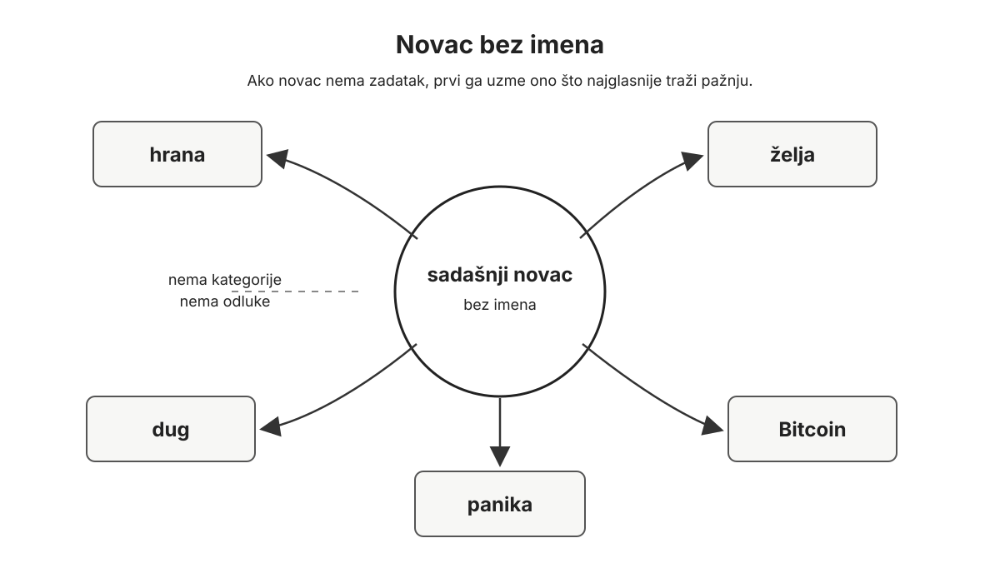
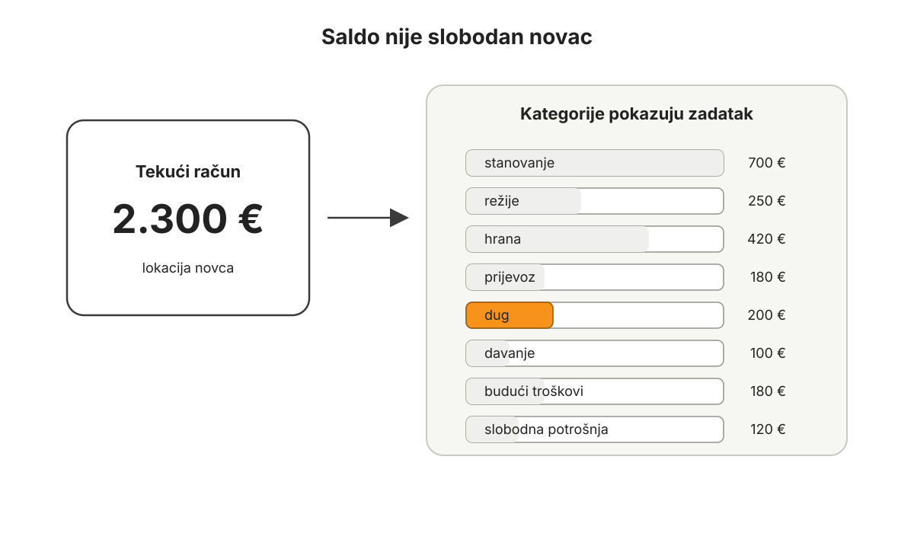
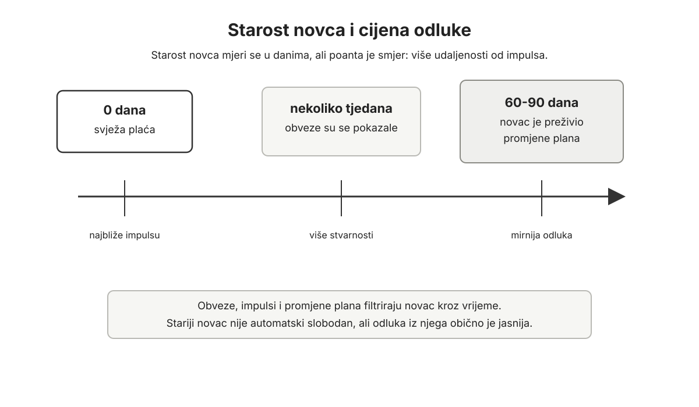
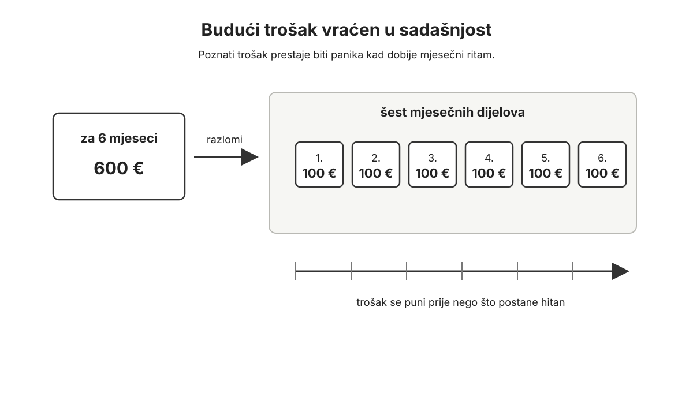
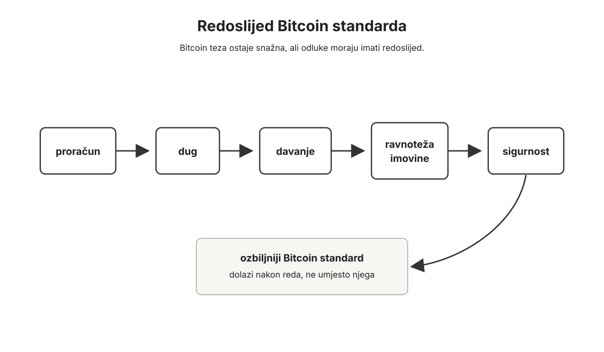
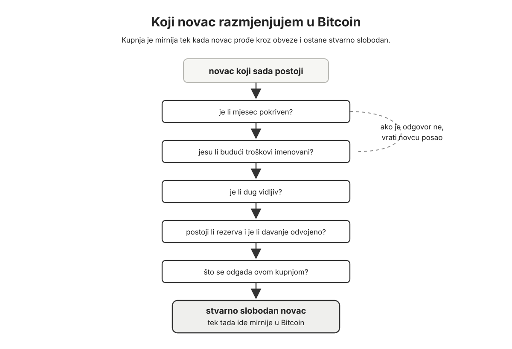
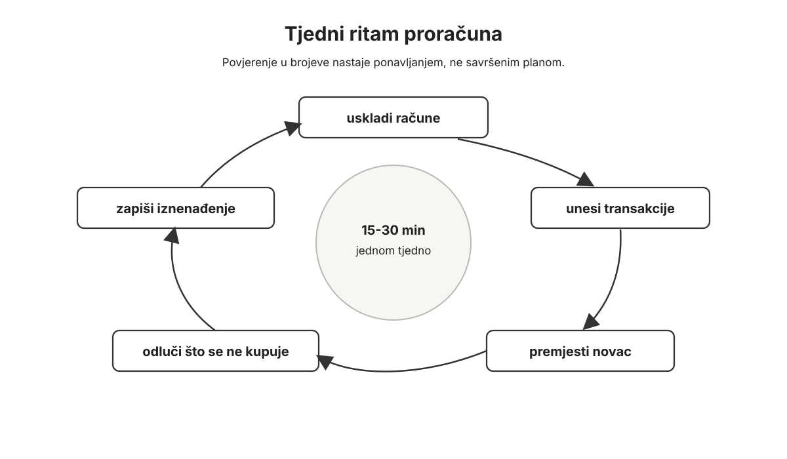
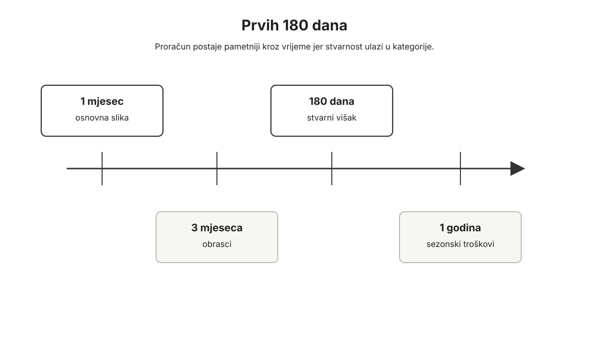
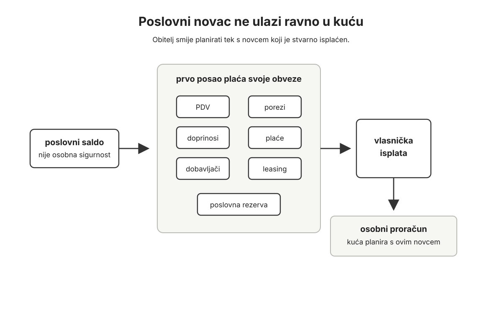
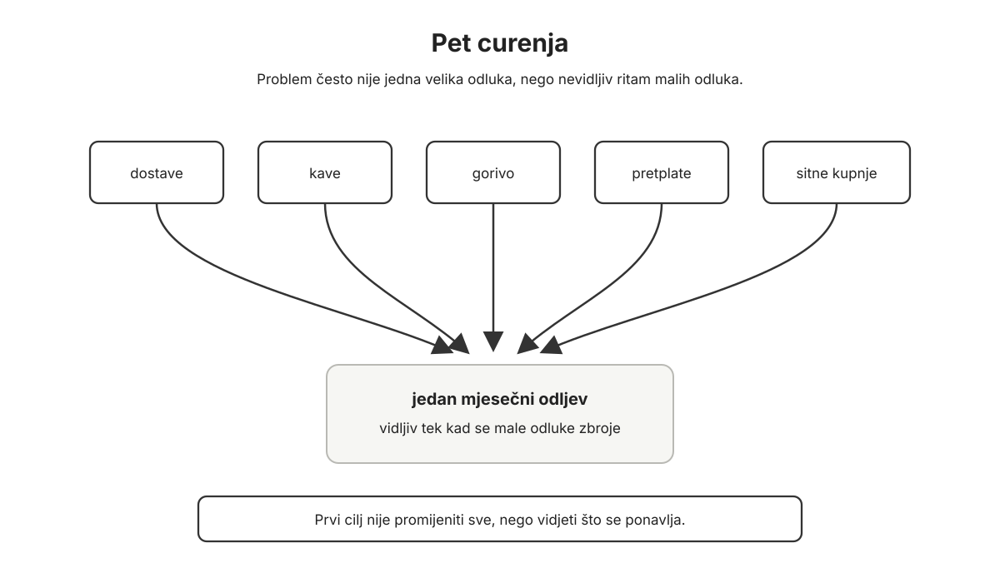

# Proračun

Proračun počinje kada sjednete pred novac koji već imate.

Ne računa na plaću koja sjeda za pet dana, bonus, povrat poreza, uplatu klijenta, rast Bitcoina ili nečiju dobru volju.

Samo na sadašnji novac.

To može biti neugodan trenutak. Otvorena bankovna aplikacija. Papir na stolu. Računi sa strane. Kartica u novčaniku. Jedan iznos na tekućem računu koji je na prvi pogled jednostavan, a nakon pet minuta više nije. Jer taj iznos već ima poslove. Stanarina. Režije. Hrana. Prijevoz. Djeca. Dug. Stomatolog. Registracija auta. Davanje. Budući troškovi. Možda i Bitcoin.

Proračun je prvi stvarni susret s vlastitim novcem zato što uklanja najopasniju riječ iz osobnih financija: otprilike.

Mnogi ljudi imaju samo približnu sliku prihoda, troškova, očekivanog viška, duga, štednje, Bitcoina, troškova koji dolaze i promjena koje odgađaju.

"Otprilike" nije dovoljno za osobni Bitcoin standard.

Poanta nije u tome da svaki račun već plaćate iz Bitcoina, nego da Bitcoin ulazi u život koji zna što mora platiti, što duguje i što smije riskirati.

Bitcoin traži red. Ne savršenstvo, ali red. Dobar novac ne spašava neuredan život od posljedica neurednih odluka. To nije moralna presuda. Neuredan proračun često nastane iz umora, djece, duga, bolesti, posla, sezonalnosti, obiteljskih pritisaka i previše malih odluka koje nitko nije imenovao. Ali posljedice svejedno dođu.

Ako sadašnji novac nema posao, Bitcoin će lako postati još jedna stvar koja stvara pritisak. Kupuje se kada cijena raste, preskače se kada padne, prodaje se kada se pojavi trošak koji se mogao vidjeti prije šest mjeseci. Ako kupite 100 eura Bitcoina, a isti mjesec karticom platite hranu jer je novac za hranu već otišao negdje drugdje, niste štedjeli. Samo ste problemu promijenili redoslijed. Tada problem nije volatilnost. Problem je proračun.

Zato ova knjiga počinje ovdje, dok dug, davanje, ravnoteža imovine i ozbiljan Bitcoin još čekaju svoj red.

Proračun ne rješava sve, ali pokazuje gdje sve počinje.

Ako večeras imate samo dvadeset minuta, nemojte tražiti savršen sustav. Otvorite račune. Zapišite samo novac koji stvarno postoji. Napravite nekoliko grubih kategorija. Sljedećih sedam dana pratite svaku transakciju. To je dovoljno za početak jer prvi cilj nije dotjerati sustav, nego prekinuti maglu.

## Što novac mora napraviti

Prvo pitanje nije koliko ću zaraditi ovaj mjesec, nego što novac koji sada imam mora napraviti prije sljedeće uplate.

To pitanje spušta čovjeka na zemlju. Ako imate 1.200 eura na računu, ne znači da imate 1.200 eura za potrošiti. Možda 450 eura pripada stanarini, 140 režijama, 300 hrani, 80 prijevozu, 60 zdravlju, 100 dugu i 70 nečemu što ste već obećali, ali niste zapisali.

Tih 1.200 eura može izgledati kao saldo.

U stvarnosti je raspored.

Kod 10.000 eura na računu vrijedi ista stvar. Iznos je veći, ali pitanje je isto: što je stvarna rezerva, što pripada porezu, plaćama, budućem servisu auta, školi, odmoru, osiguranju, održavanju stana, davanju, dugu ili Bitcoinu? Veći saldo bez kategorija samo je skuplja magla.

I kod zarade u inozemstvu vrijedi ista logika. Veća plaća ne znači automatski veći višak. Najam, osiguranje, auto, vrtić, putovanja u Hrvatsku, pomoć roditeljima, računi u dvije države i troškovi kuće "dolje" mogu pojesti razliku prije nego što se pojavi stvarno slobodan novac.

Kuća, apartman ili naslijeđena zemlja ne mijenjaju pravilo. Imovina na papiru nije isto što i novac koji može platiti idući tjedan. Kuća može biti vrijedna, a proračun svejedno prazan.

Proračun ne počinje rezanjem kave, zabranama i tablicom koja kažnjava svaku sitnicu. Počinje imenovanjem. Novac koji je bez imena lako ode u prvu stvar koja vikne dovoljno glasno. Novac koji ima ime teže je ukrasti samome sebi.

*Novac bez imena prvi ode onome što najglasnije traži pažnju. Kategorija ga ne sputava, nego mu daje posao.*

Zato je proračun nulte osnove toliko važan. On raspoređuje samo novac koji postoji. Svaki euro dobiva zadatak. Ne morate odmah znati savršen plan za godinu dana. Trebate znati što sadašnji novac mora napraviti u sljedećih nekoliko tjedana.

Bilo da imate 600 ili 6.000 eura, rasporedite samo ono što je stvarno tu. Očekivanih 1.500 eura pričekajte; kada dođu, tada ih rasporedite.

Planiranje s novcem koji još nije stigao navikava čovjeka da troši budućnost prije nego što ju zaradi. To je isti mentalni teren na kojem dug kasnije postane normalan. Proračun radi suprotno. Vraća odluku u sadašnjost.

## Račun nije kategorija

Jedna od prvih stvari koju treba naučiti jest razlika između računa i kategorije.

Račun govori gdje je novac.

Kategorija govori čemu novac služi.

Tekući račun, gotovina, štedni račun, poslovni račun, račun na burzi i Bitcoin novčanik su lokacije. Hrana, stanovanje, prijevoz, zdravlje, dug, davanje, budući troškovi, rezerva i Bitcoin su namjene.

Ta razlika izgleda sitno dok je ne primijenite na stvarni život.

Na tekućem računu može stajati 2.300 eura. Bez proračuna taj broj govori: ima novca. S proračunom taj isti broj može značiti:

- 700 eura za stanovanje
- 250 eura za režije
- 420 eura za hranu
- 180 eura za prijevoz
- 150 eura za zdravlje
- 200 eura za dug
- 100 eura za davanje
- 180 eura za buduće troškove
- 120 eura za slobodnu potrošnju

*Saldo pokazuje gdje je novac, ali kategorije pokazuju što taj novac mora napraviti.*

Saldo nije nestao. Samo je prestao lagati.

Prije veće kupnje više ne gledate samo račun. Gledate kategoriju. Ako kategorija ima novac, kupnja je mirna. Ako nema, nije automatski zabranjena, ali morate odlučiti odakle novac dolazi: iz hrane, odmora, rezerve, budućih troškova ili Bitcoina.

Taj trenutak je dragocjen jer želja dobiva cijenu.

Nije svaka promjena proračuna neuspjeh. Život se miče. Hrana poskupi. Dijete preraste tenisice. Auto traži servis. Dođe poziv na vjenčanje. Plan od 400 eura za hranu pokaže se prenizak. Dobar proračun se prilagođava. Loš proračun glumi da je bio točan i gura razliku na karticu.

U proračunu nema časti u tvrdoglavosti.

Ima časti u vraćanju stvarnosti.

## Novac ima starost

Proračun ne pokazuje samo gdje je novac. Pokazuje i koliko je dugo novac izdržao u vašem životu. Novac koji je sjeo jutros još je pun dojma, planova i tuđih zahtjeva. Novac koji je prošao nekoliko tjedana kroz kategorije već ima drukčiju težinu. Vidjeli ste što ga vuče. Vidjeli ste što se ponavlja. Vidjeli ste što ste prvo mislili kupiti, a onda više niste htjeli.

Tu se vidi oportunitetni trošak, samo bez velike riječi. Ako 100 eura ode u jednu stvar, ne može istih 100 eura otići u drugu. To nije razlog za krivnju. To je razlog za jasnoću. Večera, gume, dug, poklon, stomatolog, rezerva ili Bitcoin više nisu odvojeni svjetovi. Svi traže isti novac.

Oportunitetni trošak nije samo propušten rast Bitcoina. To može biti i nenapunjena rezerva, sporije gašenje duga, odgođen stomatolog, slabiji mir u kući ili novac koji će vam trebati prije nego što ste mislili. Proračun ne govori koju odluku vi osobno morate donijeti. Govori samo da svaka odluka treba pokazati iz koje kategorije dolazi novac, što se time odgađa i možete li mirno živjeti s tom zamjenom.

Zato je korisno gledati proračun kao vremensku liniju. Dio novca je za ovaj tjedan. Dio je za kraj mjeseca. Dio čuva trošak koji dolazi za šest mjeseci. Dio možda nema hitan rok i tek tada može mirnije tražiti svoje mjesto.

Na fiat standardu ta rečenica zvuči gotovo čudno. Ako vam je primarni novac euro, ne želite ga samo držati godinama i glumiti da se ništa ne događa. Inflacija polako jede kupovnu moć. Ne svaki dan dramatično, ne uvijek jednako, ali dovoljno da čovjek osjeti kako novac koji stoji bez prinosa s vremenom slabi.

Fiat standard osobito kažnjava pasivno držanje novca bez prinosa, a ne svaku moguću štednju ili ulaganje u fiat sustavu. Ali taj osjećaj svejedno mijenja ponašanje. Kada inflacija jede gotovinu, a kredit je lako dostupan, mnogi ljudi nauče razmišljati kroz ratu, a ne kroz akumulirani novac. Dug lako postane zamjena za vremensku disciplinu.

Proračun nulte osnove nije slavljenje fiata. To je trening vremenskog reda. Ne dopušta da se plaća koja još nije stigla već ponaša kao da je vaša. Ne dopušta da saldo glumi slobodu dok kategorije nisu imenovane. Uči vas razlikovati novac za ovaj tjedan, novac za poznati trošak, novac za dug, novac za rezervu i novac koji je stvarno slobodan.

Dug radi suprotno. On spušta starost novca jer je budući novac već potrošen. Plaća koja dolazi za dva tjedna nije nova prilika ako je već čekaju kartica, minus, rata i stara odluka. U jeziku ovog poglavlja, dug spušta starost novca ispod nule: budući mjeseci već imaju posao prije nego što je novac uopće stigao. To nije računovodstvena formula, nego korisna slika. Što više budućeg prihoda već pripada starim obvezama, to manje sadašnji proračun ima slobode.

Kasnije, ako dođete do ozbiljnijeg Bitcoin standarda, odnos prema starosti novca mijenja se. Tek ako Bitcoin za osobu stvarno postane dugoročni novac, a ne samo rizična pozicija koja će se prodati pri prvom većem trošku, tada ideja starijeg novca dobiva drukčije značenje. U Bitcoin tezi ove knjige, novac koji se ne mora dirati godinama može nositi očekivanje veće buduće kupovne moći. Ali to očekivanje nije isto što i kratkoročna sigurnost.

To ne znači da je Bitcoin prikladan za novac koji treba za tri mjeseca, godinu dana ili poznati cilj u bliskoj budućnosti. Dugoročna monetarna teza ne uklanja kratkoročnu volatilnost. Bitcoin je novac koji se kasnije možda isplati stariti. Ali ne iz novca koji još nema ime, rok, rezervu i dogovor u kući.

"Stariji novac" ovdje nije financijska formula ni univerzalno pravilo. To je način da razlikujete novac koji je već dobio posao od novca koji se na računu pojavio tek toliko da probudi osjećaj da ga imate više nego što ga stvarno imate. Često je mudrije donositi veće odluke iz novca koji je prošao barem jedan puni krug proračuna nego iz novca koji je upravo sjeo. Ne zato što je stariji novac matematički bolji, nego zato što je manje opterećen prvim impulsom.

U praksi se starost novca može mjeriti u danima. Ne kao broj kojem treba robovati, nego kao znak smjera. Ako danas trošite novac koji je sjeo jučer, živite vrlo blizu ruba. Ako sve češće trošite novac koji je u kategoriji stajao trideset, šezdeset ili devedeset dana, proračun počinje stvarati udaljenost između impulsa i odluke.

Stariji novac nije automatski Bitcoin novac. Ako mu treba likvidnost, ako pripada rezervi, dugu, porezu, djeci, poslu ili poznatom cilju, njegova starost ne mijenja njegovu namjenu. Ali ako je i nakon tih provjera slobodan, odluka iz njega obično je mirnija nego odluka iz novca koji je tek došao i još nema jasno ime.

Upravljanje novcem zato nije samo matematika. Da jest, tablica bi bila dovoljna. Novac dira strah, nadu, ponos, umor, bračne razgovore, roditelje, djecu i osjećaj da možda kasnite za svima drugima. Ova knjiga ne pokušava ugasiti te emocije. Pokušava ih staviti na pravo mjesto. Proračun je prvi alat za to: ne da odlučuje umjesto vas, nego da vaše odluke prestanu izlaziti iz panike i počnu izlaziti iz reda.

*Starost novca mjeri se u danima, ali poanta nije robovanje broju. Poanta je udaljenost između impulsa i odluke.*

## Prve kategorije

Prvi proračun ne treba biti lijep.

Treba biti upotrebljiv.

Ako napravite četrdeset kategorija prvi dan, vjerojatno ćete se umoriti prije nego što sustav počne raditi. Ako napravite tri kategorije, vjerojatno ćete sakriti previše važnih odluka. Početak treba biti dovoljno jednostavan da ga možete voditi i dovoljno konkretan da govori istinu.

Za većinu ljudi prvi skup kategorija može izgledati ovako:

- stanovanje
- režije
- hrana
- prijevoz
- zdravlje
- djeca ili obitelj
- dug
- davanje
- budući troškovi
- slobodna potrošnja
- likvidna rezerva
- Bitcoin

Ovisno o tome kako živite, neke kategorije treba dodati odmah. Mladi čovjek koji živi s roditeljima možda treba auto, izlaske, dostave, pretplate, uređaje i odlazak od doma. Podstanar treba najam, polog i selidbu. Freelancer treba poreze, doprinose, opremu, softver i mjesece bez uplate. Obitelj iz dijaspore treba putovanja kući, pomoć roditeljima i troškove u dvije države. Vlasnik nekretnine treba pričuvu, održavanje i popravke. Umirovljenik treba lijekove, preglede, pomoć djeci i neplanirane zdravstvene troškove.

Kasnije se kategorije mogu razdvojiti. Stanovanje može postati najam, rata, pričuva, režije i održavanje. Hrana može postati trgovina i restorani. Prijevoz može postati gorivo, javni prijevoz, servis, registracija i gume. Djeca mogu postati vrtić, škola, odjeća, aktivnosti, pokloni i izleti. Zdravlje može dobiti stomatologa, lijekove i preglede. Digitalni život može dobiti mobitel, pretplate, pohranu u oblaku, alate, edukaciju i zamjenu laptopa.

Nemojte to raditi prerano.

Prvih nekoliko mjeseci trebate kartu terena, a ne arhitektonski nacrt.

Proračun prvo treba odgovoriti na nekoliko običnih pitanja: stvarni trošak hrane i auta, iznos koji mjesec traži prije nego što možete govoriti o višku, troškove koji se stalno vraćaju, dug koji nosite, davanje bez glume i Bitcoin koji možete kupiti iz viška koji stvarno postoji.

Ako ta pitanja još nemaju odgovor, nije vrijeme za složene strategije.

Vrijeme je za kategorije.

## Budući troškovi nisu iznenađenje

Velik dio financijske panike nastaje iz troškova koji nisu mjesečni.

Registracija auta, Božić, rođendani i školske stvari nisu iznenađenja.

Isto vrijedi za gume, servis, odmor, osiguranje, održavanje stana, zamjenu mobitela, stomatologa, veći pregled i poklone. Možda ne znate točan datum ili iznos, ali znate da život traži takav novac.

Nekretnina također ima buduće troškove. Bojler, krov, klima, namještaj, majstori, pričuva, porez, prazni mjeseci apartmana i zimsko održavanje ne prestaju postojati zato što kuća "mirno stoji". Apartman može dobro zaraditi u srpnju i kolovozu, ali taj novac nije slobodan dok ne pokrije cijelu godinu obveza.

Proračun budući trošak vraća u sadašnjost.

Trošak od 600 eura za šest mjeseci znači 100 eura mjesečno. Odmor od 1.200 eura za godinu dana traži isti ritam. Auto koji svake godine treba registraciju, osiguranje i barem jedan ozbiljniji servis ne košta samo gorivo i rata. Ima svoju kategoriju i dok mirno stoji pred kućom.

*Poznati trošak prestaje biti panika kada dobije mjesečni ritam. Proračun ga vraća u sadašnjost prije nego što postane hitan.*

Ovo je posebno važno za Bitcoin.

Ljudi često misle da prodaju Bitcoin jer "moraju". Ponekad stvarno moraju. Ali često prodaju jer budući troškovi nisu dobili kategoriju na vrijeme. Zimske gume nisu bile budući trošak. Bile su problem u studenom. Stomatolog nije bio kategorija. Bio je panika. Odmor nije bio plan. Bio je kartica. Tada Bitcoin postane bankomat za nered koji je nastao ranije.

Bitcoin može podnijeti volatilnost.

Vaš kratkoročni život možda ne može.

Zato kratkoročni život treba pripremiti prije nego što Bitcoin dobije veću ulogu u bilanci.

## Gdje Bitcoin stoji u proračunu

U početku Bitcoin treba voditi pošteno.

Postojeći Bitcoin je imovina. Ako već imate Bitcoin, evidentirajte ga u neto imovini. Ako koristite You Need a Budget (YNAB) ili sličnu aplikaciju za proračun, početno ga je najčišće držati u praćenju imovine, odvojeno od svakodnevnih kategorija. Takvi alati mogu pomoći i zato što kroz vrijeme pokazuju starost novca u danima. Što ste ažurniji u proračunu i što dulje primjenjujete ova pravila, lakše vidite postaje li vaš novac u prosjeku stariji ili i dalje odlazi čim sjedne. To ne umanjuje Bitcoin. To priznaje da možda još ne živite iz Bitcoina kao iz primarnog novca.

Dok je euro primarni novac za plaćanje života, euro u proračunu mora ostati vezan uz rokove: ovaj tjedan, ovaj mjesec, registracija za šest mjeseci, rezerva, dug i poznati ciljevi. Bitcoin može biti dio dugoročne monetarne slike, ali ne smije preuzeti posao novca koji ima kratak rok samo zato što vjerujete u njegovu budućnost.

Ako imate 5.000 eura na računu i 800 eura u Bitcoinu, proračun za stanarinu, hranu, dug i režije najčešće se radi s onih 5.000 eura. Bitcoin postoji. Važan je. Ali ne glumite da je novac za kratkoročne obveze ako ga ne želite prodavati za svaku neugodnost.

Ista logika vrijedi za nekretninu. Postojeći stan je imovina. Nova adaptacija, kapara za drugi stan, rata kredita ili ulaganje u apartman odluka je u proračunu. Imovina i nova obveza nisu ista stvar.

Nova kupnja Bitcoina je odluka u proračunu i treba imati svoju kategoriju. Ako se to ne razdvoji, čovjek može istodobno misliti da štedi i ne primijetiti da mu mjesec krpa kartica.

Evidencija Bitcoina u proračunu nije isto što i sigurnosni plan pristupa. Možete znati koliko imate, a da vaša obitelj još uvijek ne zna što napraviti ako vas nema, ako se izgubi uređaj ili ako netko mora pronaći upute u teškom trenutku. Kasnije treba izgraditi postupak u kojem pravi ljudi mogu doći do novca u pravom trenutku, a da se opasni podaci ne dijele svima. Nitko ne smije tražiti vaše riječi za oporavak, lozinke ili "pomoć" porukom ili telefonom. To pripada kasnijem, ozbiljnijem sloju Bitcoin standarda, ali ovdje ga vrijedi barem ne pobrkati s običnom evidencijom.

Ova knjiga vodi prema tome da Bitcoin postane glavni novac u ravnoteži imovine. Ali redoslijed je važan. Prvo proračun. Zatim dug van. Zatim davanje. Zatim ravnoteža. Zatim sigurnost i ozbiljniji Bitcoin standard. Kasnije ćemo poštenije govoriti o volatilnosti, koncentraciji, nekretninama, drugim oblicima imovine, dugu i sigurnosti. Ovo poglavlje nije individualni financijski, porezni ili pravni savjet. Ono je okvir za redoslijed odluka.

*Bitcoin teza ostaje snažna, ali odluke moraju imati redoslijed. Bitcoin standard dolazi nakon reda, ne umjesto njega.*

Dok taj red nije uspostavljen, kategorija za novu kupnju Bitcoina mora biti skromna i stvarna.

Nova kupnja ne ide iz magle, ne ide preko kartice i ne ide iz osjećaja da će vlak zauvijek otići bez vas. Novac za sljedećih nekoliko mjeseci života, za poznati trošak u sljedećih godinu dana ili za cilj koji dolazi u sljedećih nekoliko godina nije automatski Bitcoin novac. To je novac s rokom, a novac s rokom ne smije glumiti da može mirno podnijeti svaki pad.

Ako imate potrošački dug, minus ili dug na kartici, nova kupnja Bitcoina ne smije konkurirati razduživanju, osim vrlo malog iznosa za učenje i održavanje navike. "Vrlo mali" znači da uplata duga, hrana i rezerva ostaju netaknuti, kartica se ne koristi i tu kupnju ne morate skrivati od osobe s kojom dijelite financijski život. Stambeni kredit, poslovni dug ili leasing za alat koji stvara prihod traže drukčiji kriterij, ali i dalje traže proračun. Ni jedan dug ne smije biti magla.

Ako nemate likvidnu rezervu, nova kupnja ne smije biti način da pobjegnete od činjenice da vas jedan kvar može natjerati u dug. Ako ne znate mjesečni trošak, ne znate ni stvarni višak.

Tu Bitcoineri najlakše sami sebe prevare. Monetarna teza može biti točna, a osobna odluka svejedno pogrešna. Ako imate potrošački dug i nemate rezervu, redovita kupnja Bitcoina možda nije disciplina, nego izbjegavanje istine. Možda si govorite da je kamata manji problem od propuštenog velikog rasta cijene. Proračun zato ne pita samo vjerujete li u Bitcoin. Pita iz kojeg novca ga kupujete.

Ako Bitcoin kupujete iz novca koji je tek sjeo i još nije prošao kroz obveze, možda kupujete iz uvjerenja, ali možda kupujete i iz nestrpljenja. Proračun traži da se te dvije stvari ne miješaju.

Ako već imate automatsku kupnju, nemojte je prvo braniti. Provjerite je. Iz koje kategorije dolazi? Što se odgađa zbog nje? Je li to stvarni višak ili samo uredniji oblik impulsa? Automatska kupnja može biti disciplina, ali može biti i strah da ćete zakasniti, samo uredno raspoređen.

Pitanje "koliko Bitcoina mogu kupiti" dolazi nakon boljeg pitanja: koji novac je slobodan?

Slobodan novac nije ono što ostane na računu prije nego što se sjetite svih obveza. Slobodan novac je ono što ostane nakon što je mjesec imenovan, dug vidljiv, budući troškovi pripremljeni, davanje odvojeno i rezerva pošteno shvaćena.

Takav novac može ići u Bitcoin mirnije.

*Bitcoin se kupuje mirnije tek iz novca koji je stvarno slobodan. Ako pitanje zapne, novcu prvo treba dati jasniji posao.*

## Tjedni ritam

Proračun se ne vodi u glavi.

Mentalni proračun je osjećaj s boljim imenom.

Treba vam evidencija. Papir može biti dovoljan za početak. Tablica može raditi. Aplikacija može pomoći. Alat nije poanta. Poanta je da transakcije uđu u kategorije i da se stanje redovito usklađuje sa stvarnim računima.

Jednom tjedno sjednite petnaest do trideset minuta. Ritam neka bude jednostavan: uskladite račune s bankom, gotovinom i karticama; unesite transakcije koje nedostaju; premjestite novac između kategorija ako se život promijenio; odlučite što se ovaj tjedan ne kupuje. Tek tada pogledajte što vas je iznenadilo.

*Povjerenje u brojeve nastaje ponavljanjem. Tjedni ritam čuva proračun od povratka u dojam.*

To nije birokracija.

To je održavanje povjerenja u vlastite brojeve.

Ako brojevi ne odgovaraju stvarnosti, nećete donositi odluke iz proračuna. Vratit ćete se dojmu. Dobar proračun ne traži da nikada nema pogrešku, nego da mu se dovoljno brzo vratite.

Prvih 180 dana treba gledati kao razdoblje učenja.

*Proračun postaje pametniji kroz vrijeme. Prvi mjesec daje sliku, a ponavljanje otkriva obrasce, višak i sezonske troškove.*

Prvi mjesec daje osnovnu sliku, tri mjeseca obrasce, šest mjeseci stvarni višak, a godina dana sezonske troškove.

Ako su prihodi promjenjivi, ritam je još važniji. Dobar mjesec nemojte odmah proglasiti normalnim mjesecom. Najprije napunite slabije mjesece, poreze, opremu i rezervu, pa tek onda odlučite što je stvarni višak.

Nakon toga više ne govorite o svom novcu napamet. Vidite koliko život traži, gdje novac bježi, koji troškovi nisu bili iznenađenje, koliko možete dati, što možete usmjeriti prema dugu i kada Bitcoin kupujete iz viška, a kada iz straha da ćete zakasniti.

Ta razlika mijenja sve što dolazi poslije.

## Ana: prvi proračun zaustavio je karticu

Ana ima 29 godina i živi u Rijeci. Radi u trgovini i zarađuje 1.120 eura neto. Ponekad dobije dodatak za smjenu, ali na to ne računa. Stan plaća 420 eura. Režije su joj oko 120 eura, zimi više. Nema auto. Koristi autobus, povremeno taksi i jednom mjesečno ode roditeljima na Krk.

Na računu ima oko 600 eura. Na kreditnoj kartici duguje 850 eura. U Bitcoinu ima oko 400 eura, kupljenih u malim iznosima kroz dvije godine.

Prije proračuna Ana nije bila neodgovorna. Radila je, plaćala račune i nije kupovala velike gluposti. Problem je bio u sitnom nevidljivom curenju. Plaća sjedne. Stanarina ode. Režije odu. Mobitel, hrana, kartica. Zatim nekoliko malih kupnji nakon posla, dvije dostave, kozmetika, poklon prijateljici, majica na sniženju. Do zadnjeg tjedna opet stezanje.

Bitcoin joj je bio nada i pritisak. Kada cijena raste, žao joj je što nema više. Kada pada, pita se je li pogriješila. Nekoliko je puta kupila 50 eura Bitcoina, a dva tjedna kasnije koristila karticu za hranu. Nije to spojila u istu odluku. Proračun joj je pokazao vezu.

Prvi put je sjela u nedjelju navečer. Otvorila bankovnu aplikaciju, stavila papir na stol i zapisala 600 eura. Onda je krenula oduzimati ono što taj novac mora napraviti. Hrana do plaće. Prijevoz. Dio režija. Minimalna uplata za karticu. Lijekovi koje je odgađala. Sitni poklon koji je već obećala.

Nije ostalo gotovo ništa.

Prvi poriv bio je zatvoriti bilježnicu.

Ako se to dogodi, proračun nije dokaz da ste zakasnili, nego da ste napokon prestali nagađati. Loša vijest na papiru bolja je od iste loše vijesti na kartici tri tjedna kasnije.

Umjesto toga napravila je mali proračun: stanovanje, režije, hrana, prijevoz, kartica, zdravlje, davanje, slobodna potrošnja, budući troškovi. Bitcoin je stavila u neto imovinu. Nije ga dirala, ali ga više nije gledala kao rješenje za mjesec.

Prvi mjesec samo je pratila.

Najviše ju je iznenadila hrana. Mislila je da troši oko 220 eura, a stvarni iznos bio je bliže 330. Zatim je došla slobodna potrošnja: nije bila velika, ali je bila razlomljena na toliko malih odluka da ju nije osjećala. Kartica je bila treći nalaz. Nije rasla zato što Ana nema karakter, nego zato što budući troškovi nisu imali kategorije.

Drugi mjesec podigla je hranu na realnih 300 eura. Slobodnu potrošnju stavila je na 80 eura, bez grižnje savjesti. Otvorila je "stomatolog" s 20 eura mjesečno i "pokloni" s 15 eura. Davanje je počelo s 10 eura. Činilo joj se premalo, ali bilo je prvi put da davanje nije čekalo ostatak mjeseca.

Bitcoin nije kupovala redovito dok kartica nije počela padati. Jedan mjesec imala je stvarni višak od 30 eura i kupila ga bez napetosti. To je bio mali iznos, ali drukčija odluka. Nije kupila iz straha. Kupila je iz viška.

Nakon šest mjeseci kartica je bila manja za 420 eura. Ana nije dobila povišicu. Nije postala druga osoba. Ali počela je gledati kategorije prije kupnje. Kada ju je prijateljica pozvala na večeru, nije gledala samo račun. Pogledala je slobodnu potrošnju. Ako je bilo novca, otišla je. Ako nije, predložila je kavu ili šetnju.

To nije bilo siromaštvo.

To je bila odrasla odluka.

Proračun Ani nije povećao prihod, ali joj je zaustavio curenje. Prvi mir nije došao iz veće plaće. Došao je iz činjenice da je svaki euro prestao biti nečija improvizacija.

## Matej: prednost roditeljskog doma nije slobodan novac

Matej ima 26 godina i živi s roditeljima u predgrađu Splita. Radi u logistici i zarađuje 1.100 eura neto. Roditeljima daje 150 eura mjesečno za režije i hranu, ali ne plaća puni najam, polog, namještaj, internet, pričuvu ni većinu kućanskih troškova.

Na papiru bi trebao imati veliki višak.

U stvarnosti ga često nema.

Auto uzme gorivo, registraciju, servis i gume. Vikend uzme izlazak, dostavu, kavu i taksi. Mobitel uzme ratu. Pretplate uzmu nekoliko malih iznosa koje ne osjeti dok ih ne zbroji. Kladionica i kripto aplikacije nisu stalno velike, ali su dovoljno česte da mu mjesec naprave mutnim. Kada mu prijatelj pošalje novu kripto kovanicu ili grupu za trgovanje, Matej ima osjećaj da bi ga proračun samo usporio.

Proračun mu je pokazao nešto neugodno: roditeljski dom mu nije bio samo pomoć. Bio je i test. Ako sada, dok nema puni trošak života, ne može imenovati višak, kasnije će teže imenovati stanarinu, režije, djecu, dug i Bitcoin.

Prve kategorije nisu bile velike: roditeljima, auto, hrana izvan kuće, izlasci, pretplate, odjeća, slobodna potrošnja, dug, rezerva, odlazak od doma i Bitcoin. Dodao je i jednu neugodnu kategoriju: klađenje i kratkoročno trgovanje. Nije ju dodao da bi si dao dopuštenje, nego da više ne može glumiti da to nije trošak.

Prvi mjesec nije kupio više Bitcoina. Izvukao je zadnjih trideset dana iz bankovne aplikacije i označio pet curenja: dostave, gorivo, kave, pretplate i kladionicu. To nije bio financijski plan za život. Bio je prvi dokaz da mu novac ne nestaje sam od sebe.

Nakon dva mjeseca ukinuo je nekoliko pretplata, prestao s klađenjem i otvorio kategoriju "odlazak od doma". Prvih 50 eura u toj kategoriji nije mu promijenilo život. Ali mu je promijenilo smjer. Prvi put roditeljski dom nije bio izgovor da ima više za trošenje, nego prilika da vježba život prije nego što ga mora platiti u cijelosti.

Tek tada je mala kupnja Bitcoina imala drugo značenje.

Nije bila bijeg od odraslosti.

Bila je dio odraslosti.

## Marko i Ivana: brojke su postale treća strana razgovora

Marko i Ivana žive u okolici Zagreba. Imaju dvoje djece, jedno u vrtiću i jedno u nižim razredima osnovne škole. Marko zarađuje oko 1.650 eura neto. Ivana zarađuje oko 1.280 eura. Zajedno imaju oko 2.930 eura mjesečno.

Imaju stambeni kredit, auto na kredit, manji dug na kartici i oko 3.500 eura Bitcoina.

Izvana nisu izgledali neuredno. Prihodi su bili pristojni. Djeca su zbrinuta. Računi se plaćaju. Auto radi. Bitcoin postoji. Ali novac je stalno bio tema u krivom trenutku: kada saldo padne, kada dođe registracija, kada djeci treba odjeća, kada Marko želi kupiti Bitcoin, kada Ivana kaže da kućanstvo košta više nego što on misli.

Njihovi razgovori brzo bi postali osobni.

Marko bi rekao da treba manje trošiti na sitnice.

Ivana bi rekla da sitnice nisu problem, nego stvarni trošak kuće i djece.

Marko bi spomenuo Bitcoin i budućnost.

Ivana bi pitala zašto budućnost uvijek dobije kategoriju prije stomatologa, registracije i vrtićkih izleta.

Nitko nije bio lud. Nitko nije bio neprijatelj. Oboje su govorili iz magle.

U nekim kućama uloge su obrnute. Nije poanta tko voli Bitcoin, tko vodi kuhinju, tko plaća račune ili tko prvi vidi problem. Poanta je da zajednički novac ne smije biti privatni projekt jedne osobe.

Prvi zajednički proračun nije bio romantičan. Sjedili su za stolom nakon što su djeca zaspala. Otvorili su bankovnu aplikaciju, karticu, kredite i popis redovitih troškova. Počeli su pisati kategorije: stanovanje, kredit, režije, hrana, vrtić, škola, prijevoz, auto, zdravlje, odjeća, djeca, pokloni, davanje, Markova slobodna potrošnja, Ivanina slobodna potrošnja, obiteljski odmor, budući troškovi, Bitcoin, rezerva.

Brojke su postale treća strana razgovora.

Više nije bilo potrebno dokazivati tko je kriv. Auto je pokazao koliko košta. Hrana je pokazala koliko košta. Djeca su pokazala koliko koštaju. Kartica je pokazala koliko prošlost još uzima. Bitcoin je pokazao da postoji, ali da ne može biti iznad svega ostalog.

Najvažnija odluka bila je uvesti osobne kategorije za Marka i Ivanu. Svatko je dobio dogovoreni iznos koji nije morao opravdavati. Kava, knjiga, alat, kozmetika, mali hobi, ručak s prijateljem. Ako je kategorija imala novac, nije bilo rasprave. To je smanjilo sitnu kontrolu koja često uništava obiteljski proračun.

Druga odluka bila je zaustaviti redovitu kupnju Bitcoina dok ne vide stvarni višak. Marku je to bilo teško. Imao je osjećaj da gube vrijeme. Ali Ivana je prvi put mogla jasno reći što joj smeta. Nije joj smetao Bitcoin. Smetalo joj je što se novac za Bitcoin pojavljivao brže od novca za registraciju, dječje izlete i dug na kartici.

Marku se u početku činilo da Ivana ne razumije Bitcoin. Nakon nekoliko večeri s brojkama morao je priznati nešto neugodnije: on nije dovoljno razumio kuću.

Dogovorili su pravilo: postojeći Bitcoin ide u neto imovinu i ne dira se. Nova kupnja ide samo nakon što su pokriveni mjesec, budući troškovi, minimalna rezerva i dogovorena uplata za dug.

Dogovorili su i drugo pravilo: ako su dugovi, računi i djeca zajednički, onda se ne skrivaju ni kupnje Bitcoina, ni kartice, ni dug, ni stanje novčanika. Privatnost nije isto što i tajnost koja partnera ostavlja da živi s posljedicama odluke koju nije vidio.

Nakon tri mjeseca napetost oko Bitcoina se smanjila. Ne zato što su kupovali više, nego zato što Bitcoin više nije izgledao kao Markova nestrpljivost. Postao je jedna kategorija u zajedničkom planu.

Nakon šest mjeseci kartica se smanjila. Kategorija za auto više nije bila prazna. Božić nije završio na kartici. Obiteljski odmor punio se unaprijed. Davanje je bilo skromno, ali redovito. Djeca nisu znala sve detalje, ali su počela čuti drukčiji jezik: "za to imamo kategoriju", "za to još punimo", "to ćemo odlučiti zajedno".

Proračun nije riješio sve bračne razgovore.

Ali je maknuo lažnu borbu.

Marko više nije morao biti čovjek koji gleda samo budućnost. Ivana više nije morala biti kočnica. Mogli su zajedno gledati isti papir.

Obiteljski novac treba zajednički jezik. Bez toga Bitcoin vrlo lako postane privatna tema jedne osobe i pritisak za drugu. S proračunom je postao dio kuće.

Dobar proračun u obitelji nije alat za nadzor partnera. Ne služi tome da jedna osoba opravdava svaku kavu, a druga glumi financijskog suca. Služi tome da se kuća prestane oslanjati na dojmove, krivnju i nagađanje. Zato su osobne kategorije važne. One čuvaju slobodu unutar zajedničkog reda.

## Marin i Petra: složen novac treba stroža pravila

Marin i Petra žive u Splitu. Marin vodi malu tvrtku koja radi usluge za strane klijente. Prihodi su dobri, ali promjenjivi. Petra je arhitektica i radi na projektima s nekoliko ureda. Imaju jedno dijete u srednjoj školi i jedno na fakultetu u Zagrebu.

Imaju stan u kojem žive, apartman koji iznajmljuju, poslovni automobil, poslovni novac, privatni novac, ulaganja i značajnu Bitcoin poziciju.

Izvana je sve izgledalo uspješno. I mnogo toga jest bilo uspješno. Ali složen novac može biti neuredan na sofisticiran način. Osobni i poslovni tokovi ponekad su se miješali. Veći prihodi stvarali su osjećaj da se problemi uvijek mogu riješiti kasnije. Kada bi trebalo platiti, novac bi se našao. Kada bi posao imao dobar mjesec, kupovalo se, ulagalo, pomagalo i prebacivalo.

Marin je gledao prilike. Novi klijent, oprema, zapošljavanje, apartman, Bitcoin, poslovna rezerva. Petra je gledala obiteljski ritam. Koliko je stvarno likvidno? Što ako klijent kasni? Koliko košta fakultet u Zagrebu? Što je privatno, a što poslovno? Što je sigurnost, a što samo velik broj u tablici?

Njima proračun u početku nije zvučao dovoljno ozbiljno. Kao alat za ljude koji moraju paziti na svaki euro.

Upravo je to bila pogreška.

Što je novac složeniji, proračun mora biti jasniji.

Kod poduzetnika saldo na računu često laže još uvjerljivije nego kod kućanstva. Na računu može stajati velik iznos, ali u njemu možda već sjede PDV, porez na dobit, doprinosi i plaće. Tu su i dobavljači, oprema i rezerva za mjesece u kojima klijent kasni s uplatom. Dobit nije isto što i likvidnost, a izdani račun nije isto što i novac koji je sjeo.

Jedan mjesec to se pokazalo bez ikakve teorije. Račun velikom klijentu bio je izdan, posao dovršen, dobit na papiru lijepa. Ali uplata je kasnila četrdeset pet dana. PDV, plaće, leasing za automobil, knjigovođa i dobavljači nisu čekali s istim strpljenjem. Taj mjesec ih je naučio da poslovni novac ne smije ulaziti u obiteljski osjećaj sigurnosti dok ne odvoje obveze koje posao mora platiti i onda kada klijent kasni.

Prvi korak bio je razdvojiti osobni i poslovni novac. Tvrtka je dobila svoje kategorije: plaće, doprinosi, PDV, porez na dobit, dobavljači, operativni troškovi i oprema. Odvojili su i rezervu za kašnjenje naplate potraživanja, ulaganje u rast i vlasničku isplatu. Osobni proračun dobio je svoje: stanovanje, hranu, prijevoz, djecu, fakultet, zdravlje, putovanja, davanje, održavanje nekretnina, slobodnu potrošnju, rezervu, Bitcoin i veće odluke.

Poslovni račun više nije bio emocionalna sigurnost obitelji.

Osobni račun više nije bio produžetak firme.

Drugi korak bio je odrediti vlasničku isplatu. Umjesto da Marin povlači novac prema osjećaju, odredili su mjesečni iznos koji ulazi u osobni proračun. Kada posao ima bolji mjesec, višak prvo ostaje u poslovnim kategorijama. Prvo PDV, porezi, doprinosi, plaće, rezerva, obveze i plan. Tek nakon toga odlučuje se što se isplaćuje, što ostaje u poslu, što ide u Bitcoin, a što u druge oblike imovine.

Apartman je dobio isti tretman. Ljetni prihod više nije automatski bio slobodan novac. Prvo su iz njega odvojeni čišćenje, platforme, popravci, klima, namještaj, porezi, prazni mjeseci i održavanje. Tek ono što ostane nakon cijele godine apartmana može biti stvarni višak.

Treći korak bio je pogledati Bitcoin unutar neto imovine. Njihov Bitcoin nije bio sitan eksperiment. Bio je značajan dio života. Jedan dio bio je dugoročan. Jedan dio psihološki je služio kao sigurnost. Jedan dio bio je povezan s budućim odlukama. Ali dok sve to nije bilo napisano, Bitcoin je bio jak element bez jasne funkcije.

Proračun ih nije učinio manje ambicioznima.

Učinio ih je preciznijima.

Marin je počeo postavljati bolje pitanje za svaku priliku: iz koje kategorije dolazi novac i što time odgađamo? Petra je dobila jasniji uvid u to koliko obitelj stvarno troši, koliko daju, koliko odlazi na djecu, koliko traži održavanje nekretnina, kolika je stvarna poslovna rezerva i koliko im treba da ne moraju prodavati Bitcoin u krivom trenutku.

Davanje se također promijenilo. Prije su davali velikodušno, ali neravnomjerno. Nekada puno, nekada ništa. Nakon proračuna davanje je postalo kategorija, ne raspoloženje. Veće kupnje više nisu bile pitanje mogu li ih platiti. Gotovo sve su mogli platiti. Pitanje je bilo što ta odluka radi cijelom sustavu.

"Možemo si to priuštiti" nije dovoljno precizno za ozbiljan život.

Ozbiljnije pitanje glasi: što ova odluka radi našoj likvidnosti, poslu, obitelji, davanju, Bitcoinu i budućoj slobodi?

Nakon godinu dana Marin i Petra nisu izgledali dramatično drukčije izvana. I dalje su imali posao, stan, apartman, Bitcoin i dobar život. Ali iznutra se promijenio nacrt. Novac više nije bio skup jakih dijelova. Postao je sustav s pravilima.

Kod većih prihoda proračun često ne služi preživljavanju mjeseca.

Služi tome da bogatstvo ne postane neuredno.

## Što se mijenja nakon proračuna

Nakon proračuna život ne postane automatski lak.

Postane vidljiviji.

Dug se više ne skriva u minimalnoj uplati. Davanje više ne čeka ostatak. Bitcoin više nije emocionalna reakcija na cijenu. Auto više nije samo gorivo. Djeca više nisu "nepredviđeni troškovi". Posao više nije veliki saldo bez obveza. Slobodna potrošnja više nije krivnja ako je planirana. Odluka više nije svađa ako kategorija govori dovoljno jasno.

To je posao ovog poglavlja.

Ne zato da vas učini savršenima, odredi koliko trebate trošiti na svaku stavku ili zamijeni mudrost tablicom.

Proračun treba napraviti jednu stvar: odvojiti stvarni novac od osjećaja o novcu.

To ne znači da proračun uklanja emocije. Novac je uvijek emocionalan: sigurnost, strah, krivnja, nestrpljenje, ponos, želja da se nešto nadoknadi. Proračun ne liječi strah, nestrpljenje ni obiteljske napetosti. Ali ih iznosi na papir prije nego što postanu kupnja, svađa, kartica ili panična prodaja.

Kada to napravi, sve iduće odluke postaju poštenije. Dug se može napasti bez nagađanja. Davanje može dobiti stvarno mjesto. Ravnoteža imovine može početi od točne bilance. Bitcoin se može kupovati iz novca koji je zaista slobodan. Sigurnost se može graditi oko iznosa koji stvarno postoji.

Nije svaki višak automatski Bitcoin višak. Dio pripada rezervi, dugu, porezu, popravku koji dolazi, odlasku od doma ili partneru koji treba mir prije rizika. Proračun to ne odlučuje umjesto vas, ali vas prisili da odluku donesete otvorenih očiju.

## Prvi potezi

Prvi potez nije dotjerivanje sustava. Prvi potez je sjesti i otvoriti sve račune.

Otvorite tekući račun, štedni račun, gotovinu, kartice, poslovni račun ako ga imate, mjenjačnicu, Bitcoin novčanik i sve drugo gdje stoji novac ili obveza. Zapišite samo novac koji stvarno postoji. Ne uključujte plaću, bonus, povrat poreza, uplatu klijenta ili bilo koji novac koji još nije stigao.

Kada je taj popis previše, počnite s papirom, bankom, gotovinom i karticom. Ostalo dodajte kada prvi sloj prestane biti magla.

Zatim napravite prve kategorije: stanovanje, režije, hrana, prijevoz, zdravlje, obitelj ili djeca, dug, davanje, budući troškovi, slobodna potrošnja, likvidna rezerva i Bitcoin. Budući troškovi neka odmah dobiju barem nekoliko stvarnih imena, primjerice auto, zdravlje, pokloni, blagdani, pričuva, putovanja kući, pretplate, lijekovi ili zamjena uređaja. Ne tražite savršen popis. Tražite popis koji možete koristiti.

Za posao vrijedi strože pravilo: poslovni saldo nemojte držati kao osobnu sigurnost. Prvo odvojite poreze, doprinose, plaće, dobavljače, operativne troškove i leasing. Zatim poslovnu rezervu, rezervu za kašnjenje naplate potraživanja i vlasničku isplatu. Tek novac koji je stvarno isplaćen vlasniku ulazi u osobni proračun. Život ili poslovanje između dvije države traži provjeru rezidentnosti, poslovne strukture i poreznih obveza u državama u kojima stvarno živite i poslujete.

*Poslovni saldo nije isto što i osobna sigurnost. Obitelj smije planirati tek s novcem koji je stvarno isplaćen.*

Rasporedite svaki euro koji sada postoji. Ako ne znate kamo pripada, to je znak da mu treba ime, a ne razlog da ga ostavite u magli. Sljedećih sedam dana unosite svaku transakciju. Hrana ide u hranu. Gorivo u prijevoz. Kartica u dug. Bitcoin ide u svoju kategoriju ili u praćenje imovine, ovisno o fazi u kojoj jeste.

U paru neka prvi razgovor bude kratak i bez optuživanja. Trideset minuta je dovoljno za prvi popis računa, dugova i kategorija. Život s roditeljima traži kategoriju za odlazak od doma. Promjenjivi prihodi ne smiju najjači mjesec proglasiti normalnim mjesecom. Pomoć obitelji treba ime i granicu.

Za početak izvucite zadnjih trideset dana iz bankovne aplikacije i označite samo pet curenja: hrana izvan kuće, dostave, gorivo, pretplate, kartica, kladionica, aplikacije za kratkoročno trgovanje ili sitne kupnje poslije posla. Ne morate odmah promijeniti sve. Prvo morate vidjeti što se ponavlja.

*Problem često nije jedna velika odluka, nego nevidljiv ritam malih odluka. Prvi cilj je vidjeti što se ponavlja.*

Jednom tjedno uskladite proračun sa stvarnim računima. Ako se brojevi ne slažu, pronađite razliku. To je dosadno samo dok ne shvatite da bez tog povjerenja u brojeve nema ozbiljnog Bitcoin standarda.

## Kada je ovo poglavlje provedeno?

Ovo poglavlje je provedeno kada proračun više nije ideja, nego ritam.

- Raspoređujete samo novac koji stvarno postoji.
- Svaki euro ima kategoriju.
- Svaki trošak ulazi u evidenciju.
- Vodite proračun nulte osnove.
- Svaki iznos ima posao.
- Poznat vam je stvarni mjesečni trošak.
- Stvarni višak više nije nagađanje.
- Prije veće odluke vidite što se tim novcem više ne može napraviti.
- Razlikujete novac koji je tek sjeo od novca koji je već prošao kroz kategorije, rokove i obveze.
- Razumijete razliku između novca koji mora ostati likvidan u eurima i novca koji smije dugo čekati u Bitcoinu.
- Imate kategorije za buduće troškove, dug, davanje, Bitcoin i rezervu.
- Nova kupnja Bitcoina ima jasnu kategoriju.
- Jasno je koji novac ne smije u Bitcoin zbog roka, rizika, duga ili obiteljske obveze.
- Ako vodite posao, vlasnička isplata je određena i ne miješa se s poslovnim saldom.
- Računi se usklađuju barem jednom tjedno.

## Ne idite dalje ako…

Stanite ovdje ako bilo što od ovoga još vrijedi: proračun se vodi samo u glavi, troškovi ne ulaze u kategorije, novac koji nije stigao već trošite u planu, ne znate stvarni višak ili Bitcoin kupujete iz magle, a ne iz kategorije.

Isto vrijedi ako partner ne zna osnovni plan ili obitelj nema osnovnu sliku, a vaš je novac već zajednička stvarnost, čak i kada niste u istoj državi. Bitcoin standard ne može dugo biti privatni projekt u kući koja dijeli račune, djecu, dugove, brige i budućnost.

Stanite i ako roditeljski dom koristite kao razlog da imate više za trošenje, a ne kao priliku da izgradite rezervu, izađete iz duga i počnete kupovati Bitcoin mirnije.

Stanite i ako ideju "starijeg Bitcoin novca" koristite kao razlog da u Bitcoin gurate novac koji ima kratak rok, otvoren dug ili obiteljsku obvezu.

Ovo nije kazna i nije dokaz da ste pali ispit. To je sigurnosna stanica. U tom slučaju sljedeće poglavlje još neće pomoći koliko treba. Prvi posao je vratiti se na sadašnji novac.

Ako ovo još ne postoji, ne treba komplicirati.

Sjednite.

Otvorite račune.

Zapišite sadašnji novac.

Dajte mu posao.

Tu počinje osobni Bitcoin standard.
