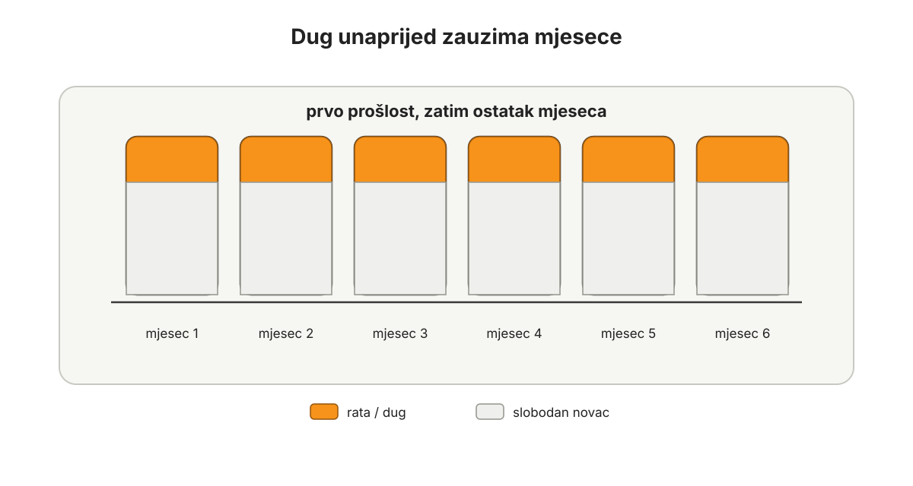

# Dug

Dug je budući novac koji ste već potrošili.

Ta rečenica mora ostati neugodna. Ako postane previše ugodna, dug se opet počne skrivati iza ljepših riječi: kredit, rata, leasing, minus, limit, financiranje, poluga, stambeno rješenje, poslovna likvidnost, investicija u budućnost.

Sve te riječi mogu imati svoj kontekst. Ali ispod njih stoji ista stvar: dio budućeg rada već je obećan.

Zato je dug najvažnija stvar koju treba riješiti prije ozbiljnog Bitcoin standarda.

Ne nakon što se skupi više Bitcoina.

Ne paralelno s agresivnom akumulacijom.

Ne kad jednog dana plaća naraste.

Prvo.

To će nekome zvučati radikalno, osobito ako se radi o stambenom kreditu. Ali ova knjiga ne pokušava učiniti dug ugodnim samo zato što je društveno normalan. Ako je cilj živjeti s Bitcoinom kao novcem, onda budućnost ne smije biti unaprijed prodana banci, kartici, leasing kući, dobavljaču, državi, rodbini ili poslovnoj kreditnoj liniji.

Proračun je prvi korak jer pokazuje što sadašnji novac mora napraviti.

Dug je drugi korak jer pokazuje koliko budućeg novca više nije slobodno.

Proračun u ovoj knjizi znači da sav novac ima namjenu prije transakcije. Nula eura ostaje bez imena. Ako novac ide u jednu kategoriju, ne ide u drugu. Zato proračun nije samo evidencija troškova, nego alat za gledanje oportunitetnog troška.

Proračun vas uči vremenu. Što dulje vodite proračun, to bolje vidite povijest vlastitog novca i lakše planirate budućnost. Dug taj proces prekida. Dio novca koji tek dolazi već je vezan za staru odluku. Novac ne može mirno stariti jer ga prošlost stalno povlači natrag.

Dok god dug stoji na bilanci, puni Bitcoin standard ne počinje.

Bitcoin i dug ne idu zajedno.

Ako imate Bitcoin i dug, taj Bitcoin ulazi u plan zatvaranja duga. To nekome može zvučati kao izdaja Bitcoina, ali nije. Bitcoin kao novac ne služi tome da čovjek pored njega zadrži staru obvezu i nazove se dugoročnim. Ako Bitcoin može pomoći da budući novac ponovno pripada vama, onda je poslužio slobodi.

Prvo čista bilanca.

Zatim davanje.

Zatim ravnoteža imovine.

Zatim Bitcoin kao glavni novac u toj ravnoteži.

Ako vam treba samo prvi potez za danas, ne čekajte savršen plan. Zaustavite novi dug. Izvadite karticu iz novčanika i mobitela ako krpa mjesec. Popišite sve dugove na jedno mjesto. Popišite i imovinu koja može zatvoriti dug, uključujući Bitcoin. To nije cijela strategija, ali je izlaz iz magle.

## Zašto dug mora izaći prvi

Bitcoin traži strpljenje. Dug traži uplatu.

Bitcoin traži dug horizont. Dug ga skraćuje.

Bitcoin traži miran višak. Dug često proizvodi privid viška.

Bitcoin traži da možete čekati kada cijena padne i ne poludjeti kada cijena raste. Dug vas tjera da svaki mjesec prvo platite prošlost, bez obzira na tržište, zdravlje, posao, djecu, kvar auta ili kašnjenje klijenta.

Zato dug nije samo financijski trošak. Dug je stanje.

Temeljni problem duga je psihološko stanje u kojem čovjek živi dok je u dugu.

Dug proizvodi nemir i nejasnoću jer smo današnju stvar platili budućim novcem. Vrednovali smo nešto sadašnje novcem koji još nemamo. Ne znamo koliko ćemo ga imati. Ne znamo pod kojim uvjetima ćemo ga zaraditi. Ne znamo hoćemo li u toj budućnosti biti zdravi, zaposleni, sposobni, prisutni, u istoj državi, u istom poslu ili u istoj obitelji.

To je vremenska konfuzija.

Stvar je sadašnja.

Novac je budući.

Odluka je donesena danas, ali posljedica sjedi u mjesecima i godinama koji još nisu došli.

Zato dug oduzima slobodu. Stara rečenica da je dužnik rob vjerovnika ne mora se prvo čitati politički ni pravno. Dovoljno ju je pročitati psihološki. Čovjek pod dugom nema isti unutarnji položaj kao slobodan čovjek. Dio njegove budućnosti već ima vlasnika.

*Dug nije samo broj u sadašnjosti. On unaprijed zauzima buduće mjesece.*

Dok ste u dugu, dio života se događa pod pritiskom koji možda više ni ne primjećujete. Rata je u kalendaru. Kartica je u novčaniku. Minus je na računu. Leasing je u cijeni auta. Stambeni kredit je u pozadini svakog većeg razgovora, čak i kada ga nitko ne spominje.

Čovjek se navikne.

To je najopasniji dio.

Velik dug ponekad brže probudi čovjeka nego mali dug. Ako imate imovinu 100, a dug 80, voda je visoko. Teško je glumiti da se ništa ne događa. Jasno je da se morate izvući. Takav dug može biti dubok, neugodan i opasan, ali često čovjeku pokaže stvarnost bez puno objašnjavanja.

Suptilniji problem je dug koji izgleda podnošljivo.

Imovina 100, dug 20.

Rata nije strašna.

Kredit je "normalan".

Kamata nije dramatična.

Auto služi.

Stan je lijep.

Posao ide.

I tako prođe petnaest, dvadeset ili trideset godina u stanju zaduženosti.

To je skupo na način koji se ne vidi samo u kamati. Čovjek je u tim godinama propustio prilike za veći prihod jer nije mogao mirno riskirati. Propustio je zadovoljstvo rada i štednje prije kupnje. Propustio je naučiti čekati. Propustio je kupovati stvari iz slobode, a ne iz buduće plaće. Propustio je davati iz čistog proračuna. Propustio je držati Bitcoin bez pozadinskog pritiska.

Nije isto deset godina štedjeti za auto i kupiti auto sada pa ga deset godina otplaćivati.

Možda je auto na kraju sličan. Ali čovjek nije isti.

Ako štedite, radite, čekate i istražujete, već u tom procesu postajete bolji kupac. Gledate alternative. Učite što vam stvarno treba. Razgovarate s ljudima. Uspoređujete rješenja. Možda na kraju kupite jeftinije jer nemate kamatu. Možda dobijete popust na gotovinu. Možda kupite bolji auto, bolji alat, bolju opremu ili bolju edukaciju jer ste imali vrijeme da odluka sazrije.

Priprema je dio vrijednosti.

Kao kod putovanja. Čovjek koji mjesecima istražuje gdje će ići, što će vidjeti, gdje će spavati i kako će provesti vrijeme, već živi dio tog putovanja prije polaska. Anticipacija nije sporedna. Ona povećava zahvalnost. Isto vrijedi za stvari koje kupujemo iz rada, štednje i odgođene konzumacije.

Dug preskače taj proces.

Daje stvar odmah, ali oduzima put do nje.

Kamata je cijena tog preskakanja. To je cijena trošenja budućeg novca. Koliko dugo čovjek ostaje u dugu, toliko mu novac curi iz bilance. Taj novac je mogao ostati u rezervi, kasnije biti pretvoren u Bitcoin, povećati kupovnu moć ili otvoriti stvarnu priliku. Umjesto toga plaća cijenu nestrpljenja.

Dug smanjuje i kapacitet za rizik. Što je dug dublji i što dulje traje, čovjek ima manje prostora za hrabru, ali razumnu odluku. Teže mijenja posao. Teže pokreće posao. Teže ulaže u alat. Teže uči novu vještinu. Teže podnosi Bitcoin volatilnost. Teže investira tvrdi novac. Dug skraćuje čovjekov potencijal prije nego što on uopće pokuša rasti.

Dug ima dubinu i trajanje.

Dubina je veličina duga u odnosu na imovinu.

Trajanje je vrijeme provedeno u stanju duga.

Možemo razlikovati hitnost, kamatu, vjerovnika, redoslijed zatvaranja i posljedice kašnjenja. Ali ova knjiga ne uvodi trajnu kategoriju dobrog i lošeg duga. Takva podjela prečesto postane dozvola da neki dug ostane. Ovdje je pravilo jednostavnije: sav dug treba izaći iz bilance.

Ne treba podcijeniti dubinu, ali trajanje je ono što polako odgaja čovjeka. Ako predugo živite s dugom, dug prestane izgledati kao privremeni problem i postane normalna pozadina života. Tada više nije samo broj. Postaje navika.

Ova knjiga želi što prije izvaditi čovjeka iz tog stanja.

Ne urediti dug.

Ne optimizirati dug.

Ne učiniti dug ugodnijim.

Izvaditi ga van.

## Bitcoin i dug ne idu zajedno

Ovdje ne želim ostaviti rupu.

Bitcoin koji čovjek drži dok drži dug jest Bitcoin koji treba ući u plan zatvaranja duga.

Ne zato što Bitcoin nije važan.

Baš zato što jest.

Bitcoin nije značka kojom pokrivamo neurednu bilancu. Bitcoin nije dokaz da smo dugoročno dobro dok kartica, minus, leasing, stambeni kredit ili poslovna kreditna linija još drže dio budućnosti. Ako Bitcoin stoji pored duga, redoslijed je pokvaren.

Pravi Bitcoin standard ne živi jednom nogom u fiatu, a drugom u Bitcoinu. Ne možemo ozbiljno govoriti o tvrdom novcu dok istovremeno trošimo novac iz budućnosti. Koncept treba biti jednostavan: troši se novac koji već postoji u našoj bilanci. Budući novac ne troši se unaprijed.

Zato se postojeći Bitcoin ne štiti od poglavlja o dugu. Ulazi u isti papir kao auto, oprema, financijska imovina, drugi stan, apartman, poslovni višak i sve drugo što može pomoći da dug nestane.

Prodaja Bitcoina radi zatvaranja duga nije izdaja Bitcoina. To je priznanje da Bitcoin kao novac ne može stajati na vrhu zaduženog života. Ako može vratiti budućnost natrag u vaše ruke, poslužio je svojoj svrsi.

To ne znači da se Bitcoin prodaje panično, preko sumnjivih kanala, pod pritiskom poruke ili telefonskog poziva. Nitko ne smije tražiti vaše riječi za oporavak, lozinke ili pristup novčaniku da bi vam "pomogao" oko duga. Ako prodajete Bitcoin, financijsku imovinu ili nekretninu, provjerite porezne, pravne i evidencijske posljedice u stvarnom sustavu u kojem živite.

Ali nemojte koristiti tu provjeru kao izgovor da sačuvate sliku o sebi kao Bitcoineru dok dug ostaje.

Prvo dug van.

Tek nakon toga Bitcoin može postati glavni novac u čistoj bilanci.

## Dug hrani fiat standard

Dug nije samo osobna pogreška u tablici.

Kada banka odobri kredit, novi novac često nastaje u trenutku zaduženja. Ako ste podigli 100.000 eura kredita, tih 100.000 eura nije samo promijenilo vlasnika. U samoj mehanici fiat sustava novi novac nastaje kroz dug.

Pojedinačno, to izgleda malo. Čovjek kaže: što moj kredit mijenja u velikom sustavu?

Ali knjiga ne gleda samo veliki sustav. Gleda i standard u kojem čovjek sudjeluje.

Kad živimo na dug, hranimo standard u kojem se sadašnje želje financiraju budućim novcem, a kupovna moć novca polako se razvodnjava. To najteže pogađa ljude koji najmanje mogu pobjeći iz novca. Oni koji imaju malo imovine često najveći dio imovine drže baš u novcu: na računu, u gotovini, u plaći koja tek treba sjesti, u maloj rezervi koju čuvaju za kvar, bolest ili djecu.

Kada se kupovna moć tog novca topi, njih boli prvo.

Zato razduživanje nije samo privatna higijena. U ovoj knjizi ono je i moralna gesta. Odbijanje novog duga znači odbijanje sudjelovanja u navici da se budućnost troši unaprijed i da se teret takvog standarda prelijeva na ljude koji imaju najmanje prostora za obranu.

Bitcoin standard zato ne znači samo kupiti Bitcoin.

Znači prestati živjeti kao fiat čovjek.

Fiat čovjek troši budući novac.

Bitcoin čovjek najprije očisti bilancu.

## Stambeni kredit nije iznimka

Ovdje treba biti posebno jasno.

Stambeni kredit se ne izuzima iz ovog pravila.

U hrvatskom kontekstu to će mnogima zvučati najtvrđe. Dom se doživljava kao sigurnost, vlasništvo kao odraslost, najam kao privremeno stanje, a kredit kao nužna cijena "normalnog života". Razumijem zašto se tako misli. Ljudi žele mir, mjesto, djecu, susjede, školu, poznatu ulicu, osjećaj da nešto grade.

Ako živite u inozemstvu, ista tema može imati dva sloja: stan ili najam vani, a kuća, kat obiteljske kuće, zemljište ili apartman u Hrvatskoj. Tada treba još jasnije pitati je li kuća stvaran plan povratka, obiteljska obveza, investicija, nasljedstvo ili skupa rečenica kojom umirujemo nostalgiju. Veća plaća vani ne znači automatski slobodan novac ako najam, osiguranje, putovanja kući, pomoć roditeljima i gradnja u Hrvatskoj već pojedu budućnost.

Ali stambeni kredit je i dalje dug.

Ako je dom pod kreditom, dio budućnosti pripada banci. Možda je rata podnošljiva. Možda je kamata razumna. Možda je nekretnina dobra. Možda bi prodaja bila neugodna. Sve to može biti istina.

I dalje ostaje dug.

Ako treba prodati stan ili kuću, zatvoriti kredit, izaći iz zaduženosti, otići u najam i imati čistu bilancu, to nije financijski poraz. Ali to nije ni brz zaključak jedne osobe. Prodaja doma traži ozbiljan obiteljski razgovor: gdje se živi, koliko stoji najam, koliko je stabilan ugovor, što je s djecom, školom, poslom, zdravljem, roditeljima, troškovima selidbe i kapitalom koji ostaje nakon svega.

Ako vam je ta misao teška, to ne znači da ste nerazumni. Znači da dom nije samo financijska stavka.

Najam nije dokaz neuspjeha. Može biti alat slobode kada je stabilan, priuštiv i bolji od života pod dugom. Može biti i novi rizik ako je tržište najma skupo, nesigurno ili neprikladno za obitelj. Zato se ne uspoređuju samo kredit i ideja najma, nego stvarna rata, kamata, trošak prodaje, trošak najma, sigurnost stanovanja, alternativa ubrzane otplate i mir kuće. Ako nakon takve provjere prodaja i zatvaranje kredita daju čistu bilancu, stvarno davanje i više prostora za novac, tada prodaja nije pad. To je promjena stanja.

Nekretnina se može ponovno kupiti kasnije.

Ali samo iz drugog stanja.

Bez duga.

Bez žurbe.

Bez toga da nekretnina prelazi razumnu mjeru u neto imovini.

U ovoj knjizi nekretnina u kojoj živite nije novac. Ona je osobna uporabna imovina: služi životu, obitelji, stabilnosti i mjestu. Može biti lijepa, korisna, obiteljski važna i emocionalno vrijedna. Ali ne smije pojesti bilancu. Ako se nekretnina kupuje kasnije, neka bude u okviru u kojem imovina koja služi životu ne preuzima cijeli život. Disciplina trećina čuva da dom, auto, apartman ili status ne progutaju novac, davanje, proizvodnu imovinu i Bitcoin.

Dom treba služiti životu.

Dom ne treba prezirati da bismo priznali da dug na domu nije sloboda.

## Davanje ne raste na dugu

Još jedan razlog zašto dug mora izaći prije ozbiljnog Bitcoina jest davanje.

Dok dug postoji, ova knjiga ne uvodi praksu sustavnog davanja.

Čovjek može pomoći konkretnoj osobi kao što je i dosad pomagao: prema savjesti, stvarnoj potrebi i trenutku. Može donijeti hranu, pomoći roditelju, dati vrijeme, učiniti uslugu ili nekome diskretno pomoći novcem. Ali to nije treći korak ove knjige.

Kad ova knjiga kasnije kaže Davanje, misli na novac. Volontiranje, vrijeme i usluga mogu biti dobri, ali nisu ova kategorija. Ovdje govorimo o novcu koji ima ime u proračunu i stvarnu namjenu prije nego što se potroši.

Treći korak počinje tek nakon nula duga na bilanci.

Davanje ne raste na dugu. Davanje raste iz slobodnog proračuna.

Nakon proračuna i razduživanja treba uspostaviti kategoriju Davanje. Ne kao ukras i ne kao slučajni ostatak, nego kao stvarnu kategoriju. U osobnom Bitcoin standardu davanje nije dodatak za bogate. To je praksa koja mijenja čovjeka.

Kad čovjek izađe iz duga i počne u proračunu držati kategoriju Davanje od 10 do 20 posto ukupnog novca kojim raspolaže, događa se velika promjena. Novac više nije samo obrana. Nije samo štednja. Nije samo Bitcoin. Dio novca aktivno ide prema drugima.

To nije 10 do 20 posto plaće.

Nije 10 do 20 posto viška.

Nije iznos koji je emocionalno ugodan.

To je 10 do 20 posto novca kojim čovjek raspolaže, nakon što je izašao iz duga.

To mijenja način rada.

Čovjek koji daje počinje drukčije gledati prihod. Lakše vidi da novac dolazi kroz stvaranje vrijednosti za ljude. Lakše preuzima razborit rizik. Lakše radi, prodaje, uči i služi jer novac nije samo nešto što mora zadržati. Dio mora proći kroz njega.

U slobodnoj razmjeni veći prihod nije sramota ako je nastao stvaranjem veće vrijednosti za druge ljude. Zato davanje nije iskupljenje za zarađivanje. Ono trenira čovjeka da bolje vidi potrebe, odnose, kupce, klijente, obitelj i zajednicu. Ne jamči automatski veći prihod, ali povećava kapacitet iz kojeg veći prihod može nastati.

Zato je dug problem i za prihod.

Dug zatvara čovjeka. Davanje ga otvara.

Ako želite da Bitcoin ne stvori tvrdu osobu, prvo treba maknuti dug, zatim otvoriti davanje. Tek tada ozbiljan Bitcoin saldo ima gdje zdravo stajati.

## Redoslijed je stroži nego što ljudi žele

Redoslijed ove knjige nije slučajan:

1. Proračun.
2. Dug van.
3. Davanje.
4. Ravnoteža imovine.
5. Bitcoin kroz vrijeme.
6. Skrbništvo i sigurnost.
7. Puni Bitcoin standard.

Proračun ide prvi jer bez njega ne znate što novac radi.

Dug ide odmah zatim jer budućnost mora prestati pripadati prošlim odlukama.

Davanje dolazi nakon razduživanja jer otvorena ruka treba slobodan proračun.

Ravnoteža imovine dolazi zatim jer čista bilanca mora dobiti oblik: novac, imovina koja služi životu i proizvodna imovina.

Bitcoin kroz vrijeme dolazi tek kada čovjek može gledati volatilnost bez toga da ga rata prisiljava na lošu odluku.

Skrbništvo i sigurnost dolaze prije punog standarda jer veći Bitcoin saldo traži ozbiljan sigurnosni sustav.

Tek tada dolazi puni Bitcoin standard: najmanje trećina neto imovine u novcu, a taj novac dominantno u Bitcoinu.

Trećina u novcu nije ukrasna brojka. Ova knjiga polazi od toga da novac mora ponovno postati ozbiljna kategorija imovine. Na fiat standardu ljudi često bježe iz novca jer novac gubi kupovnu moć. Jedni zato "štede" u nekretnini u kojoj žive, pa im potrošna imovina proguta bilancu. Drugi bježe u proizvodnu ili financijsku imovinu, pa im kapitalna imovina traži vrijeme, pažnju, likvidnost i upravljanje.

Bitcoin standard ide u drugom smjeru. Novac ponovno raste u važnosti. Zato ova knjiga želi najmanje trećinu neto imovine u novcu, najviše trećinu u imovini koja služi životu i najviše trećinu u proizvodnoj imovini. Dom, auto, apartman, posao, alati i ulaganja imaju svoje mjesto. Ali nijedna od tih stvari ne smije preuzeti ulogu novca.

Novac koji treba platiti poznate obveze u sljedećih nekoliko godina ne smije automatski ovisiti o cijeni Bitcoina. Uvjerenje nije isto što i sposobnost da se izdrži volatilnost, pogotovo kada su u pitanju djeca, zdravlje, posao, mirovina ili plan povratka u Hrvatsku.

Ako preskočite dug, preskočili ste temelj.

## Prvi potezi

Prvo zatvorite ulaz u novi dug.

Ako kartica krpa mjesec, izvadite je iz novčanika i uklonite iz aplikacija za plaćanje. To uključuje Apple Pay, Google Pay, internetske trgovine, aplikacije za dostavu, preglednik i pretplate koje se naplaćuju bez razmišljanja. Ako minus stoji na računu, prestanite ga gledati kao novac. Ako rata zvuči kao normalan način kupnje, vratite se u proračun i pitajte iz koje kategorije stvar mora biti plaćena.

Zatim popišite svaki dug. Za svaki dug zapišite preostali iznos, ratu, kamatu, rok, vjerovnika i posljedice kašnjenja. U isti popis ulaze kartice, minus, leasing, potrošački krediti, stambeni kredit, privatne posudbe, poslovne kreditne linije, dugovi prema dobavljačima, porezne obveze, mobitel na rate, "kupi sada, plati kasnije" obveze, rate za opremu i edukacije te dugovi ili računi u drugoj državi ako živite između dva sustava.

Ako vodite posao, osobne dugove i poslovne obveze stavite u odvojene popise. Poslovni račun nije obiteljska rezerva, a obiteljski Bitcoin nije kreditna linija firme. Dok postoji dug, kupnja Bitcoina iz poslovnog ili osobnog novca ne rješava problem. Prvo moraju biti odvojeni PDV, doprinosi, plaće, dobavljači, najam prostora, porez i operativna rezerva. Zatim se gleda kako dug izlazi iz bilance.

Nakon toga popišite imovinu koja se može prodati. Auto, drugi auto, oprema koja stoji, apartman, višak stvari, financijska imovina, Bitcoin koji držite, pa i nekretnina pod kreditom. Prvi scenarij treba biti ozbiljno razmatranje neposrednog zatvaranja duga likvidacijom imovine. Tek ako to nije izvedivo, ako bi stvorilo novu ozbiljnu opasnost ili ako bi porezne, ugovorne, obiteljske ili poslovne posljedice bile veće od koristi, birajte snježnu grudu ili snježnu lavinu.

Na kraju odredite sljedeću konkretnu akciju. Ne "raditi na dugu", nego prodati određenu stvar, zatvoriti karticu, zatvoriti minus, poslati dodatnu uplatu, razgovarati s bankom ili staviti oglas danas. Velike odluke ne donose se isti dan kad se pojavio strah, pritisak ili poruka koja traži hitnost.

## Prvi posao: zatvoriti ulaz

Razduživanje počinje granicom.

Nema novog duga.

Ne kartica.

Ne minus.

Ne novi leasing za status ili komfor.

Ne potrošački kredit.

Ne "samo ovaj put".

Ne poslovni kredit za ideju koja nije prošla test stvarne žrtve, kapaciteta i naplate.

Ne stambeni kredit kao trajno stanje koje se više ne propituje.

Ako se nešto ne može kupiti iz postojećeg proračuna, ne kupuje se. Ako je stvar važna, za nju se štedi. Ako se za nju ne može štedjeti, onda vjerojatno nije dovoljno važna ili život još nije u fazi za tu kupnju. Iznimke nisu kupnje za dojam, nego zdravlje, osnovna sigurnost, nužan prijevoz za rad ili alat bez kojeg se prihod stvarno ne može stvarati.

Prvi potezi trebaju biti konkretni.

Karticu izvaditi iz novčanika ako služi za krpanje mjeseca. Ukloniti je iz aplikacija za plaćanje, dostave, internetskih trgovina i preglednika. Minus prestati zvati dostupnim novcem. Rate prestati gledati kao neutralan način kupnje. Ako se u obitelji o većim kupnjama razgovara tek kad se pojavi ponuda, promijeniti razgovor: prvo kategorija, zatim odluka.

Ne pokušava se istovremeno graditi ozbiljan Bitcoin saldo i održavati dug.

Dug mora izaći.

## Popis koji ne zaobilazi ništa

Nakon granice dolazi popis.

Zapišite sve dugove na jedno mjesto:

- minus po računu
- kreditne kartice
- potrošačke kredite
- leasing
- stambeni kredit
- privatne posudbe
- dug prema obitelji
- jamstva i sudužništva
- neplaćene račune
- poslovne kreditne linije
- dugove prema dobavljačima
- porezne obveze
- rate za mobitel, opremu, edukacije ili "kupi sada, plati kasnije"
- obveze u drugoj državi ako živite, radite ili imate imovinu između dva sustava
- sve drugo što traži budući novac

Za svaki dug zapišite preostali iznos, minimalnu mjesečnu uplatu, kamatu, rok, posljedicu kašnjenja i emocionalnu težinu.

Ako ste jamac ili sudužnik, nemojte to držati izvan popisa samo zato što rata još ne izlazi s vašeg računa. Jamstvo nije pristojna usluga bez rizika. To je mogući budući dug koji često nastane iz ljubavi, srama ili pritiska obitelji.

Emocionalna težina je važna. Dug prema sestri može biti manji od kartice, ali teže sjediti na duši. Stomatolog može biti manji od auta, ali svaki pogled na račun podsjeća na odgađanje zdravlja. Poslovni dobavljač može biti samo jedna stavka u tablici, ali ako znate čovjeka, taj dug nosi odnos.

Kad je sve na papiru, dug prestaje biti magla.

Možda boli.

Ali sada se može raditi.

## Dubina i trajanje

Svaki dug ima dvije dimenzije: dubinu i trajanje.

Dubina je koliko je dug velik u odnosu na imovinu i prihod.

Trajanje je koliko dugo čovjek ostaje u stanju duga.

Dubok dug traži hitnost. Ako dug ugrožava osnovnu stabilnost, ako imovina jedva pokriva obveze, ako jedna pogreška može srušiti kućanstvo ili posao, nema vremena za filozofiranje. Treba prodati, smanjiti, pregovarati, povećati prihod i zatvoriti što se može zatvoriti.

Ali nemojte podcijeniti plitak dug koji dugo traje.

Plitak dug je varljiv jer se s njim može živjeti. Može se putovati, kupovati, imati lijep stan, uredan auto, aplikaciju za Bitcoin i izgledati normalno. Rata ne guši. Kamata ne boli dovoljno. Obitelj se navikne.

Posebno vara mlade koji još žive s roditeljima. Ako ne plaćate puni najam, hranu, režije i pričuvu, a svejedno nemate višak, problem možda nije plaća nego sustav. Roditeljski dom tada nije slobodan novac za veći auto, izlaske, mobitel na rate i klađenje, nego prozor u kojem se dug može ubiti prije nego odrasli troškovi dođu u punoj veličini.

Baš zato je opasan.

Godine prolaze u stanju u kojem dio budućnosti uvijek pripada nekome drugome. Čovjek ne nauči u potpunosti kupiti iz ušteđenog novca. Ne nauči dovoljno jasno odgoditi želju. Ne razvije punu radost stvari koje je kupio iz slobode. Ne razvije isti odnos prema radu jer plod rada stalno prvo ide prema starim odlukama.

Vrijeme u dugu se akumulira.

Svaki mjesec u dugu nije samo mjesec u kojem je plaćena kamata. To je mjesec u kojem je budući novac već imao vlasnika prije nego što je stigao. To je mjesec u kojem je rizik teže podnijeti, davanje teže uspostaviti, prihod teže povećati, a Bitcoin teže držati mirno. Zato vrijeme provedeno u dugu nije neutralno. Ono odgađa cijeli ostatak knjige.

Ne želimo da čitatelj provede još pet, deset ili dvadeset godina u "podnošljivom" dugu.

Želimo ga izvaditi što prije.

## Prodaja nije poraz

Ako dug treba izaći brzo, prodaja mora biti normalna opcija.

Prodati auto.

Prodati drugi auto.

Prodati apartman.

Prodati opremu koja ne radi.

Prodati stvari koje čuvaju status, ali ne služe životu.

Prodati dio financijske imovine.

Neka financijska imovina ima porezne, mirovinske ili ugovorne posljedice. ETF, treći stup, depozit, poslovni udio, Bitcoin i auto nisu ista stvar. Zajedničko im je samo pitanje: služi li prodaja stvarnom izlasku iz duga ili stvara novi problem koji niste vidjeli?

Prodati nekretninu pod kreditom.

Prodati Bitcoin ako dug time može nestati ili se bitno skratiti.

To nije izdaja Bitcoina. Ako Bitcoin služi tome da zatvorite dug i dođete do čiste bilance, on je poslužio novcu bolje nego da stoji kao simbol budućnosti pored stare obveze.

Ali prodaja nije panika. Ne prodaje se dom, apartman, financijska imovina ili Bitcoin zato što vas je netko nazvao, poslao poruku, obećao brzu pomoć ili rekao da odluka mora biti donesena odmah. Ne instalirajte aplikacije po uputi nepoznate osobe, ne šaljite Bitcoin nikome tko obećava izlaz iz duga i ne dajte lozinke, riječi za oporavak ili pristup novčaniku. Razduživanje traži mir, papir i provjeru, ne hitnost.

Prodaja najviše boli kada stvar koju prodajemo čuva sliku koju imamo o sebi.

Auto nije samo auto. Ponekad je dokaz napretka.

Stan nije samo stan. Ponekad je dokaz odraslosti.

Apartman nije samo apartman. Ponekad je dokaz da smo "pametno ulagali".

Poslovna oprema nije samo oprema. Ponekad je dokaz da projekt mora uspjeti.

Ali ako ta stvar stoji između vas i čiste bilance, treba je pogledati bez romantike.

Prava sloboda nije u tome da zadržite sliku o sebi.

Prava sloboda je da budući novac ponovno pripada vama.

## Poslovni dug mora proći test žrtve

Poslovni dug često ima najbolji jezik.

Rast. Poluga. Investicija. Likvidnost. Skaliranje. Prilika.

Ponekad je taj jezik opravdan. Posao može trebati kapital. Ali prije duga treba proći test žrtve.

Biste li za isti posao radili dodatne sezone?

Biste li smanjili vlastiti komfor?

Biste li odgodili putovanja?

Biste li prodali višak imovine?

Biste li nekoliko godina skupljali kapital bez duga?

Ako ne biste, možda posao još nije vizija. Možda je želja financirana tuđim novcem.

Zatim dolazi test kapaciteta. Donosi li taj dug više naplativog rada, kraći rok izvedbe, manje kvarova, bolju maržu, sigurniju isporuku ili stvaran pristup kupcima? Novi alat od 1.800 eura koji skraćuje posao s dva dana na jedan dan nije isto što i oprema koja stoji u skladištu da vlasnik izgleda ozbiljnije. Leasing kombija koji nosi posao nije isto što i leasing auta koji nosi dojam.

Dug može platiti početak. Ne može kupiti kupce, strpljenje, prodaju, naplatu, dobar proizvod i sposobnost da se nosi loš mjesec.

Kod poduzetnika je posebno važno odvojiti osobnu i poslovnu bilancu. Poslovni dug ne smije tiho postati obiteljski pritisak. Ako tvrtka kasni s naplatom, a obitelj prodaje Bitcoin ili reže osnovne kategorije da bi posao izgledao stabilno, dug je već prešao granicu.

Tvrtka mora znati koji je novac za PDV, doprinose, plaće, dobavljače, najam prostora, gorivo, materijal i osnovni rad. Mora znati i starost potraživanja: što kasni 15 dana, što 30, što 60, što već izgleda kao problem. Ako poslovna kreditna linija stalno spašava lošu naplatu, preniske cijene, previše projekata ili vlasnikovu nedisciplinu, ona nije alat. Ona je dug s boljim rječnikom.

Posao treba stvarati vrijednost.

Ne gutati budućnost.

## Kako zatvoriti dug

Nakon popisa i prodaje, ostaje metoda.

Ako se dug može zatvoriti odmah bez stvaranja nove opasnosti, zatvorite ga.

Osnovni put nije uredno živjeti uz dug, nego što hitnije zatvoriti dug kada je to izvedivo: prodajom imovine, smanjenjem životnog stila, povećanjem prihoda i usmjeravanjem stvarnog viška prema zatvaranju obveza. Tek kada neposredno zatvaranje nije razborito ili moguće, metode otplate imaju svoje mjesto.

Ako ne može, koristite snježnu grudu ili snježnu lavinu.

Snježna gruda znači da zatvarate dugove od najmanjeg prema najvećem. Nije uvijek matematički najjeftinija, ali daje brze pobjede. Jedan dug nestane. Jedna rata nestane. Jedan odnos nestane. Oslobođena uplata zatim ide na sljedeći dug.

Snježna lavina znači da zatvarate najskuplji dug prvi. Matematički je često bolja. Kod nje treba gledati stvarnu kamatu, naknade, promjenjivu kamatu i rizik novčanog toka, ne samo naziv proizvoda. Ako ste dovoljno mirni i disciplinirani, može imati smisla.

Ovdje nema potrebe za ponosom. Plan koji ćete provesti bolji je od plana koji izgleda pametnije, ali ga napustite nakon dva mjeseca.

U oba slučaja vrijedi pravilo: svi dugovi dobivaju minimum, a sav dodatni novac ide na jedan glavni dug dok ne nestane.

Oslobođene rate ne vraćaju se u potrošnju.

One idu na sljedeći dug.

To je ritam dok dug ne izađe iz bilance.

## Mali jastuk, ne udobna rezerva

Tijekom razduživanja treba imati mali zaštitni novčani jastuk.

Ne veliku rezervu koja usporava izlazak iz skupog duga.

Ne nulu koja svaku sitnicu vraća na karticu.

Dovoljno za manji popravak, lijek, nekoliko dana hrane, osnovnu obiteljsku potrebu ili kratki zastoj u prihodu. Taj jastuk nije osjećaj bogatstva. To je zaštita od povratka u dug zbog malog udarca.

Veličina jastuka nije ista za svakoga. Samac sa stabilnom plaćom i obitelj s djecom ne nose isti rizik. Freelanceru kratki zastoj u prihodu nije iznimka, nego dio godine. Ako vam prihod varira, razduživanje se ne planira prema najboljem mjesecu. Poduzetnik treba odvojenu operativnu rezervu za plaće, porezne obveze, dobavljače i osnovni rad. Starija ili bolesna osoba treba veću sigurnosnu marginu nego mladi zaposlenik koji može lakše povećati prihod. Ako živite u inozemstvu, jastuk mora vidjeti i hitan put kući, bolest roditelja, kvar na kući u Hrvatskoj ili zastoj prihoda vani.

Nakon što dug nestane, rezerva i budući troškovi grade se ozbiljnije. Registracija auta, stomatolog, škola, Božić, servis uređaja i odjeća za djecu prestaju biti "iznenađenja" i dobivaju kategorije u proračunu.

Ali dok dug postoji, jastuk ne smije postati izgovor da dug traje godinama.

Cilj je izaći.

## Prvih 180 dana

Prvih 180 dana razduživanja treba biti sezona promjene.

U tih šest mjeseci ne pokušavate dokazati da se stari život može nastaviti bez posljedica. Pokušavate dokazati da dug može početi nestajati.

U tih 180 dana:

- proračun se vodi precizno
- novi dug je zatvoren kao opcija
- svi dugovi su zapisani
- prodaja je na stolu
- stambeni kredit nije izvan slike
- kartice, minusi i digitalni novčanici prestaju biti alati za krpanje mjeseca
- pretplate, rate i "kupi sada, plati kasnije" obveze su pregledane
- klađenje, poluga i trgovanje kao način spašavanja duga su zatvoreni kao opcija
- troškovi koji su navika režu se bez drame
- dodatni prihod se traži gdje je stvarno moguće
- kućanstvo zna koji dug se napada prvi
- veće odluke ne donose se isti dan kad se pojavi strah ili pritisak
- nova kupnja Bitcoina staje, a postojeći Bitcoin ulazi u plan zatvaranja duga

To nije kazna. Obitelj treba hranu, zdravlje, osnovnu radost i mir. Ali razduživanje ne smije biti samo ideja. Mora se vidjeti u kalendaru, proračunu, prodaji, navikama i razgovorima.

Šest mjeseci ozbiljnog rada može promijeniti stanje čovjeka više nego deset godina podnošljivog duga.

## Kad dug nestane

Kad zadnji dug nestane, posao nije gotov.

Tada počinje sljedeći redoslijed.

Prvo se davanje uspostavlja kao stvarna kategorija. Ne kao povremena gesta, ne kao dio plaće i ne kao ono što ostane, nego kao 10 do 20 posto ukupnog novca kojim raspolažete. Cilj nije glumiti savršenstvo, ali Davanje mora postati vidljiva kategorija u proračunu.

Zatim se gradi ravnoteža imovine. Novac, imovina koja služi životu i proizvodna imovina dobivaju svoje mjesto. Dom, auto, apartman za odmor i statusne stvari ne smiju progutati bilancu. Proizvodna imovina mora stvarno stvarati vrijednost. Novac mora biti dovoljno velik da čuva odluku.

Zatim Bitcoin postaje glavni novac unutar tog novčanog sloja.

Puni Bitcoin standard znači da najmanje trećina neto imovine stoji u novcu, a taj novac dominantno u Bitcoinu. Do toga se ne dolazi preko duga. Dolazi se iz čiste bilance. I tada se ne glumi da je svaki euro za sljedećih nekoliko godina spreman podnijeti svaki pad cijene.

To je drugačiji unutarnji prostor.

Čovjek bez duga, s proračunom, davanjem, ravnotežom imovine i Bitcoinom kao glavnim novcem ne gleda cijenu isto kao čovjek koji ima rate iza leđa. Pad cijene ne prijeti isto. Rast cijene ne opija isto. Potrošnja ne boli isto. Davanje ne izgleda isto. Rad ne zvuči isto.

Zato dug mora izaći prvi.

## Četiri zamišljene situacije

Ana, Matej, Marko i Ivana te Marin i Petra ne trebaju "bolje upravljati dugom". Trebaju izaći iz njega. Njihove situacije su različite, ali redoslijed je isti: proračun, razduživanje, davanje, ravnoteža, Bitcoin kroz vrijeme, sigurnost, puni standard.

### Ana: mali dug koji ne smije postati dug život

Ana živi u Rijeci i zarađuje oko 1.120 eura neto. Najam joj je 420 eura, režije oko 120, hrana i prijevoz uzmu velik dio ostatka. Ima 400 eura Bitcoina i 850 eura na kreditnoj kartici. Još 220 eura duguje stomatologu, a 140 eura sestri.

Ukupno 1.210 eura.

To nije velik dug u apsolutnom smislu. Ali za Anu je dovoljno velik da joj plaća nikad ne sjedne potpuno slobodna.

Najgore što bi Ana mogla napraviti jest reći: dug je mali, nastavit ću kupovati Bitcoin redovito, a karticu ću malo-pomalo. Tako mali dug može trajati godinama. Navika ostaje. Kartica ostaje. Osjećaj da se mjesec krpa ostaje.

Ana zato zaustavlja sve nove kupnje Bitcoina dok dug ne nestane.

Četiristo eura Bitcoina ne ostavlja kao mali znak nade. Stavlja ga na isti papir kao svu drugu imovinu. Ako joj taj Bitcoin može ubrzati izlazak iz kartice, stomatologa i duga sestri, on služi zatvaranju duga.

Prvi potez je kartica izvan novčanika i izvan mobitela.

Drugi potez je popis.

Treći potez je prodaja: Bitcoin, stari mobitel, bicikl koji stoji u hodniku, nekoliko komada opreme i odjeće. Ne zato što joj te stvari ništa ne znače, nego zato što joj budućnost mora ponovno pripadati njoj.

Zatim ide snježna gruda za ono što ostane: sestra, stomatolog, pa kartica.

Sedam mjeseci živi jednostavnije. Nema dostava. Nema "samo ovaj put" kupnji. Slobodna potrošnja je mala, ali nije nula. Jedan vikend zamjenjuje odlaskom roditeljima na Krk. Bitcoin ne kupuje dok dug ne nestane.

Kad kartica dođe na nulu, ne događa se čudo.

Ali događa se nešto važnije.

Sljedeća plaća ne mora prvo liječiti prošli mjesec.

Ana tada ne "nastavlja po starom". Gradi novčani temelj i u sljedećem koraku uvodi Davanje kao stvarnu kategoriju: 10 do 20 posto novca kojim raspolaže.

Tek tada počinje njezin drugi arc. Kroz davanje ne kupuje bolju budućnost magijom. Počinje drukčije vidjeti ljude, potrebe, kupce, kolege i prilike. Duh joj se mijenja. Postaje osoba koja bolje stvara vrijednost. Netko je primijeti, upozna ili joj otvori vrata bolje plaćenog posla.

Ali to ne počinje dok je kartica još otvorena.

Za Anu je najvažnije da mali dug ne postane dugi dug.

### Matej: roditeljski dom nije dozvola za dug

Matej ima 26 godina, radi u logistici i živi s roditeljima u predgrađu Splita. Nema najam, polog, pričuvu ni puni trošak hrane. Na papiru bi trebao imati višak.

Ali ima auto-kredit, mobitel na rate, minus od 600 eura, nekoliko pretplata i nešto novca na aplikaciji za Bitcoin. Povremeno se kladi. Povremeno kupi neki altcoin jer mu netko pošalje signal. Nisu to uvijek veliki iznosi, ali svaki mjesec pojedu mogućnost da odraste financijski.

Najgore što Matej može napraviti jest reći: živim doma, zato si mogu priuštiti malo više. Roditeljski dom nije hotelski popust za veći auto, izlaske, dostave, klađenje i trgovanje. To je privremeni prozor u kojem može ugasiti dug prije nego ga život natjera da plati puni račun odraslosti.

Prvih sedam dana ne kupuje ništa novo. Iz bankovne aplikacije izvlači zadnjih trideset dana i označuje auto, gorivo, dostave, izlaske, kladionicu, pretplate, rate, karticu, minus i kupnje kriptoimovine. Briše karticu iz mobitela. Zaustavlja klađenje, polugu, nove kupnje altcoina i nove kupnje Bitcoina. Ono što već ima u Bitcoinu ulazi u isti popis imovine kao sve drugo što može pomoći da minus i rate nestanu.

Prvi dug koji napada je minus. Nakon toga mobitel na rate. Nakon toga auto mora proći pitanje: služi li poslu i životu ili samo slici koju želi imati o sebi?

Ako živi s roditeljima i svejedno nema višak, problem možda nije plaća nego sustav.

### Marko i Ivana: stambeni kredit nije sveta iznimka

Marko i Ivana žive u okolici Zagreba. Imaju dvoje djece, stambeni kredit, auto na kredit, karticu, potrošački kredit za namještaj i oko 3.500 eura Bitcoina. Zajedno zarađuju oko 2.930 eura neto.

Proračun im je već pokazao da problem nije samo "sve je skupo". Problem je da novac dolazi u kuću, ali budućnost je već djelomično zauzeta.

Na papir stavljaju sve:

Auto: 9.800 eura.

Kartica: 1.600 eura.

Namještaj: 1.200 eura.

Stambeni kredit: 112.000 eura.

Prva odluka je laka na papiru, teška u životu: prodati noviji auto. Rata, registracija, osiguranje, servis, gume i gorivo više ne smiju gutati višak. Imaju stariji auto koji može izdržati. Prodaju noviji auto, zatvaraju najveći dio duga za auto i oslobađaju ratu.

Zatim prodaju dio Bitcoina, oko 1.500 eura, i zatvaraju karticu i namještaj.

Tu Marku najviše zapne. Osjeća da prodaje budućnost. Ali Ivana ga vraća na papir: ako Bitcoin stoji pored kartice i potrošačkog kredita, onda budućnost nije čista. Nisu prodali Bitcoin jer ne vjeruju u njega. Prodali su dio jer ne žele da dug određuje njihov Bitcoin standard.

Za nekoliko mjeseci kratkoročni dugovi nestaju.

Onda dolazi najteži razgovor: stambeni kredit.

Ranije bi ga nazvali normalnim. Sada ga ne mogu preskočiti. Marko i Ivana ne staju nakon kartice, auta i potrošačkog kredita. Ako stambeni kredit ostaje, oni još nisu razduženi.

To nije Markova Bitcoin pobjeda i nije Ivanin poraz. To nije odluka koja se donosi zato što je netko našao rečenicu u knjizi. To je obiteljski proces.

Nije lagan razgovor. Djeca, škola, kvart, osjećaj doma, strah od najma, mišljenje roditelja, vlastita slika o sebi. Sve ulazi u sobu.

Ali sada imaju novo pitanje: što će nam dati veću budućnost?

Kuća pod dugom ili čista bilanca?

Kuću zato stavljaju na papir bez svetog izuzeća. Pišu stvarne brojeve: kolika je rata, kolika je kamata, koliko bi koštao najam, koliko bi ostalo nakon prodaje, koliko stoji preseljenje, što se događa sa školom, koliko im treba sigurnosne rezerve i mogu li isti cilj postići agresivnom otplatom bez prodaje doma.

Brojevi pokažu ono što su emocionalno pokušavali izbjeći: prodaja kuće može zatvoriti kredit, ostaviti ih s kapitalom i omogućiti izvediv najam.

Prodaju kuću.

Nije jednostavno. Nitko ne kaže da je jednostavno. Ali prodaja nije pad statusa ako zatvara stanje dužnika. Odlaze u najam ne zato da bi prezreli dom, nego zato da bi budući novac ponovno pripadao njima.

Nakon nula duga uvode Davanje kao 10 do 20 posto ukupnog novca. Marko kroz praksu davanja upoznaje druge ljude, bolje vidi potrebe i otvara vrata poslu koji mu prije nije bio u vidokrugu. Ne zato što je davanje čarobna formula, nego zato što se mijenja njegov kapacitet za stvaranje vrijednosti.

Tek tada ozbiljnije grade Bitcoin kao glavni novac u novčanom sloju.

To nije all-in kao bijeg od stvarnosti. To je puni Bitcoin standard u redoslijedu knjige: bez duga, s davanjem, s novcem kao ozbiljnom kategorijom i s potrošnom imovinom pod kontrolom.

Nekoliko godina kasnije mogu ponovno kupiti kuću. Ali tada kupuju iz čiste bilance, a ne iz potrebe da budu "normalni". Kuća, auto i potrošna dobra zajedno ne smiju preuzeti više od razumne trećine njihove neto imovine.

Kad to shvate, Bitcoin prestaje biti Markova tema protiv obiteljskog mira.

Postaje dio sustava koji počinje tek nakon što dug ode.

### Marin i Petra: bogatstvo koje je još uvijek bilo zaduženo

Marin i Petra žive u Splitu. Marin vodi tvrtku s klijentima iz inozemstva. Petra radi kao arhitektica. Imaju stan, apartman, poslovni automobil, ulaganja, značajnu Bitcoin poziciju i djecu koja ulaze u skuplje životne faze.

Izvana izgledaju snažno.

Na papiru imaju imovinu.

Ali kada sve stave na jedno mjesto, vide više od 300.000 eura dugoročnih i poslovnih obveza: poslovna kreditna linija, leasing za automobil, kredit vezan uz apartman, obveze prema dobavljačima, stambeni dug i nekoliko projekata u kojima naplata kasni. U tablici potraživanja stoji 38.000 eura starijih od četrdeset pet dana.

Marin i Petra nisu siromašni.

Ali nisu ni slobodni dok imovina stoji pokraj 300.000 eura obveza.

Marin svaki dug može objasniti.

Petra više ne pita može li se objasniti. Pita mora li ostati.

Njihov problem nije manjak imovine, nego zadužena imovina. Zato prvi kanonski potez nije bolja optimizacija kredita, nego likvidacija dijela imovine radi nula duga.

Prvo zatvaraju poslovnu kreditnu liniju. Marin je zvao alatom, ali alat koji stalno spašava kašnjenje naplate nije alat. To je navika. Uvode strože rokove naplate, zaustavljaju projekt koji troši previše radnog kapitala, zovu klijente koji kasne i prodaju opremu koja stoji.

Zatim gledaju apartman.

Na papiru je investicija. U stvarnosti je dug, sezona, čišćenje, platforme, održavanje, poruke gostiju, porez, popravci, Petrina pažnja i stalna mala briga. Prije odluke računaju bruto prihod, prazne mjesece, porez, popravke, amortizaciju namještaja i vlastito vrijeme. Tek tada vide da apartman ne nosi onoliko slobode koliko su mu pripisivali. Prodaju ga i zatvaraju dio obveza.

Zatim gledaju poslovni automobil. Ako je stvarno potreban i stvara prihod, ostaje. Ako je djelomično status, ide. Računaju koliko donosi, koliko štedi, koliko košta stajanje i što se događa ako ga nema. Nema više skrivanja iza poslovnog jezika.

Financijska imovina i Bitcoin također ulaze u istu provjeru. Nema posebnog mentalnog sefa u kojem Bitcoin stoji čist, dok su obveze u drugom dijelu papira. Ako im dio Bitcoina ili financijske imovine može brže vratiti čistu bilancu, to se mora ozbiljno razmotriti.

Prodaja imovine radi čiste bilance nije pad statusa. To je povratak u slobodu.

Na kraju gledaju i privatni dom pod dugom. I on ulazi u istu raspravu. Ne zato što dom nije važan, nego zato što čist život bez duga postaje važniji od slike stabilnosti koja se održava obvezama.

Marin i Petra pritom ne postaju manje ambiciozni.

Postaju stroži.

Nakon što se razduže, davanje dobiva ozbiljan fond. Ne više povremeno i impulzivno, nego planirano. Dio ide ljudima u stvarnoj potrebi, dio edukaciji, dio mladima koji žele naučiti raditi, stvarati i razumjeti novac.

Tada grade ravnotežu imovine. Dio u novcu, dominantno Bitcoinu. Imovina koja služi životu pod kontrolom. Proizvodna imovina samo tamo gdje stvarno stvara vrijednost.

Marin prvi put osjeća da ne mora svaku priliku pretvoriti u projekt.

Petra prvi put osjeća da imovina nije samo velika brojka, nego mirniji sustav.

Bitcoin im više nije protuteža kaosu.

Postaje glavni novac u čistijoj bilanci.

## Dvije budućnosti

Ovo poglavlje traži teške poteze.

Prodati auto nije lako.

Prodati Bitcoin nije lako.

Prodati kuću nije lako.

Preseliti se u najam nije lako.

Reći poslu da više ne može živjeti na kreditnoj liniji nije lako.

Zato ovu odluku ne treba gledati samo kroz sljedećih mjesec dana. Treba je staviti na papir u vremenu.

Kako izgleda vaš život za pet godina ako sada stvarno izađete iz duga?

Kako izgleda za deset?

Kako izgleda za petnaest?

Kako izgleda za dvadeset?

I onda drugo pitanje.

Kako izgleda vaš život za pet, deset, petnaest i dvadeset godina ako dug ostane "podnošljiv"?

Kratkoročno, izlazak iz duga može izgledati kao gubitak: manji auto, prodana imovina, najam, manje komfora, manje statusa, manje priče o tome kako sve ide prema planu.

Dugoročno, isti potez može biti početak slobode: čista bilanca, davanje, ravnoteža imovine, Bitcoin kao glavni novac, veći kapacitet za rizik, bolji posao, bolja sposobnost stvaranja vrijednosti i manje života koji pripada starim odlukama.

Ova knjiga ne obećava da će kratki rok biti udoban.

Kaže da treba pogledati dugu liniju.

## Zaključak

Dug ne treba uljepšavati.

Treba ga zatvoriti.

Proračun pokazuje sadašnji novac. Dug pokazuje budućnost koja je već obećana. Dok god je ta budućnost obećana, ozbiljan Bitcoin standard ne počinje.

Bitcoin ne stoji pored duga kao znak da je budućnost ipak sigurna. Ako postoji dug, Bitcoin ulazi u plan zatvaranja duga. Ozbiljno držanje Bitcoina dolazi nakon duga, ne prije njega.

Stambeni kredit nije iznimka.

Poslovni dug nije iznimka.

Mali dug nije bezopasan ako traje godinama.

Cilj nije provesti život u podnošljivom dugu. Cilj je što prije izaći iz stanja duga, uspostaviti davanje, složiti ravnotežu imovine i tek tada graditi puni Bitcoin standard: najmanje trećina neto imovine u novcu, dominantno u Bitcoinu, uz dom, posao, auto, apartman i druge oblike imovine koji ne preuzimaju cijeli život.

Ovo poglavlje ne može znati vašu kamatu, ugovor, porezni položaj, zdravlje, obitelj, rezidentnost, posao i stvarno tržište najma. Ono zato ne donosi odluku umjesto vas. Ono odbija jednu opasnu iznimku: da dug nazovete normalnim i nastavite graditi budućnost na novcu koji već pripada prošlim odlukama.

To je strogo.

Ali strogost ovdje nije protiv čovjeka.

Strogost je protiv nereda koji bi mu ukrao desetljeća.

## Kada je ovo poglavlje provedeno?

Ovo poglavlje je provedeno kada dug više nije normalno stanje života.

- Nema novog duga.
- Svi dugovi su popisani na jednom mjestu.
- Jamstva, sudužništva, digitalne rate i obveze u drugim državama nisu ostale izvan popisa.
- Likvidacija imovine je prvo ozbiljno razmotrena.
- Velika prodaja imovine ima obiteljski, porezni, pravni i sigurnosni filter.
- Dug je zatvoren ili postoji najagresivniji izvediv plan zatvaranja.
- Snježna gruda ili snježna lavina koriste se samo kao rezervni postupci kada neposredno zatvaranje nije izvedivo.
- Bitcoin se ne koristi kao izgovor za ostanak u dugu.
- Nova kupnja Bitcoina staje dok dug postoji, a postojeći Bitcoin ulazi u plan zatvaranja duga.
- Stambeni kredit nije mentalno izuzet iz kategorije duga.

## Ne idite dalje ako…

Ne idite dalje ako dug još smatrate normalnim stanjem.

Ne idite dalje ako gradite ozbiljnu Bitcoin poziciju dok dug stoji na bilanci, ako zadržavate imovinu iz sentimentalnosti dok vas dug drži u mjesečnoj obvezi ili ako snježnu grudu i lavinu koristite da dug postane ugodniji, umjesto da nestane što prije.

Ne idite dalje ni ako ste stambeni kredit proglasili iznimkom samo zato što ga društvo zove normalnim. Ne idite dalje ako vas netko nagovara da prodate imovinu, dignete kredit, pošaljete Bitcoin ili donesete veliku odluku odmah.

Ovdje se dug ne uređuje da bi duže trajao. Ovdje se uklanja. Ali uklanja se redom, uz obiteljsku istinu, sigurnosnu marginu i provjeru stvarnih posljedica.

Cilj nije upravljati dugom. Cilj je izaći iz stanja duga.
