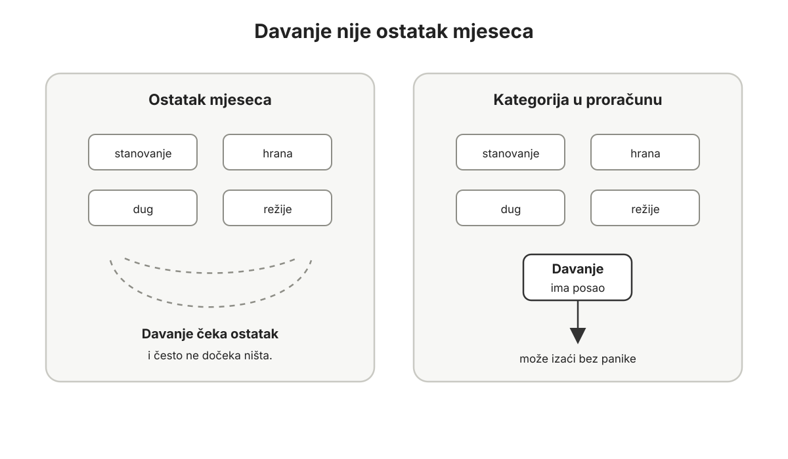
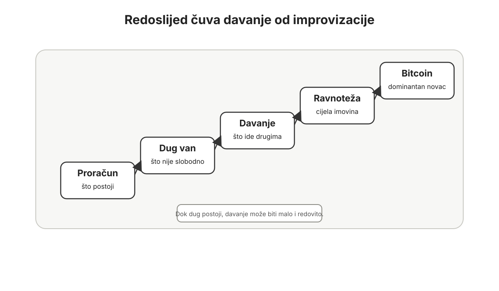
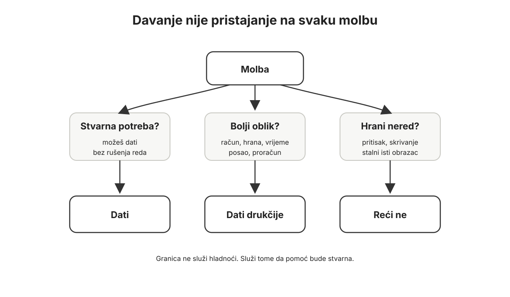
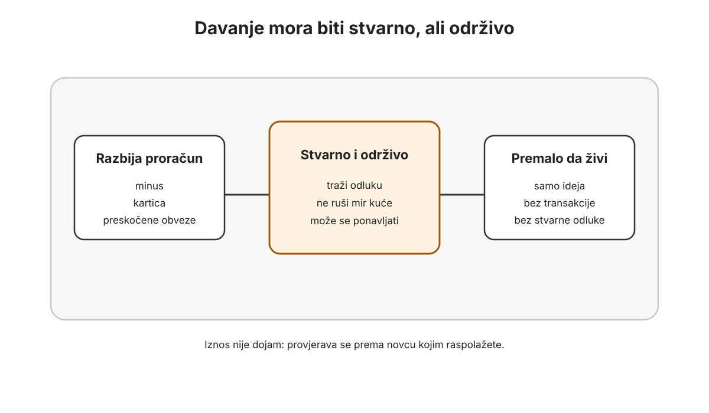

# Davanje

Davanje nije ono što ostane na kraju mjeseca.

Ako davanje čeka kraj mjeseca, najčešće neće dočekati ništa. Stanarina neće čekati. Hrana neće čekati. Dug neće čekati. Auto, škola, režije, rođendani, stomatolog i registracija neće čekati.

Ako živite s roditeljima, možda nemate stanarinu, ali imate drugu opasnost: višak koji može postati rezerva, izlazak iz duga, Bitcoin i davanje, ili nestati na auto, izlaske, dostave, pretplate i aplikacije. Ako radite u inozemstvu, istu plaću mogu istodobno čekati najam vani, putovanja kući, pomoć roditeljima i troškovi u Hrvatskoj.

Sve što nema kategoriju mora se boriti za ostatke.

Zato davanje mora postati kategorija.

*Davanje koje čeka ostatak mjeseca često ne dočeka ništa. Kategorija mu daje posao prije nego što novac nestane u drugim zahtjevima.*

Ne zato da bi čovjek izgledao velikodušno. Ne zato da bi kupio mir. Ne zato da bi pokazao da je bolji od drugih. Nego zato da novac ne završi uvijek u istom krugu: ja, moja sigurnost, moja imovina, moj Bitcoin, moja budućnost.

Nakon proračuna i duga dolazi davanje.

Proračun pokazuje novac koji sada postoji.

Dug pokazuje budući novac koji više nije slobodan.

Davanje ne znači da je novac prljav dok se ne podijeli. Pošteno zarađen novac ne treba iskupljenje. Ako vam je netko platio jer ste mu riješili problem, držali rok, preuzeli rizik ili olakšali posao, taj novac već nosi trag rada, koristi i povjerenja.

Ali novac se ne smije zatvoriti samo u obranu i akumulaciju. Loše zarađen novac donacija ne popravlja. Pošteno zarađen novac donacija ne pere. Davanje je jedan od načina da novac ne ostane samo u krugu: moje, moje, moje.

Bitcoin sam po sebi ne stvara velikodušnost. Bolji novac ne zamjenjuje karakter; samo povećava važnost karaktera. Ako loš novac ljude tjera u žurbu, dobar novac može ih iskušati na drugoj strani: da previše čuvaju, previše računaju i sve teže puste i mali iznos prema drugome. Ako svaki mjesec znate koliko ste sats-a kupili, ali ne znate koliko je otišlo na impulse, dostave, pretplate i ljude kojima ste mogli pomoći, to još nije Bitcoin standard. To je selektivna disciplina.

Davanje zato nije ukras. Ono štiti od toga da osobni Bitcoin standard postane dobro organiziran strah. Ujedno trenira pogled: čovjek koji redovito daje počinje bolje vidjeti stvarne potrebe ljudi, a tko bolje vidi potrebe, bolje razumije kako služiti, raditi i stvarati vrijednost.

## Zašto davanje dolazi treće

Davanje dolazi nakon proračuna jer bez proračuna ne znate iz čega dajete.

Ako ne znate što novac mora napraviti, lako ćete dati novac koji pripada stanarini, hrani, porezu, registraciji auta ili dugu. To nije zdrava velikodušnost. To je nered koji se lijepo osjeća nekoliko minuta, a kasnije se vrati kao pritisak.

Ako proračun postoji samo u glavi, i davanje će najčešće postojati samo u glavi.

Davanje dolazi nakon duga jer novac pod dugom nije potpuno slobodan.

Dok dug stoji na bilanci, ozbiljno davanje još nema puni prostor. Može postojati mali, simboličan iznos koji čuva naviku i pogled prema van. To je posebno važno kod ljudi koji imaju dug, bolesnog roditelja, promjenjiv prihod ili dugi stambeni kredit, ali svejedno ne žele da im srce čeka savršene uvjete. Puni oblik davanja dolazi tek kada dug više ne vodi kuću.

Ovdje se prije svega misli na dug koji guta mjesečni mir: kartice, minus, potrošački kredit, dospjele obveze, auto koji jede slobodu i dug koji se skriva iza normalnog života. Dugoročni stambeni kredit ili poslovni leasing traže oprezniji ritam, ne nužno nula davanja dvadeset godina. Ali i takav dug mora biti imenovan. Kod stambenog ili poslovnog duga pitanje nije samo postoji li dug, nego kolika je kamata, koliko je stabilan prihod, postoji li rezerva i može li se obveza nositi i kada mjesec podbaci.

Ne treba glumiti velikodušnost s novcem koji je već obećan banci, kartici, leasingu, rodbini, dobavljaču, porezu, plaćama, doprinosima ili poslovnoj kreditnoj liniji.

To ne umanjuje davanje. Upravo suprotno.

Davanje treba uređenu podlogu da bi postalo praksa, a ne improvizacija.

Zato redoslijed ostaje strog:

- proračun
- dug van
- davanje
- ravnoteža imovine
- Bitcoin kao dominantan novac u toj ravnoteži

*Davanje ne dolazi kao ukras nakon svega, ali ni prije reda u novcu. Dok dug postoji, može biti malo i redovito.*

Strog redoslijed ne znači krutost prema stvarnom životu. U sezoni bolesti, rodiljnog dopusta, gubitka posla, skrbi za roditelje, slabije sezone ili kvara auta cilj je sačuvati smjer, a ne glumiti tempo koji obitelj ne može nositi.

Kada dug nestane, u proračunu se otvara prostor koji ne smije sav otići u potrošnju, rezervu i Bitcoin. Dio oslobođenog novca treba odmah dobiti drugu namjenu. Nekome će prije rasta davanja trebati jača rezerva, popravak auta, terapija, osiguranje, manji stambeni rizik, oprema za posao ili mirovinska štednja. Dio će možda otići i u alat, znanje, zdravlje, posao, reputaciju ili odnose koji vam pomažu bolje služiti drugima. To nije zamjena za davanje, nego susjedna disciplina: ulaganje u sposobnost da kasnije stvarate više vrijednosti za druge. Kategorija Davanje tada prestaje biti dobra namjera i postaje stvarni tok vrijednosti prema drugima.

U ovoj knjizi jedan mogući dugoročni cilj nakon izlaska iz potrošačkog duga jest 10-20% slobodnog dijela proračuna. To nije 10-20% cijele plaće. Slobodni dio nije novac koji samo trenutno stoji na računu, nego novac koji ostaje nakon obveznih troškova, poreza, osnovne obiteljske sigurnosti, kratkoročnih obveza, godišnjih troškova, zdravlja, rezerve i troškova koji se već vide na horizontu. Ako nakon svega toga ostane 500 eura, cilj od 10-20% znači 50-100 eura, a ne postotak ukupne plaće.

To nije univerzalna alokacija, individualni financijski savjet, mjera vrijednosti čovjeka ni zapovijed za svaku sezonu života. Netko će početi s manje i rasti sporije. Ako vam nakon stvarnih obveza ostaje 50 eura, pitanje nije možete li davati kao obitelj s dvije visoke plaće, nego možete li taj mali višak rasporediti bez magle: dio rezerva, dio dug, dio Bitcoin, možda 2, 5 ili 10 eura davanja. Kod promjenjivih prihoda cilj se ne postavlja prema najboljem mjesecu, nego prema prosjeku i oprezu. Kod mirovine ili pred mirovinu davanje ne smije dirati lijekove, režije, hranu, pričuvu, hitne popravke i osnovni mir.

Ali cilj mora biti dovoljno jasan da davanje ne ostane mali ostatak koji se nikada ne pomakne. Ako osobni Bitcoin standard želi ozbiljan dio neto imovine držati u novcu, i to dominantno u Bitcoinu, mora imati i ozbiljnu kategoriju koja novac šalje izvan vlastitog sustava. Možete li osobi s kojom dijelite život mirno objasniti zašto povećavate Bitcoin poziciju ako istodobno nemate dogovorenu kategoriju za obitelj, dug, rezervu i davanje?

Bez toga ravnoteža imovine može postati samo elegantniji oblik zatvorenosti.

Prvi korak zato ne mora biti velik. Otvorite kategoriju Davanje. Stavite iznos koji ne ruši kuću. Neka iz nje u ovom mjesecu izađe jedan konkretan čin. Tek zatim pitajte treba li iznos rasti.

## Kategorija, ne raspoloženje

Davanje koje ovisi o raspoloženju bit će neujednačeno.

Neki mjesec dat ćete puno jer vas je nešto pogodilo. Drugi mjesec nećete dati ništa jer ste umorni, cijena Bitcoina je pala, došao je veći račun ili se niste sjetili. Treći mjesec dat ćete iz krivnje, a četvrti iz pritiska. Tako davanje ostaje reakcija.

Kategorija mijenja stvar.

Kada u proračunu stoji "Davanje: 10 eura", "Davanje: 20 eura" ili "Davanje: 100 eura", taj novac već ima posao. Broj ovisi o sezoni i proračunu. Nekome je 5 eura stvaran početak dok zatvara dug, plaća najam ili živi od promjenjivog prihoda. Nekome je 100 eura premalo za kapacitet koji već ima. Poanta nije dojmljivost iznosa, nego dokaz da novac više ne curi samo na naviku.

Taj novac ne pripada restoranu, novoj odjeći, dodatnoj kupnji Bitcoina ili nekoj nejasnoj rezervi. Ne treba svaki put prolaziti unutarnju raspravu. Može otići kada se pojavi stvarna potreba.

U praksi to izgleda vrlo obično.

Račun u trgovini za stariju susjedu.

Školski izlet za dijete čiji roditelji kasne s plaćanjem.

Knjiga za studenta.

Lijekovi za nekoga tko ih odgađa.

Anonimna uplata obitelji koja prolazi teško razdoblje.

Prijevoz na pregled nekome tko nema auto.

Vrijeme provedeno s osobom koja je sama.

Mentorstvo, preporuka, prvi alat ili posao za osobu koja želi učiti i preuzeti odgovornost.

U specifičnom Bitcoin krugu to može biti i hardverski novčanik za osobu koja već ima dovoljno Bitcoina da ga treba ozbiljnije čuvati. Ali davanje ne smije ostati zatvoreno u krugu ljudi koji već razumiju Bitcoin.

Ako pomažemo samo ljudima koji dijele naš pogled na novac, možda ne dajemo iz ljubavi nego iz identiteta.

Te stvari nisu spektakl. Upravo zato su važne. One uče čovjeka da vrijednost može otići bez pozornice, bez kupovanja utjecaja i bez potrebe da primatelj postane nečiji projekt.

Dobro je imati dva dijela kategorije. Jedan dio može biti planiran: redovita pomoć, zajednica, obrazovanje, stipendija, obitelj, župa, Caritas, crkva ako je to dio vašeg života, lokalna udruga, lokalni projekt ili netko koga ste odlučili nositi kroz dulje vrijeme. Ako svaki mjesec šaljete roditeljima ili članu obitelji određeni iznos, to treba biti imenovana kategorija, a ne svaki put nova hitna situacija. To posebno vrijedi za ljude koji rade u inozemstvu: plaća u Njemačkoj, Austriji ili Irskoj može izgledati velika rodbini u Hrvatskoj, ali slobodni dio se računa tek nakon najma, poreza, osiguranja, djece, putovanja, obveza u zemlji rada i obveza u Hrvatskoj.

Kod većih ili dugotrajnijih davanja vrijedi provjeriti stvarni učinak osobe, organizacije ili projekta kojem dajete. Ne zbog sumnjičavosti, nego zbog odgovornosti. Ako vas netko požuruje, izaziva krivnju, traži veći iznos na temelju telefonskog poziva, poruke, kućnog posjeta ili traži da pomoć ostane skrivena od vaše obitelji, stanite i provjerite s osobom od povjerenja. Dobra potreba može izdržati razumnu provjeru.

Drugi dio može biti otvoren za situacije koje se pojave tijekom mjeseca.

Ako je sve unaprijed zaključano, možete proći pored stvarne potrebe. Ako je sve potpuno otvoreno, kategorija može postati kaotična. Dobar proračun ostavlja prostor i za pravilo i za trenutak.

Davanje treba stvarne transakcije.

Nije dovoljno misliti da ste osoba koja bi dala kada bi se pojavila prava prilika. Nije dovoljno imati dobre namjere. Ako kategorija mjesecima stoji puna, a novac nikada ne izlazi, nešto nije provedeno. Možda nemate jasne smjerove. Možda čekate savršenu potrebu. Možda vam je teško pustiti novac. To treba vidjeti bez drame.

Proračun ne služi samo tome da pronađe višak. Služi i tome da pokaže kada se višak ne želi pomaknuti.

Ako ima novca za tiket, trgovanje s polugom, meme coin, treću dostavu u tjednu, novu pretplatu ili uređaj koji nije nužan, ali nikada nema ni 10 eura za kategoriju Davanje, problem nije samo mali prihod. Problem je neimenovan sustav vrijednosti.

## Granice davanja

Davanje nije isto što i pristajanje na svaku molbu.

To treba reći jasno, posebno ljudima koji teško govore ne.

Postoji davanje koje pomaže. Postoji davanje koje odgađa nečiju odgovornost. Postoji i "davanje" koje zapravo kupuje mir ili hrani strah da će vas netko odbaciti ako odbijete.

Ali prosudba mora ostati ponizna. Nisu sve potrebe plod neurednosti. Ljudi mogu biti u potrebi zbog bolesti, otkaza, smrti u obitelji, razvoda, tuđe nepravde, rata, nesreće ili okolnosti koje nisu sami birali. Granice ne služe tome da se čovjek uzdigne iznad onoga koji traži pomoć. Služe tome da pomoć bude stvarna.

Kategorija Davanje ne znači da svatko ima pravo na vaš novac.

Ona znači da ste vi unaprijed odlučili kako dio novca treba ići prema drugima. I dalje morate prosuđivati. Nekad je dobro dati bez puno pitanja. Nekad je bolje platiti račun izravno, kupiti hranu, ponuditi posao ili sjesti s osobom i pomoći joj složiti proračun. Nekad je bolje reći ne. Ne mora svako "ne" biti odbacivanje. Ponekad je poštenije reći: ne mogu dati novac, ali mogu sjesti s tobom, nazvati nekoga, odvesti te, pomoći ti složiti prvi korak.

*Molba nije automatska obveza. Dobra granica pomaže da pomoć bude stvarna, a ne samo reakcija na pritisak.*

Odbijanje loše molbe nije tvrdoća.

Ponekad je to poštenje.

Ako netko stalno traži novac, a nikada ne mijenja obrazac, možda mu vaš novac ne pomaže. Ako netko želi posudbu koju ne može vratiti, bolje je znati da je to dar ili je uopće ne dati. Nije pošteno nekoga zvati dužnikom ako oboje zapravo znate da neće moći vratiti. Ili darujte bez skrivene kontrole, ili odbijte bez lažnog zajma.

Dar ne traži povrat. Zajam traži jasan povrat. Posao traži stvarnu vrijednost. Mentorstvo traži odgovornost. Preporuka traži povjerenje. Ako nekome otvarate vrata kod klijenta, posuđujete alat ili dajete preporuku, na stol stavljate i svoje ime. Ne dajte preporuku osobi kojoj ne biste dali posao pred vlastitim kupcem.

Ako se u obitelji pomoć stalno pretvara u očekivanje, treba postaviti granicu prije nego što odnos postane gorak. Posebno ako radite u inozemstvu, granica nije sebičnost. Ona štiti da pomoć roditeljima ili rodbini ne pojede vaš proračun, brak, plan povratka i budućnost djece. Ako odraslo dijete, rođak ili poznanik stalno traži novac, a vi zbog toga preskačete lijekove, režije, hranu, pričuvu ili se bojite reći ne, to više nije davanje nego pritisak.

Davanje mora biti otvoreno, ali ne smije biti slijepo.

Kod većih iznosa to je još važnije. Što više možete dati, to više trebate pravila. Ne zbog hladnoće, nego zbog odgovornosti. Veća imovina privlači više molbi, više priča, više pritiska i više prilika. Bez pravila, drugi ljudi počnu upravljati vašom velikodušnošću. S pravilima možete biti mirniji, jasniji i trajniji.

Jedno jednostavno pravilo pomaže: davanje ne smije razbiti proračun, ali mora biti stvarno.

*Zdrava praksa nije formula za točan iznos. Ona traži sredinu između samooštećenja i davanja koje nikada ne postane stvarna odluka.*

Velikodušnost ne smije rušiti mir doma, ali ni mir doma ne smije postati izgovor da nitko izvan doma više ne postoji.

Ako vas davanje tjera u minus, karticu, preskakanje računa, diranje hrane, goriva, lijekova, dječjih obveza ili nužne rezerve, iznos je previsok za tu sezonu. Ako davanje nikada ne traži nikakvu odluku, možda je iznos premalen ili je davanje postalo administracija. Ako se nakon davanja morate zadužiti ili preskakati obveze, iznos ili način nisu zdravi. Između te dvije krajnosti nalazi se dobra praksa.

Ako ste u braku ili dijelite kućni budžet, kategorija Davanje ne smije biti tajna odluka jedne osobe. To mora biti dogovor koji oboje mogu mirno nositi.

## Davanje i Bitcoin

Bitcoin mijenja psihologiju davanja.

Kod novca koji gubi vrijednost, ljudi često troše jer ne žele držati nešto što se topi. Kod Bitcoina je iskušenje drukčije: ako novac može rasti kroz vrijeme, svako davanje može izgledati skupo. 100 eura danas nije samo 100 eura. U glavi postaje buduća kupovna moć koju ste možda mogli zadržati.

Jednostavno rečeno: isti novac ne može istodobno kupiti Bitcoin i pomoći čovjeku. To je oportunitetni trošak. Ali to ne znači da svako davanje treba preračunavati u hipotetsku buduću cijenu Bitcoina. Ako se svaka pomoć pretvori u tablicu propuštenog rasta, davanje više nije ljudska odluka nego beskrajna obrana salda.

To pitanje nije glupo.

Ali ako vas potpuno zaustavi, Bitcoin je počeo upravljati vama.

Ovo nije optužba, nego test smjera. Ako vas davanje zaustavlja zato što obitelj nema rezervu, plan ili dogovor, to nije škrtost. To je signal da prvo treba vratiti mir u sustav. Ali ako vam je lakše kupiti još 100 eura Bitcoina nego dati 20 eura bez povrata, problem možda nije u monetarnoj tezi nego u strahu.

Osobni Bitcoin standard ne smije značiti da sve osim akumulacije izgleda kao pogreška. Novac je tu da čuva vrijednost, ali i da omogući dobre odluke u vremenu u kojem živite. Ako nikada ne možete dati jer bi taj novac možda vrijedio više za deset godina, onda niste slobodni. Samo ste zamijenili jedan pritisak drugim.

Bitcoin može čuvati vrijednost, ali ne stvara vrijednost umjesto čovjeka. Samo držanje Bitcoina nije zamjena za korisnost. Kupac koji se vraća, klijent kojem je posao olakšan, mladi radnik koji je naučio vještinu, susjed kojem je mjesec postao lakši, dijete koje nije osramoćeno pred razredom: tu se vidi vrijednost koju čovjek stvara ili oslobađa. Monetarna ispravnost nije moralna zrelost. Dobar novac ne može umjesto vas služiti kupcu, klijentu, obitelji, susjedu ili zajednici.

Zato treba unaprijed odlučiti kako se daje.

U prijelaznoj fazi davanje može ići iz redovnog prihoda u eurima. To je najjednostavnije dok još gradite proračun, zatvarate dug i učite sigurnost. Dok nemate rezervu, jasan proračun i obiteljski dogovor, ne improvizirajte s Bitcoinom. Dajte iz prihoda. Bitcoin dirajte tek kada je to dio unaprijed dogovorene ravnoteže, a ne emocionalna reakcija.

Kasnije, kada je bilanca čista i Bitcoin ima ozbiljno mjesto u neto imovini, dio davanja može doći i iz Bitcoina, osobito ako je kupovna moć narasla i ravnoteža imovine traži prilagodbu. Ali davanje iz Bitcoina ne smije biti jednostrana odluka tehnički jačeg člana obitelji. Prije toga oboje trebaju razumjeti iznos, pristup, porezne posljedice i što se događa ako taj Bitcoin više nije u obiteljskoj rezervi. Ako dajete iz Bitcoina, nemojte to raditi pod pritiskom ni uz pomoć nepoznate osobe. Nitko tko prima pomoć ne smije tražiti vaše riječi za oporavak, lozinke ili pristup novčaniku. Kod većih darova, prodaje Bitcoina ili prekograničnih uplata treba provjeriti porezne, pravne, bankovne i rezidentne posljedice za stvarni slučaj.

Ako Bitcoin padne, kategorija Davanje može se prilagoditi, ali ne nestaje iz života. Pad cijene može promijeniti iznos, ali ne smije izbrisati naviku. Inače davanje nije kategorija nego luksuz uzlaznog tržišta. Ako Bitcoin raste, kategorija ne ostaje zauvijek na početnom iznosu samo zato što vam je sve teže pustiti novac koji se dobro čuva. Davanje raste prema stabilnom kapacitetu, obiteljskom dogovoru i stvarnoj odgovornosti, a ne prema dnevnoj cijeni. Kategoriju ne treba mijenjati svaki put kad cijena skoči ili padne; dovoljna je mjesečna ili tromjesečna provjera prihoda, obveza, rezerve i dogovora.

Isto vrijedi za posao i sezonu. Ako sezona podbaci, dva veća klijenta kasne ili se pokvari kombi, iznos se može smanjiti. Kategorija ne mora nestati.

Bitcoin koji povećava kupovnu moć, a ne povećava sposobnost davanja, nije završio posao u čovjeku. Povećao je saldo. Nije nužno proširio život. Ali ni ova rečenica nije poziv na krivnju. Rast davanja treba pratiti stabilan kapacitet, obiteljski dogovor i stvarne potrebe, ne sram zbog većeg salda.

Ako vas dobar novac nauči samo čuvati, a ne i služiti, nije vas oslobodio.

## Prvi potezi

Otvorite kategoriju Davanje u proračunu.

Ako dug još postoji, stavite mali simbolični iznos koji ne razbija razduživanje. To može biti 2, 5, 10 ili 20 eura. Nije cilj glumiti zrelost koju proračun još ne može nositi. Cilj je da davanje ne nestane iz života dok dug izlazi. Ako vozite auto koji vam jede slobodu, nosite minus, plaćate karticu, mobitel na rate ili potrošački kredit, davanje ostaje malo i redovito dok dug izlazi. Ne glumite velikodušnost dok banka, kartica i leasing već imaju prvi red.

Nakon izlaska iz potrošačkog duga možete početi dizati kategoriju prema 10-20% slobodnog dijela proračuna, u ritmu koji vaša obitelj, zdravlje, posao i obveze mogu nositi. Ako prihod varira, odredite minimalni iznos za slab mjesec, a tek u dobrom mjesecu dodajte više. Ako ste u mirovini ili pred mirovinom, prvo čuvajte lijekove, režije, hranu, pričuvu, hitne popravke i miran mjesec. Ako poslujete, odvojite osobno davanje od poslovnog: osobno davanje ne ide iz novca firme, a poslovno davanje ide tek nakon dogovora s računovođom, uredne likvidnosti, dokumentacije, poreza, PDV-a, plaća, doprinosa, dobavljača i leasinga. Ako živite između dvije države, veće darove, prodaju Bitcoina i prekogranične uplate provjerite u državama koje su uključene.

Ako ima smisla, podijelite kategoriju na redovito davanje i otvoreni dio za potrebe koje se pojave tijekom mjeseca.

Jednom mjesečno neka iz te kategorije izađe konkretan čin: hrana, knjiga, školski izlet, edukacija, pomoć obitelji u potrebi ili nešto drugo što ne traži povrat.

Nakon toga zabilježite što se dogodilo. Je li davanje pomoglo ili je hranilo nered? Treba li idući put platiti račun, ponuditi vrijeme, znanje, preporuku, alat ili posao, postaviti uvjet ili reći ne?

Zapišite i jedno drugo pitanje: kome moj rad stvarno služi? Kome bih mogao služiti bolje zbog većeg reda u novcu? Čuvanje Bitcoina nije zamjena za koristan rad.

Ako još živite s roditeljima, dodajte i treće pitanje: sudjelujem li pošteno u kući? Hrana, režije ili dogovoreni doprinos roditeljima nisu isto što i davanje. To je dio odraslosti. Davanje dolazi tek nakon što roditeljski dom prestane biti izgovor za osobni luksuz.

## Ana: mali iznos koji nije bio mali

Ana nije počela davati zato što je imala puno novca.

Radila je administrativni posao u maloj firmi. Nije mijenjala svijet iz naslova novina, ali je svaki dan rješavala tuđe račune, rokove, pozive i sitne probleme koji nekome olakšaju posao. Njezina plaća nije bila nešto što treba opravdati. Bila je trag toga da je nekome bila korisna.

Nakon što je zatvorila karticu, dug prema sestri i račun stomatologu, njezin život nije odjednom postao lagan. Plaća je i dalje bila skromna. Najam, režije, hrana, prijevoz i zdravlje i dalje su tražili pažnju. Ali prvi put novac nije curio kroz dug.

U proračunu je otvorila kategoriju Davanje s 20 eura mjesečno.

Nakon obveznih troškova, malog punjenja rezerve i poznatih računa nije joj ostajalo mnogo. Zato tih 20 eura nije bilo 20 eura iz dojma, nego mali dio stvarnog slobodnog prostora.

Na papiru je to izgledalo malo. U njoj nije izgledalo malo. Odmah su se javila tri glasa. Jedan je govorio da 20 eura nema smisla. Drugi je govorio da će joj baš tih 20 eura zatrebati. Treći je govorio da pravi velikodušni ljudi daju više.

Proračun joj je pomogao da ne sluša nijedan od ta tri glasa predugo.

Tih 20 eura nije bilo uzeto od hrane, stanarine ili zdravlja. Imalo je svoje mjesto. Bilo je malo, ali stvarno.

Prvi mjesec kupila je namirnice starijoj susjedi u zgradi. Kruh, mlijeko, voće, deterdžent i nekoliko sitnica. Račun je bio nešto manje od 18 eura. Ana nije od toga napravila priču. Samo je rekla da je ionako išla u trgovinu.

Kad se vratila u stan, otvorila je proračun i unijela transakciju pod Davanje.

To je bio važan trenutak.

Novac nije nestao u nejasnoj potrošnji. Nije završio na kartici. Nije otišao iz grižnje savjesti. Otišao je tamo gdje je unaprijed trebao moći otići.

Sljedećih mjeseci davanje je ostalo malo. Nekad knjiga mlađoj sestrični. Nekad 10 eura za obitelj iz kvarta. Nekad kava prijateljici koja traži posao. Nekad hrana. Nekad ništa odmah, pa kategorija čeka do kraja mjeseca dok se ne pojavi konkretna potreba.

Jedan mjesec klijent njezine male dodatne honorarne suradnje kasnio je s uplatom. Morala je platiti softver koji koristi za posao i odgoditi jednu kupnju za sebe. Tada nije povećavala davanje da bi dokazala nešto o sebi. Ostavila je planirani mali iznos, provjerila hranu, najam i zdravlje, i pustila da kategorija odradi ono što može nositi. To ju je učilo da promjenjiv prihod ne traži dramatične odluke, nego minimalni ritam i oprez u dobrim mjesecima.

Ana je primijetila nešto što nije očekivala. Davanje joj nije samo otvorilo pogled prema drugima. Počela je bolje primjećivati potrebe ljudi i na poslu: kolegicu koja se gubi u rokovima, klijenta kojem treba jasnije objašnjenje, stariju osobu kojoj jedan telefonski poziv štedi puno nervoze. Smirilo je i njezinu slobodnu potrošnju. Dok nije davala, svaka kupnja za sebe imala je čudan okus. Možda je sebična. Možda bi trebala sve čuvati. Možda ne smije potrošiti ništa dok ne zaradi više.

Kada je davanje dobilo svoje mjesto, i njezina mala osobna potrošnja postala je mirnija. Znala je da novac ne ide samo njoj. Zato je mogla lakše prihvatiti i ono malo što ide njoj.

Nakon godinu dana povećala je davanje na 35 eura mjesečno. U međuvremenu je promijenila radno mjesto i dobila nešto bolju plaću. Dio povećanja otišao je u hranu, dio u rezervu, dio u Bitcoin, dio u davanje.

Nije postala bogata.

Postala je manje zarobljena osjećajem manjka.

To je dostojanstvo malog davanja. Ne pravi buku, ali mijenja držanje. Uči čovjeka zahvalnosti: ni posao, ni zdravlje, ni red, ni prilika da se pomogne drugome nisu samo osobna zasluga.

## Matej: prednost koja može nestati

Matej je imao plaću i živio je s roditeljima.

Na papiru je to značilo da ima prednost. Nije plaćao najam, nije sam nosio režije i nije imao djecu. U stvarnosti mu je novac nestajao na gorivo, izlaske, dostave, pretplate, mobitel, povremeno klađenje i male kripto aplikacije koje su svaka izgledale bezopasno.

Kad je prvi put otvorio proračun, nije krenuo od velikog plana davanja. Krenuo je od istine. Označio je auto, izlaske, dostave, pretplate, klađenje, Bitcoin i ono što roditelji stvarno plaćaju za kuću. Tek tada je otvorio tri male kategorije: odlazak od doma, dug i davanje.

U Davanje je stavio 10 eura.

To nije bio dokaz da je velikodušan. Bio je dokaz da više ne želi da sav višak nestane prije nego što dobije ime. Dio novca morao je ići prema odraslosti u kući: dogovoreni doprinos za hranu i režije. Dio prema izlasku iz malih dugova i budućem stanu. Dio prema Bitcoinu, ali ne kao zamjena za red.

Prvi čin davanja bio je jednostavan. Kupio je namirnice starijem susjedu koji je teško nosio vrećice. Nije to bila velika priča. Ali za Mateja je bila granica: ako ima novca za tiket, dostavu i još jednu aplikaciju, ima mjesta i za mali iznos koji ne služi samo njemu.

Život s roditeljima tada je prestao biti izgovor za odgođenu odraslost.

Postao je prednost koju može iskoristiti prije nego što nestane.

## Marko i Ivana: djeca su čula novi jezik

Kod Marka i Ivane davanje je u početku bilo osjetljivo.

Nakon što su zatvorili potrošačke dugove i prestali živjeti iz stalne napetosti, prvi put su imali prostor koji nije odmah pripadao prošlosti. Marko je htio brže graditi Bitcoin poziciju. Ivana je htjela jaču rezervu i mirniji obiteljski mjesec.

Ovaj put razgovor nije otišao u stari sukob. Imali su proračun pred sobom.

Tada su otvorili pitanje davanja.

Pomagali su i prije, ali usputno. Marko bi uplatio kada bi ga nešto pogodilo. Ivana bi češće pomagala u obitelji, ali to se vodilo kao hrana, pokloni ili neobjašnjeni trošak. Djeca su vidjela da roditelji ponekad pomažu, ali nisu mogla vidjeti da je to dio obiteljskog reda.

Marku nije bilo lako. Dio njega htio je sav novi prostor odmah pretvoriti u Bitcoin. Ivana nije sporila Bitcoin, ali nije htjela da svaki slobodan euro mora proći kroz Markovu buduću projekciju cijene. Dogovorili su da iznos za davanje ne uvode dok oboje ne mogu reći da ne dira rezervu, more, dječje obveze ni mir u mjesecu.

Odlučili su staviti 120 eura mjesečno u Davanje.

Nije to bio konačan cilj. Nije bilo ni 10% prihoda. Bilo je otprilike onoliko koliko su nakon obveznih troškova, rezerve i poznatih obiteljskih obveza mogli mirno nositi. Ali bilo je dovoljno stvarno da se osjeti. Dogovorili su da 70 eura ide u redoviti smjer koji su zajedno izabrali, a 50 eura ostaje otvoreno za potrebe koje se pojave.

Prva veća odluka bila je školski izlet.

U razredu njihova sina jedna obitelj nije mogla platiti cijeli iznos. Marko i Ivana nisu htjeli da se dijete izlaže. Razgovarali su s učiteljicom, platili razliku i nisu tražili da se zna. Djeci su kod kuće objasnili samo osnovno: u proračunu postoji kategorija iz koje obitelj može pomoći drugima bez toga da svaki put paničari.

Nisu time preuzeli trajnu obvezu za svaki idući slučaj. Pomogli su jednom, iz kategorije koja za to postoji, i kasnije ponovno zajedno procjenjivali.

Sin je pitao znači li to da će oni imati manje za more.

Ivana je otvorila proračun i pokazala mu dvije kategorije. More je imalo svoj novac. Davanje je imalo svoj novac. Nisu morali jedno sakriti pod drugo.

To je djeci bilo razumljivije od bilo kakve lekcije.

S vremenom se u kući pojavio novi jezik. "Za to još punimo." "To je želja, nije potreba." "Ovo ide iz davanja." "Ovo nije dobra pomoć." "Ovo možemo napraviti anonimno." Djeca nisu postala mali financijski stručnjaci, niti je to bio cilj. Ali počela su vidjeti da novac nije samo za račune, želje i Bitcoin.

Jedne večeri kći je sama predložila da dio rođendanskog novca odvoji za prijateljicu kojoj je trebala oprema za aktivnost. Iznos je bio malen. Ali Marko i Ivana su znali da djeca ne uče samo iz onoga što roditelji govore. Uče iz onoga što obiteljski proračun ponavlja.

Davanje nije riješilo sve njihove napetosti.

I dalje su imali umorne dane, rasprave oko troškova i različite osjećaje oko Bitcoina. Ali kategorija Davanje napravila je nešto važno: novac više nije bio samo borba između sigurnosti danas i Bitcoina sutra.

Postojala je i treća namjena: nekome olakšati mjesec.

## Marin i Petra: pravila prije iznosa

Marin i Petra su davali i prije nego što su uredili sustav.

Njihov problem nije bila škrtost. Problem je bio nered. Nekad su dali puno, nekad ništa. Nekad iz jasne odluke, nekad iz pritiska. Nekad su pomogli dobro. Nekad su kasnije shvatili da su samo produžili tuđu neodgovornost. Budući da su imali veću imovinu, više ljudi je pretpostavljalo da mogu pomoći.

Mogli su.

Ali "možemo" nije dovoljno dobro pravilo.

Nakon što su očistili bilancu i razdvojili osobni i poslovni novac, davanje je dobilo vlastitu strukturu. Njihov poslovni profit nije bio nešto čega su se trebali sramiti. Nastao je iz dobrih proizvoda, poštene usluge, rokova koje su držali, rizika koji su preuzeli i kupaca koji su im se vraćali jer su im vjerovali. Reputacija je bila dio njihove imovine, iako nije stajala u bilanci.

Ali profit na papiru nije isto što i novac koji je slobodan. Firma može imati dobit, a čekati 45 dana naplatu, dok PDV, plaće, doprinosi, dobavljači, leasing, porez i sezonska rezerva dolaze ranije. Zato osobno davanje nije išlo iz novca firme. Išlo je iz novca koji je stvarno isplaćen u osobni proračun.

U osobnom proračunu otvorili su veću kategoriju Davanje. U poslovnom sustavu, u dogovoru s računovođom i uz poštivanje poreznog, računovodstvenog i pravnog okvira, odvojili su poseban fond za edukaciju, lokalne projekte i pomoć mladim ljudima koji žele učiti raditi, stvarati i razumjeti novac. Znali su da donacije, sponzorstva, stipendije, poklonjeni alat, edukacije, pomoć fizičkim osobama i davanja zaposlenicima mogu imati različit tretman. To nije područje za improvizaciju.

Prije iznosa definirali su smjerove.

Prvi smjer bila je izravna pomoć ljudima u stvarnoj potrebi: liječenje, hrana, stanovanje, krizne situacije.

Drugi smjer bila je edukacija: knjige, mentorstvo, radionice, školarine, prvi alati, prva računala, pomoć studentima.

Treći smjer bilo je učenje o novcu i Bitcoinu, ali bez nagovaranja ljudi da preskoče redoslijed. Nisu htjeli platiti nečiju prvu kupnju Bitcoina dok osoba ima karticu, minus i nikakav proračun. Radije bi platili knjigu, radionicu, savjetovanje ili vrijeme da osoba prvo vidi svoj novac.

Ta pravila su ih oslobodila.

Kada bi došla molba koja se uklapala, mogli su dati brzo. Kada se nije uklapala, mogli su reći ne bez dugog objašnjavanja. Kada nisu bili sigurni, mogli su tražiti više informacija. Kategorija Davanje nije značila da se svaka priča mora financirati. Značila je da dio novca ima zadatak, a oni imaju odgovornost dobro ga usmjeriti.

Jednom ih je poznanik tražio novac za "kratkoročni most" u poslu. Marin je znao da se takvi mostovi često pretvore u stalnu rupu. Umjesto novca, ponudio je dva sata da zajedno prođu poslovni proračun i obveze. Poznanik se naljutio. Petra je kasnije rekla da je to vjerojatno bio znak da novac ne bi riješio problem.

Drugi put su platili edukaciju mladoj osobi koja je već radila, štedjela i imala jasan plan. Taj iznos nije bio najveći koji su dali, ali bio je jedan od najboljih. Nakon šest mjeseci ta osoba je dobila bolji posao. Ne zato što su Marin i Petra "spasili" nekoga, nego zato što je davanje pogodilo osobu koja je već bila spremna preuzeti odgovornost.

Treći put pomoć nije bila novac. Marin je mladoj obrtnici otvorio vrata kod prvog ozbiljnog klijenta i posudio joj alat za posao koji sama još nije mogla financirati. Preporuka je bila stvarna valuta povjerenja. Da nije bila spremna raditi dobro, preporuka bi joj samo kratko pomogla. Budući da je bila spremna, otvorila joj je idući korak.

Davanje nije značilo stvarati ljude koji ovise o njihovoj dobroti. Značilo je pomoći onima koji mogu postati samostalniji, korisniji i sposobniji služiti drugima.

Davanje je promijenilo i Marinov odnos prema poslu. Prije je gotovo svaki projekt gledao kroz prihod, maržu, rizik i vrijeme. To su i dalje važne mjere. Profit nije krađa kada nastaje iz dragovoljne razmjene i stvarne koristi. Ali dodao je još jedno pitanje: želim li da moj rad služi ovoj vrsti klijenta, ovoj vrsti problema i ovoj vrsti svijeta?

Nisu svi dobro plaćeni poslovi prošli taj test.

Jedan posao je odbio iako je bio dobro plaćen. Klijent je tražio praksu koju Marin nije mogao mirno objasniti zaposleniku, dobavljaču ni vlastitoj djeci. Taj novac bi povećao prihod, ali bi smanjio povjerenje na kojem je posao stajao.

Petra je primijetila da Marin nije postao manje ambiciozan. Postao je mirniji. Ambicija je dobila izlaz koji nije bio samo novi rast, nova oprema, nova nekretnina ili veći Bitcoin saldo. Dio rasta već je imao svoje odredište.

Za nekoga tko gradi kuću u Hrvatskoj dok živi vani, ta rečenica ima dodatnu težinu. I gradnja mora imati granice. Kuća nije isto što i likvidan novac, a plan povratka nije isto što i neodređena utjeha.

Njihova djeca su to vidjela. Vidjela su razgovore o tome kome dati, kako dati, kada ne dati i zašto iznos nije jedino pitanje. Vidjela su da obitelj ne mjeri imovinu samo po tome koliko posjeduje, nego i po tome što može pokrenuti u životima drugih.

Marin i Petra nisu htjeli da ih se pamti po iznosima. Htjeli su da njihova djeca razumiju princip: veća imovina traži bolja pravila i širi pogled.

## Prag drugog dijela

Davanje zatvara prvi dio knjige. Ako proračun ne postoji, ne znate što je višak. Ako dug još stoji kao normalno stanje, budućnost nije slobodna. Ako davanje nema svoje mjesto, imovina se lako pretvori u tvrđavu.

Možete čitati dalje, ali nemojte drugi dio knjige graditi kao životni sustav ako davanje postoji samo kao ideja. Nemojte ga graditi ako kategorija mjesecima stoji, ali novac ne izlazi; ako davanje ovisi samo o krivnji, pritisku ili raspoloženju; ili ako želite ravnotežu imovine bez otvorene ruke.

Ako ste ovdje prepoznali da davanje još nije uređeno, to nije razlog za odustajanje od knjige. To je razlog da prije nastavka otvorite malu, stvarnu kategoriju i dogovorite prvi mjesec.

Tek tada Bitcoin može ući u ravnotežu imovine bez toga da postane samo još jedan način kontrole.

## Kada je ovo poglavlje provedeno?

Ovo poglavlje je provedeno kada davanje više nije ostatak mjeseca.

Ova lista nije test vrijednosti čovjeka ni univerzalna financijska norma. Ona je smjer za čitatelja koji želi graditi red. U težoj sezoni provedba može značiti mali redoviti iznos ili nenovčani oblik davanja koji ne ruši kuću.

- Postoji kategorija Davanje.
- Dok dug postoji, davanje je malo, redovito i ne razbija razduživanje.
- Razlikujete potrošački dug od stambenog ili poslovnog duga, ali nijedan dug ne koristite kao izgovor za maglu.
- Nakon izlaska iz potrošačkog duga jedan mogući dugoročni cilj je 10-20% slobodnog dijela proračuna, bez pretvaranja tog cilja u mjeru vrijednosti čovjeka.
- Znate izračunati da je slobodni dio ono što ostaje nakon obveznih troškova, poreza, rezerve, godišnjih troškova, zdravlja i poznatih obveza, a ne cijela plaća.
- Iznos je stvaran, ali ne razbija proračun.
- Ako živite sami, u najmu, s roditeljima, od promjenjivih prihoda ili od mirovine, postoji mali, stvaran i ponovljiv oblik davanja koji ne ugrožava osnovni mir.
- Dio davanja je planiran, a dio otvoren za stvarne potrebe.
- Novac iz kategorije stvarno izlazi prema ljudima, projektima ili potrebama.
- Znate reći ne molbi koja bi hranila nered.
- Znate razlikovati dar, zajam, posao, mentorstvo, preporuku i stvaranje prilike.
- Veće iznose, pritisak, hitne pozive, uplate nepoznatim osobama, poslovna davanja, davanje iz Bitcoina i prekogranične darove ne rješavate impulzivno, nego uz provjeru.
- Postoji barem jedan oblik davanja koji nije novac: vrijeme, znanje, preporuka, alat, posao ili prisutnost.
- Znate kome vaš rad služi i kome biste mogli služiti bolje.
- Ako Bitcoin i imovina rastu, davanje raste s vama u skladu sa stabilnim kapacitetom i obiteljskim dogovorom, a ne dnevnom cijenom.
- Znate razlikovati stvarno davanje od rečenice da ćete "jednog dana, kad Bitcoin dovoljno naraste" biti velikodušni.
- Možete imenovati barem jednu stvar koju niste sami zaslužili: zdravlje, posao, priliku, pomoć, vrijeme ili ljude koji su vas nosili.
