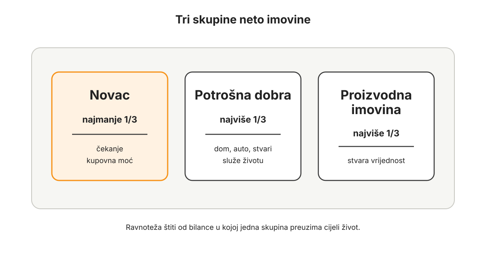

# Ravnoteža imovine

Nakon proračuna, duga i davanja, pogled se širi.

Proračun pokazuje što sadašnji novac radi. Dug pokazuje koliko je budućnosti već bilo zauzeto. Davanje otvara sustav prema drugima i sprječava da red u novcu postane zatvorena šaka. Tek nakon toga ima smisla pitati: kako izgleda cijela imovina?

Taj redoslijed nije samo urednička odluka. Ravnoteža imovine pretpostavlja da proračun već razlikuje stvarni višak od novca koji ima zadatak, da dug više ne određuje budući prihod i da davanje ima stvarno mjesto u životu. Fond za davanje mijenja psihologiju novca: prihod se ne gleda samo kao obrana i akumulacija, nego kao sposobnost služenja. To čovjeka čini manje stisnutim, razboritijim u riziku i sposobnijim čekati.

Mnogi ljudi ne znaju odgovor na to pitanje.

Znaju koliko otprilike imaju na računu. Znaju koliko vrijedi stan ili kuća, barem prema osjećaju, oglasima ili razgovorima s ljudima. Znaju koliko vrijedi auto ako bi ga danas pokušali prodati. Znaju koliko imaju Bitcoina, ako ga imaju. Znaju za kredit, ali ga često mentalno odvoje od imovine. Znaju da “imaju nešto”, ali ne znaju što to nešto radi, koliko je likvidno, koliko stvara vrijednost, koliko troši, koliko traži održavanje i koliko stvarno povećava sposobnost donošenja dobrih odluka.

Neto imovina je pokušaj da se sve to pogleda kao jedna cjelina.

Ne zato da bismo se uspoređivali s drugima. Ne zato da bismo život sveli na broj. Ne zato da bismo svaki mjesec slavili ili očajavali zbog promjene vrijednosti. Neto imovina je korisna zato što pokazuje gdje je vrijednost vašeg života financijski smještena.

Ako je gotovo sve u nekretnini u kojoj živite, možda izgledate imovinski snažno, ali ste likvidno slabi. Ako je gotovo sve u poslu, možda imate veliki potencijal, ali i veliku ovisnost o jednom izvoru rizika. Ako je gotovo sve u autima, opremi, namještaju i potrošnim stvarima, možda imate mnogo stvari, ali malo stvarne financijske snage. Ako je gotovo sve u Bitcoinu, možda držite najbolji novac koji poznajete, ali vam kratkoročni život može biti previše izložen ako proračun, likvidnost, davanje i sigurnost nisu dovoljno zreli.

Ravnoteža imovine nije potraga za savršenim omjerom. Ona je obrana od jednostrane bilance.

Čovjek može biti krhak i s visokom neto imovinom ako je ta imovina krivo raspoređena. Može imati stan, apartman, auto, opremu, posao i Bitcoin, a svejedno donositi odluke iz napetosti jer malo toga može koristiti bez prodaje, duga, obiteljskog dogovora, poslovnog rizika ili poreznih posljedica. Može imati veliku imovinu na papiru, ali nisku sposobnost mirnog odlučivanja.

Zato ovo poglavlje ne pita samo koliko imate.

Pita u kakvom vas stanju ta imovina drži.

## Zašto ravnoteža imovine?

Imovina nije jedna stvar.

Nije isto imati 100.000 eura u novcu, 100.000 eura u autu, 100.000 eura u stanu u kojem živite, 100.000 eura u poslovnoj opremi, 100.000 eura u Bitcoinu ili 100.000 eura u potraživanjima od klijenata. Broj može biti isti, ali značenje nije isto. Jedna imovina je likvidna. Druga se teško prodaje. Treća stvara prihod. Četvrta traži održavanje. Peta služi svakodnevnom životu. Šesta ovisi o tržištu. Sedma ovisi o vašem radu, klijentima, lokaciji, tehnologiji ili obitelji.

Zato je potrebno razlikovati tri glavne skupine: novac, potrošna dobra i proizvodna imovina.

Novac držimo radi buduće razmjene. On nije tu zato da ga pojedemo, vozimo, nosimo ili koristimo kao alat u proizvodnji. Držimo ga zato što želimo sačuvati kupovnu moć i imati mogućnost kasnije odlučiti. Dobar novac daje vremenski prostor. Omogućuje čekanje. Omogućuje mirnije “ne sada”. Omogućuje da se prilika ne mora zgrabiti iz panike i da se problem ne mora rješavati pod prisilom.

U ovoj knjizi Bitcoin postupno preuzima središnje mjesto u toj kategoriji. Ne zato što je uvijek najpraktičniji za svaki kratkoročni trošak, nego zato što je najbolji kandidat za dugoročni novac: strogo ograničena ponuda, globalna prenosivost, neovisna provjerljivost, otpornost na proizvoljno umnažanje i mogućnost čuvanja izvan tuđeg duga.

Ali i tu treba biti trezven. Bitcoin kao novac ne znači da se sav kratkoročni život odmah mora osloniti na Bitcoin. Prijelaz se gradi. Dok troškovi dolaze u eurima, dok obitelj još uči sustav, dok sigurnost nije postavljena i dok volatilnost može poremetiti kratkoročni mir, dio likvidnosti može ostati u državnom novcu. Cilj nije glumiti čistoću, nego graditi sustav koji stvarno funkcionira.

Druga skupina su potrošna dobra.

To su stvari koje koristimo za život: stan ili kuća u kojoj živimo, auto, namještaj, uređaji, odjeća, oprema za osobnu upotrebu, vikendica koju primarno koristimo za odmor i sve druge stvari koje služe udobnosti, stabilnosti, obitelji ili statusu, ali ne služe prvenstveno stvaranju prihoda. Potrošna dobra nisu loša. Čovjek treba živjeti. Obitelj treba dom. Djeca trebaju prostor. Auto ponekad stvarno povećava funkcionalnost života. Nije cilj živjeti kao da je svaka potrošnja moralni poraz.

Problem nastaje kada potrošna dobra pojedu bilancu.

To je čest obrazac. Ljudi imaju skupu nekretninu, skup auto, mnogo stvari, ali malo novca. Izvana izgledaju stabilno. Iznutra su krhki. Njihova imovina ne daje dovoljno manevarskog prostora. Ako dođe loš period, moraju se zadužiti, prodati nešto pod pritiskom ili smanjivati život iz nelagode. Potrošna dobra mogu biti korisna, ali ne smiju postati grobnica kupovne moći.

Treća skupina je proizvodna imovina.

To je imovina koja služi stvaranju drugih dobara, usluga ili prihoda: posao, alati, strojevi, poslovna oprema, znanje koje se stvarno pretvara u tržišnu vrijednost, udjeli u poslovima, produktivna nekretnina, zemljište koje se obrađuje, softver, reputacija, sustavi i odnosi koji omogućuju stvaranje vrijednosti. Ova imovina može biti vrlo važna jer povećava sposobnost zarađivanja i služenja tržištu.

Ali ni proizvodna imovina nije bez rizika.

Posao traži pažnju. Klijenti se mijenjaju. Tehnologija se mijenja. Regulacija se mijenja. Ljudi odlaze. Oprema zastarijeva. Kapital može ostati zarobljen u nečemu što više ne daje povrat. Poduzetnik lako počne svaku slobodnu jedinicu novca gledati kao gorivo za rast, a zaboravi da obitelj, likvidnost, davanje i mir također pripadaju bilanci.

Ravnoteža imovine pokušava spriječiti da jedna od te tri skupine preuzme cijeli život.

*Ravnoteža imovine ne traži savršen omjer, nego štiti od bilance u kojoj jedna vrsta imovine preuzima cijeli život.*

Pravilo koje ova knjiga koristi jednostavno je: ciljajte da najmanje trećina neto imovine bude u novcu, dok potrošna i proizvodna imovina ne bi trebale pojedinačno preuzeti više od trećine. To nije zakon fizike, porezni savjet ni investicijska formula. To je strateški okvir koji pomaže vidjeti gdje je imovina previše jednostrana.

Najmanje trećina u novcu znači da čovjek ima stvaran novčani temelj. Ne samo vrijednost u zidovima, autima, opremi ili poslovnim idejama, nego novac koji može čekati, čuvati kupovnu moć i omogućiti odluke. Ako je taj novac sve više Bitcoin, tada se neto imovina počinje mjeriti ozbiljnijim standardom od državnog novca koji gubi kupovnu moć kroz vrijeme.

Najviše trećina u potrošnim dobrima štiti od toga da životni stil pojede slobodu. Dom, auto i stvari mogu biti dobri sluge, ali loši gospodari. Ako prevelik dio imovine ode u ono što se koristi, troši, održava ili samo pruža udobnost, obitelj može izgledati uspješno, a imati malo prostora za odluke.

Najviše trećina u proizvodnoj imovini štiti od druge krajnosti: da čovjek cijeli život pretvori u poslovni ili investicijski rizik. Poduzetništvo, proizvodnja i ulaganje u kapital mogu biti korisni i plemeniti, ali ako je gotovo sve u poslu ili produktivnoj imovini, jedan loš period može ugroziti puno više od prihoda.

Ovaj okvir ne znači da morate imati trećinu imovine u proizvodnoj imovini. To je važna razlika. Proizvodna imovina mora zaslužiti svoje mjesto. Ako je Bitcoin vaš novac, nemate isti pritisak koji državni novac stvara: pritisak da novac što prije “radi” samo zato da ne bi gubio kupovnu moć. Bitcoin već radi jednu ključnu stvar: čuva monetarnu opcionalnost. Ulaganje u proizvodnu imovinu mora pokazati zašto je bolje od držanja novca.

U državnom novcu čovjek često bježi u bilo kakvu imovinu. U Bitcoin standardu može čekati.

To mijenja sve.

### Nekretnina nije novac

Ovaj dio treba posebno jasno reći u hrvatskom kontekstu.

U Hrvatskoj je nekretnina često središte financijske sigurnosti. Ljudi vole “imati svoje”. To je razumljivo. Povijest, obitelj, nepovjerenje u institucije, inflacija i iskustvo nesigurnosti učinili su nekretninu prirodnim skloništem za mnoge obitelji. Dom može biti dobra i važna odluka. Ali dom nije novac.

Stan ili kuća u kojoj živite dugotrajno je potrošno dobro. Koristi se. Troši se. Traži održavanje. Traži obnovu. Može imati veliku osobnu i obiteljsku vrijednost, ali ne može istovremeno biti dom, likvidna rezerva, poslovni kapital i novac za buduće prilike.

Često se kaže da nekretnine dugoročno rastu. Ali velik dio tog rasta u državnom novcu nije nužno rast stvarne vrijednosti nekretnine, nego pad kupovne moći državnog novca u kojem se cijena izražava. Ako je neka zgrada prije trideset godina imala cijenu 100, a danas ima cijenu 200, to samo po sebi ne znači da je zgrada nakon trideset godina dvostruko vrijednija. Ona je starija, trošenija i ovisna o održavanju. Dio rasta cijene može dolaziti iz lokacije, demografije, infrastrukture i regulacije, ali značajan dio može biti samo znak da je novčana jedinica u međuvremenu oslabila.

Kada se nekretnine izraze u Bitcoinu, slika često postaje stroža. Mnoge nekretnine dugoročno ne rastu u odnosu na bolji novac, nego padaju. Ne svaka jednako. Nekretnine nisu međusobno zamjenjive. Jedna lokacija može postati iznimno tražena, druga može stagnirati, treća može izgubiti smisao zbog demografije, regulacije ili promjene navika. Jedan Bitcoin je u monetarnom smislu jednak drugom Bitcoinu. Jedna kuća nije jednaka drugoj kući.

Zato je problematično koristiti nekretninu kao novac.

Mnogi ljudi to rade svjesno ili nesvjesno. Ne kupuju nekretninu samo zato što im treba prostor za život ili zato što ona produktivno stvara prihod, nego zato što ne znaju gdje drugdje spremiti kupovnu moć. Time nekretnina dobiva dodatnu monetarnu potražnju. Postaje skuplja ne samo za ulagače, nego i za ljude koji tek pokušavaju riješiti svoje stambeno pitanje. Kada društvo štedi u nekretninama zato što državni novac ne čuva vrijednost, stanovanje postaje skuplje upravo onima kojima je stan potreban kao dom.

Bitcoin tu nudi drukčiji izlaz.

Ako ljudi imaju bolji novac u kojem mogu čuvati kupovnu moć, manja je potreba da nekretnina glumi novac. Tada se stanovanje može postupno vratiti bliže svojoj stvarnoj funkciji: prostoru za život ili proizvodnoj imovini ako se stvarno iznajmljuje i donosi povrat. To ne znači da cijene nekretnina jednostavno moraju pasti u svakoj valuti i na svakoj lokaciji. Znači da se dio monetarne premije može smanjivati kada ljudi dobiju bolji novac.

Ravnoteža imovine zato ne govori protiv doma. Ona govori protiv zamjene doma za novac.

## Tvrdi novac i teže stvari

Kada čovjek počne ozbiljno živjeti s tvrdim novcem, ne mijenja se samo štednja. Mijenja se i potrošnja. Pitanje više nije samo mogu li si ovo priuštiti. Pitanje postaje: je li ovo vrijedno dijela mog života koji sada dajem?

Tvrdi novac prirodno smanjuje sklonost kratkoj potrošnji. Čovjek počinje više primjećivati kvalitetu, materijal, trajnost, popravak, zanat, vrijeme i ruke koje su nešto izradile. Umjesto deset slabih predmeta, sve privlačnija postaje jedna dobra stvar. Umjesto stvari koje se brzo troše i bacaju, sve privlačnije postaju stvari koje mogu starjeti dostojanstveno: alat, knjiga, komad namještaja, kaput, posuđe, cipele, predmet koji jednog dana može imati priču.

To ne znači da je skuplje uvijek bolje. Ne znači da treba graditi novi identitet oko ukusa, marke ili statusa. Tvrdi novac ne smije postati luksuzni manifest. Njegova tiša posljedica trebala bi biti manja impulzivnost i veće poštovanje prema stvarima koje traju, koje se mogu popraviti i koje ne traže stalnu zamjenu.

Bitcoin ne potiče bijeg od materijalnog svijeta. On može vratiti poštovanje prema stvarima koje su dobro napravljene.

### Prodaja Bitcoina nije problem sama po sebi

U ovoj knjizi ne pokušavamo čitatelja naučiti da Bitcoin nikada ne treba prodati ili potrošiti.

Bitcoin je novac. Novac postoji da se čuva, troši, daje, ulaže, razmjenjuje i prenosi kroz vrijeme prema namjeni. Nije problem ako se Bitcoin potroši u trenutku kada je njegova kupovna moć niža nego jučer. Nije problem ako se dio Bitcoina upotrijebi za stvarnu potrebu, obiteljsku odluku, proizvodnu investiciju, davanje, sigurnost ili izlazak iz duga.

Problem je stanje iz kojeg odluka nastaje.

Ako čovjek prodaje Bitcoin iz jasnog proračuna, bez duga, s uravnoteženom imovinom i s razumijevanjem što time dobiva, ta prodaja može biti dobra odluka. Ako prodaje zato što je sva imovina zaključana u nekretnini, jer nema likvidnosti, jer je u dugu, jer je posao nelikvidan, jer je trošak došao “iznenada” iako se mogao predvidjeti, tada problem nije prodaja Bitcoina kao takva. Problem je neravnoteža koja je proizvela prisilu.

Ravnoteža imovine ne postoji da bismo Bitcoin čuvali pod svaku cijenu. Postoji da bi odluke o Bitcoinu bile kvalitetnije.

To je suštinska razlika.

Kada je imovina u ravnoteži, čovjek može trošiti, davati, ulagati i čuvati Bitcoin iz boljeg stanja. Može vidjeti što odluka radi proračunu, obitelji, poslovnom riziku, budućim troškovima i dugoročnom novcu. Može odlučiti da je trošak vrijedan. Može odlučiti da nije. U oba slučaja odluka nastaje iz sustava, ne iz pritiska.

Cilj osobnog Bitcoin standarda nije da nikada ne koristite novac.

Cilj je da ga koristite mudrije.

## Kako uspostaviti ravnotežu imovine?

Prvi korak je napraviti popis neto imovine.

Ne procjenu u glavi. Ne osjećaj. Ne razgovor u kojem se kaže “otprilike imamo stan, nešto Bitcoina i nešto na računu”. Treba zapisati sve glavne stavke imovine i sve dugove, pa izračunati razliku.

Imovina uključuje novac na računima, gotovinu, Bitcoin, druge financijske instrumente, nekretnine, vozila, poslovnu imovinu, opremu, udjele u poslu, potraživanja koja su stvarno naplativa i sve ostalo što ima značajnu vrijednost. Dugovi uključuju stambene kredite, leasinge, potrošačke kredite, kreditne kartice, poslovne obveze, privatne posudbe i sve druge buduće obveze.

Neto imovina je imovina minus dug.

Ako imate stan vrijedan 180.000 eura i stambeni kredit od 110.000 eura, u neto imovini nije 180.000 eura, nego 70.000 eura kapitala u toj nekretnini. Ako imate auto vrijedan 18.000 eura i leasing od 12.000 eura, neto vrijednost auta nije 18.000, nego 6.000 eura, uz napomenu da auto istovremeno stvara troškove. Ako imate posao koji na papiru vrijedi mnogo, ali ovisi gotovo potpuno o vašem osobnom radu i nema lako prodajivu vrijednost, treba biti konzervativan.

Neto imovina ne smije biti mjesto mašte.

Bolje je procijeniti oprezno nego živjeti u napuhanom osjećaju sigurnosti.

Drugi korak je razvrstati imovinu.

Svaku stavku treba staviti u jednu od tri skupine: novac, potrošna dobra ili proizvodna imovina. Neke stavke mogu imati miješanu funkciju. Nekretnina koju djelomično koristite, a djelomično iznajmljujete, ima potrošnu i proizvodnu komponentu. Auto koji služi za posao i obitelj također može imati miješanu funkciju. Bitcoin može u početnoj fazi stajati u praćenju imovine, ali u ovom dijelu knjige sve ga jasnije promatramo kao novac, osobito u dugoročnom dijelu bilance.

Nije važno da klasifikacija bude savršena u prvom pokušaju. Važno je prestati sve zvati istim imenom.

Treći korak je izračunati omjere.

Koliko posto neto imovine je u novcu? Koliko u potrošnim dobrima? Koliko u proizvodnoj imovini? Ako je novac ispod trećine, to je signal. Ako potrošna dobra prelaze trećinu, to je signal. Ako proizvodna imovina prelazi trećinu, to je također signal. Signal ne znači da odmah morate nešto prodati. Znači da trebate razumjeti gdje ste izloženi.

Na primjer, obitelj može imati neto imovinu od 150.000 eura, od čega je 120.000 eura u domu, 15.000 eura u autu, 10.000 eura u Bitcoinu i 5.000 eura na računu. Na papiru nisu siromašni. Ali gotovo sva njihova imovina nalazi se u potrošnim dobrima i vrlo malo u novcu. Ako dođe kriza, nemaju puno prostora. Ako se pojavi prilika, moraju se zadužiti ili prodati nešto teško prodajno. Ako žele davati ozbiljnije ili ulagati, nemaju dovoljno fleksibilnosti.

Druga osoba može imati 60.000 eura neto imovine: 25.000 eura u Bitcoinu, 20.000 eura u poslovnoj opremi, 10.000 eura u autu i 5.000 eura na računu. Tu je novčani sloj značajniji, ali dio novca je volatilan, a proizvodna imovina ovisi o poslu. Treba vidjeti ima li dovoljno kratkoročne likvidnosti i je li posao previše izložen jednom klijentu ili jednoj tehnologiji.

Treći primjer je poduzetnik s 500.000 eura neto imovine, od čega je 350.000 eura u poslu, 80.000 u nekretnini, 50.000 u Bitcoinu i 20.000 u novcu na računu. Izvana izgleda snažno. Strateški je previše ovisan o poslu. Ako posao uspori, imovina se može pokazati manje likvidnom nego što je mislio.

Četvrti korak je odrediti smjer, ne savršen trenutni omjer.

Ravnoteža imovine se ne uspostavlja preko noći. Ne treba mehanički prodavati dom, posao ili imovinu samo zato što omjer nije idealan. Ova knjiga ne traži slijepo provođenje formule. Traži svjesno kretanje prema otpornijoj bilanci.

Ako imate previše potrošnih dobara, buduće odluke trebaju usporiti rast životnog stila i povećati novac. To može značiti zadržati postojeći auto dulje, odgoditi renovaciju koja nije nužna, ne povećavati stanovanje, prodati drugi auto ili prestati kupovati stvari koje traže održavanje i prostor.

Ako imate premalo novca, prioritet je graditi novčani saldo. U početku dio može biti u eurima zbog kratkoročnih obveza, a dugoročno se sve veći dio može premještati u Bitcoin kada proračun, dug, davanje i sigurnost to dopuštaju. Važno je da novac bude namjenski: dio za kratkoročni život, dio za buduće troškove, dio za dugoročnu kupovnu moć.

Ako imate previše proizvodne imovine, treba procijeniti koji dio stvarno stvara povrat, a koji samo troši pažnju. Nije svaka poslovna imovina dobra imovina. Nije svaki projekt kapital. Nije svaka nekretnina investicija. Nije svaki alat produktivan. Proizvodna imovina mora opravdati sebe stvaranjem vrijednosti, a ne pričom koju volimo o sebi.

Peti korak je odvojiti vlasništvo od korištenja.

U kulturi koja vlasništvo često izjednačava s uspjehom, najam se lako doživljava kao privremeno stanje za one koji “još nisu uspjeli”. Ali strateški gledano, najam može biti dobra odluka u određenoj fazi života. Daje pokretljivost, smanjuje koncentraciju imovine, oslobađa kapital i čuva sposobnost odluke. Naravno, ni najam nije uvijek bolji. Ako je nestabilan, preskup ili obiteljski neprikladan, vlasništvo može biti razumno.

Poanta nije ideologija najma ili vlasništva.

Poanta je računati ukupni učinak na život.

Šesti korak je računati ukupni trošak vlasništva.

Cijena kupnje nije ukupni trošak. Auto ima registraciju, osiguranje, servis, gume, gorivo, amortizaciju i vrijeme. Nekretnina ima održavanje, pričuvu, renovacije, opremanje, pravne obveze, vrijeme, rizik i nelikvidnost. Poslovna oprema ima održavanje, zastarijevanje, prostor, osiguranje, obuku i ovisnost o prihodima koje bi trebala stvarati. Ako gledate samo cijenu kupnje ili ratu, podcjenjujete odluku.

U Bitcoin standardu svaka veća kupnja ima i oportunitetni trošak u boljem novcu.

To ne znači da ne treba kupovati. Kuća, auto, oprema, obrazovanje, posao i obiteljski život mogu biti vrijedni troška. Ali treba znati što se daje zauzvrat. Ako 20.000 eura ode u auto, tih 20.000 eura ne ide u Bitcoin, rezervu, dug, posao ili davanje. Ako 80.000 eura ode u preveliku renovaciju, taj novac više ne stoji u obliku koji može čekati. Ako 50.000 eura ode u poslovni projekt, treba znati koja je realna vjerojatnost da projekt nadmaši držanje boljeg novca.

Sedmi korak je postaviti pravila za velike odluke.

Bez pravila, velike odluke obično nastaju iz uzbuđenja, straha, statusa ili umora. Zato je korisno unaprijed definirati prag. Na primjer: svaka odluka veća od jedne šezdesetine neto imovine mora proći dodatnu provjeru. Ako je neto imovina 120.000 eura, to je 2.000 eura. Ako je 600.000 eura, to je 10.000 eura. Prag se može prilagoditi, ali ideja je ista: veće odluke ne smiju nastati impulzivno.

Provjera može biti jednostavna.

Što ova odluka radi omjeru novca, potrošnih dobara i proizvodne imovine? Povećava li likvidnost ili je smanjuje? Stvara li budući prihod ili samo budući trošak? Je li financirana iz stvarnog viška ili iz duga? Ako uključuje Bitcoin, zašto se Bitcoin koristi baš za tu odluku? Je li odluka donesena iz proračuna ili iz pritiska? Što se događa ako prihod padne šest mjeseci? Što se događa ako se kupovna moć Bitcoina privremeno smanji? Može li obitelj razumjeti ovu odluku?

Ova pitanja ne služe tome da ubiju život. Služe tome da velike odluke ne budu donesene pod maglom.

Osmi korak je jednom godišnje napraviti pregled neto imovine.

Proračun se vodi često. Neto imovina ne mora se opsesivno gledati svaki dan. Dovoljno je mjesečno ili tromjesečno pratiti osnovnu sliku, a jednom godišnje napraviti ozbiljan pregled. Tada se vidi smjer. Je li udio novca rastao? Je li potrošna imovina preuzela previše? Je li posao stvorio vrijednost ili samo tražio dodatni kapital? Je li Bitcoin pozicija u skladu s planom? Je li likvidnost dovoljna? Jesu li dugovi smanjeni? Je li davanje raslo s mogućnostima? Je li sigurnosni plan pratio rast imovine?

Neto imovina nije samo broj.

Ona je karta rasporeda vrijednosti.

Ako je karta dobra, čovjek ne mora znati sve što će se dogoditi. Ima bolju sposobnost odgovora.

## Prvi potezi

Uzmite jednu večer i napravite popis neto imovine bez uljepšavanja. Zapišite novac na računima, gotovinu, Bitcoin, druge financijske instrumente, nekretnine, vozila, poslovnu imovinu, opremu, udjele, potraživanja i sve veće stvari koje bi se realno mogle prodati. Zatim zapišite svaki dug. Neto imovina je ono što ostaje nakon oduzimanja duga.

Procjene neka budu oprezne. Nekretninu ne upisujete po cijeni koju biste voljeli dobiti, nego po cijeni koja bi imala smisla ako je stvarno morate prodati. Auto ne upisujete po osjećaju, nego po tržištu. Posao ne upisujete po potencijalu, nego po vrijednosti koju bi netko stvarno mogao kupiti bez vašeg svakodnevnog rada.

Zatim svaku stavku stavite u jednu od tri skupine: novac, potrošna dobra ili proizvodna imovina. Ako je stavka miješana, razdvojite je koliko možete. Stan u kojem živite je potrošno dobro, čak i ako vjerujete da mu cijena raste. Bitcoin u dugoročnom dijelu bilance tretirajte kao novac. Poslovna oprema je proizvodna imovina samo ako stvarno pomaže stvaranju vrijednosti.

Nakon toga izračunajte omjere. Koliko neto imovine je u novcu? Koliko u potrošnim dobrima? Koliko u proizvodnoj imovini? Ne tražite savršenstvo u prvom izračunu. Tražite smjer. Ako novac nije ni blizu trećine, sljedeće odluke moraju ga graditi. Ako potrošna dobra prelaze trećinu, zaustavite rast životnog stila. Ako proizvodna imovina nosi previše bilance, prestanite svaki novi projekt automatski zvati prilikom.

Odredite jednu odluku za ovaj mjesec. Možda ne kupujete novi auto. Možda prodajete stvar koju ne koristite. Možda odgađate renovaciju koja nije nužna. Možda dio viška ide u kratkoročnu likvidnost, a dio u Bitcoin. Možda prvi put ozbiljno pitate bi li najam bio bolje rješenje od vlasništva. Ravnoteža imovine ne počinje velikim potezom. Počinje time da svaka veća odluka zna kojoj skupini imovine služi.

## Tri zamišljene situacije

Tri priče sada ulaze u drugi dio knjige. Ana je kroz proračun naučila vidjeti novac, uklonila kratkoročne dugove i počela davati. Marko i Ivana su vratili obiteljski prostor nakon prodaje auta i zatvaranja potrošačkih dugova. Marin i Petra su smanjili polugu i počeli davati sustavnije. Sada svatko od njih mora pogledati širu sliku: ne samo mjesečni tok, nego cijelu imovinu.

### Ana: mala imovina, velika važnost likvidnosti

Ana nema veliku neto imovinu, ali baš zato ravnoteža imovine za nju nije nevažna. Živi u Rijeci, zarađuje oko 1.200 eura nakon promjene posla, nema potrošački dug, ima mali proračun koji vodi redovito, kategoriju Davanje od 35 eura i Bitcoin poziciju koja je u međuvremenu narasla na oko 650 eura. Na računu ima 1.400 eura, od čega je dio već raspoređen na buduće troškove.

Prije bi mislila da “nema imovinu” i da se ravnoteža imovine tiče ljudi s nekretninama, poslovima i velikim portfeljima. Ali ravnoteža imovine počinje čim čovjek ima nešto što treba rasporediti. Kod Ane je najveće pitanje bilo kako ne pretvoriti svaki višak odmah u Bitcoin, a istovremeno ne ostati bez dugoročnog novca.

Njezin prvi popis bio je jednostavan.

Imala je 1.400 eura likvidnog novca, 650 eura u Bitcoinu, stari laptop, mobitel, bicikl i nekoliko osobnih stvari koje nisu imale veliku prodajnu vrijednost. Nije imala auto ni nekretninu. Neto imovina joj je bila oko 2.200 eura ako se sve procijeni konzervativno. Na prvi pogled to nije izgledalo kao tema za strategiju. Ali kad je razvrstala imovinu, vidjela je nešto korisno: gotovo sve što ima treba joj ili kao novac, ili za svakodnevni život.

Nije imala problem prevelike potrošne imovine. Imala je problem nedovoljno snažnog novčanog temelja.

Da je sav višak usmjeravala u Bitcoin, kratkoročno bi se osjećala kao da napreduje, ali svaka veća potreba mogla bi odluku o Bitcoinu pretvoriti u reakciju. Ne zato što je prodaja Bitcoina problem, nego zato što bi prodaja nastala iz nedovoljno pripremljenog stanja. Zato je odredila jednostavno pravilo: dok ne izgradi tri mjeseca osnovnih troškova u kratkoročnoj likvidnosti, kupnja Bitcoina ide malim iznosom iz stvarnog viška, ne agresivno. Postojeći Bitcoin ostaje u praćenju imovine, a cilj nije povećati ga pod svaku cijenu, nego graditi novčani temelj bez povratka u dug.

To joj je bilo trezveno, ali ne i lako.

Kada je Bitcoin rastao, imala je osjećaj da zaostaje. Kada je padao, bilo joj je drago da nije pretjerala. Upravo joj je proračun pomogao da ne donosi odluke iz dnevnog raspoloženja. Kategorije su pokazivale što novac mora raditi, a neto imovina je pokazivala širu sliku.

Nakon godinu dana Ana je imala 2.800 eura ukupne neto imovine: 1.900 eura kratkoročne likvidnosti, 800 eura u Bitcoinu i nešto malo opreme. Nije to bila velika brojka, ali omjer je bio zdraviji. Imala je dovoljno prostora da manji trošak ne postane kriza. Mogla je povećati davanje na 45 eura. Mogla je kupovati Bitcoin skromno, ali mirno. I što je najvažnije, više nije miješala želju za napretkom s potrebom da preskoči fazu.

Za Anu je ravnoteža imovine značila priznati da se bogatstvo ne gradi samo kupnjom Bitcoina, nego i izgradnjom stanja iz kojeg Bitcoin može stvarno biti novac.

### Marko i Ivana: kuća, djeca i pitanje što je stvarno novac

Marko i Ivana su nakon razduživanja i početka davanja prvi put imali jasniji mjesečni višak. Žive u okolici Zagreba, imaju dvoje djece, stambeni kredit, jedan stariji auto, Bitcoin poziciju koju su djelomično smanjili radi izlaska iz duga i stabilniji proračun. Sada su morali pogledati neto imovinu.

Njihov popis izgledao je ovako: dom procijenjen na 185.000 eura, preostali stambeni kredit 112.000 eura, auto vrijedan oko 7.000 eura, Bitcoin oko 2.400 eura, novac na računima i u kategorijama oko 5.500 eura. Kada su oduzeli dug, neto imovina im je bila približno 87.900 eura.

Na papiru su imali pristojnu neto imovinu. Ali kad su je razvrstali, vidjeli su da je gotovo sve vezano uz dom u kojem žive. Oko 73.000 eura kapitala bilo je u nekretnini, 7.000 u autu, 5.500 u likvidnom novcu i 2.400 u Bitcoinu. Drugim riječima, velika većina njihove neto imovine bila je u potrošnim dobrima, jer dom u kojem žive nije novac i ne stvara prihod. On je važan, možda i vrlo dobra odluka za obitelj, ali nije likvidan.

To im nije govorilo da trebaju prodati dom. Govorilo im je da ne smiju misliti da su novčano snažni samo zato što imaju kapital u nekretnini.

Prvi strateški cilj bio je povećati novac.

Dogovorili su da neće ulaziti u nove velike potrošne odluke dok novčani sloj ne naraste. Auto će voziti dok god je razumno pouzdan. Renovacije koje nisu nužne odgađaju se. Namještaj se kupuje iz kategorije, ne iz duga. Ljetovanje se planira unaprijed. Bitcoin se kupuje redovito, ali u iznosu koji ne smanjuje kratkoročnu sigurnost. Dio viška ide u eursku likvidnost zbog obveza i troškova, dio u Bitcoin kao dugoročni novac.

Prvi put su dom počeli gledati mirnije. Prije su ga doživljavali kao dokaz da “nešto imaju”. Sada su ga doživjeli kao važno potrošno dobro koje mora biti uravnoteženo novcem. To nije umanjilo vrijednost doma. Naprotiv, smanjilo je pritisak da dom bude sve: sigurnost, investicija, status, štednja i plan za budućnost.

Djeci su to objasnili jednostavno. Kuća je mjesto gdje živimo. Auto je stvar koju koristimo. Bitcoin i novac su ono što nam daje mogućnost odluke. Posao je ono kroz što stvaramo novu vrijednost. Sve je važno, ali nije sve isto.

Nakon dvije godine omjer se počeo mijenjati. Nisu preko noći došli do trećine u novcu, ali smjer je bio jasan. Kredit se smanjivao, Bitcoin pozicija rasla je iz stvarnog viška, kratkoročna likvidnost postala je jača, a potrošne kupnje više nisu automatski imale prednost. Marko je i dalje ponekad želio agresivnije kupovati Bitcoin. Ivana je i dalje ponekad htjela veći osjećaj sigurnosti u eurima. Ali sada su razgovarali u okviru: što ova odluka radi ravnoteži?

To pitanje je za njih postalo korisnije od pitanja tko je oprezniji, a tko ambiciozniji.

### Marin i Petra: velika imovina traži hladniji pogled

Marin i Petra su imali najviše imovine, ali i najviše složenosti. Nakon što su smanjili dug i prodali apartman koji je više trošio pažnju nego što je donosio slobodu, prvi put su mogli hladnije pogledati cijelu bilancu. Imali su stan u kojem žive, poslovnu imovinu, udio u Marinovoj tvrtki, nešto financijskih instrumenata, značajnu Bitcoin poziciju, novac na računima i preostale obveze koje su bile znatno manje nego prije.

Njihova neto imovina bila je visoka, ali neravnomjerno raspoređena. Dio je bio u domu, dio u poslu, dio u Bitcoinu, dio u likvidnosti. Najveći problem više nije bio dug, nego koncentracija i ovisnost. Ako posao ima lošu godinu, koliko imovine je stvarno dostupno? Ako se kupovna moć Bitcoina privremeno smanji, moraju li išta mijenjati? Ako se pojavi prilika, imaju li novac ili samo vrijednost na papiru? Ako se Marinu nešto dogodi, može li Petra jasno vidjeti imovinsku sliku?

Prvi strateški potez bio je konzervativno vrednovanje.

Marin je imao naviku procjenjivati posao prema potencijalu. Petra je tražila procjenu prema stvarnosti. Ne koliko bi posao mogao vrijediti idealnom kupcu u idealnim uvjetima, nego koliko je stvarno stabilan bez Marinove svakodnevne prisutnosti. To je promijenilo brojke. Posao je i dalje bio vrijedan, ali manje likvidan i više osobno ovisan nego što je Marin volio priznati.

Drugi potez bio je odvajanje obiteljskog novca od poslovnog rizika.

Posao može rasti, ali ne smije stalno povlačiti obiteljsku bilancu u sebe. Definirali su koliko kapitala ostaje u tvrtki, koliko se isplaćuje, koliko ide u Bitcoin, koliko u kratkoročnu likvidnost, koliko u davanje i koliko u druge produktivne prilike. Marin nije prestao biti poduzetnik. Samo je prestao svaku poslovnu ideju tretirati kao automatski prioritet nad novčanim temeljem obitelji.

Treći potez bio je jasnije definirati Bitcoin.

Do tada je Bitcoin bio “dugoročno najbolja imovina”, “novac”, “rezerva”, “prilika” i “za djecu” istovremeno. Sve to može biti djelomično točno, ali za odluke nije dovoljno. Podijelili su Bitcoin mentalno u slojeve: dio koji se ne dira desetljećima, dio koji se može koristiti za veliku obiteljsku ili poslovnu odluku ako je odluka promišljena i ako ravnoteža to dopušta, te dio koji služi kao dugoročni novčani temelj. Ta podjela kasnije će tražiti i sigurnosni plan, ali im je već sada dala jasniji pogled.

Njihova ciljana ravnoteža nije bila mehanička trećina svaki mjesec. Kod većih i složenijih bilanci to rijetko ide tako. Ali pravilo trećina postalo je kompas. Ako proizvodna imovina previše naraste, dio budućih dobitaka ide u novac. Ako potrošna imovina traži novu veliku kupnju, prvo se gleda omjer. Ako Bitcoin snažno poraste i počne dominirati neto imovinom, ne prodaje se automatski, ali se postavlja pitanje sigurnosti, davanja, obiteljskih ciljeva i koncentracije. Ako posao traži dodatni kapital, uspoređuje se s držanjem novca.

Najveća promjena bila je u tome što su prestali gledati imovinu kroz priče koje vole o sebi.

Marin nije morao stalno biti čovjek koji ulaže u rast. Petra nije morala biti osoba koja koči rizik. Bitcoin nije morao opravdati svaku odluku. Dom nije morao biti dokaz uspjeha. Posao nije morao biti središte svega. Svaka stavka dobila je funkciju.

To je trezvenost koja dolazi tek kad se čovjek odvoji od vlastitog imovinskog identiteta.

## Zaključak

Ravnoteža imovine je trezveni pogled na ono što posjedujete.

Ona ne pita samo koliko vrijedi vaša imovina, nego u kakvo vas stanje dovodi. Koliko je likvidna. Koliko čuva kupovnu moć. Koliko stvara prihod. Koliko troši. Koliko traži održavanje. Koliko ovisi o vašem radu. Koliko je možete koristiti bez duga. Koliko obitelj razumije. Koliko bi izdržala lošu godinu. Koliko vas približava Bitcoin standardu, a koliko vas veže za stare obrasce.

Bez tog pogleda lako je zamijeniti vlasništvo za slobodu. Lako je misliti da je dom isto što i novac, da je auto isto što i sigurnost, da je posao isto što i likvidnost, da je Bitcoin sam po sebi dovoljan, ili da velika neto imovina automatski znači stabilan život.

Ništa od toga ne mora biti istina.

Neto imovina treba biti jedna cjelina. U toj cjelini novac, potrošna dobra i proizvodna imovina imaju različite uloge. Novac čuva mogućnost odluke. Potrošna dobra služe životu. Proizvodna imovina stvara vrijednost. Kada jedna uloga preuzme sve, sustav postaje krhak.

Bitcoin u ovom poglavlju počinje zauzimati ozbiljnije mjesto kao novac. Ali upravo zato ga ne smijemo koristiti kao izgovor za nered. Ako je Bitcoin novac, onda mora stajati u sustavu. Mora imati odnos prema proračunu, dugu, davanju, likvidnosti, potrošnji, proizvodnoj imovini, volatilnosti i sigurnosti. Ne može biti samo nada izvan bilance.

Ravnoteža imovine ne traži savršenu matematiku. Traži smjer.

Ako imate premalo novca, gradite novčani sloj. Ako imate previše potrošnih dobara, zaustavite rast životnog stila. Ako imate previše proizvodnog rizika, izvucite dio vrijednosti u novac i mir. Ako imate Bitcoin, odredite njegovu ulogu. Ako imate dom, poštujte ga kao dom, ali ga ne zovite novcem. Ako imate posao, gradite ga, ali ne dopustite da proguta cijelu obiteljsku bilancu.

Prvi dio knjige uredio je tok novca.

Ovo poglavlje uređuje raspored vrijednosti.

Tek kada su oba pogleda prisutna, čovjek počinje ozbiljnije živjeti s Bitcoinom kao novcem. Ne samo zato što ima Bitcoin, nego zato što zna gdje Bitcoin stoji, što čuva, kada ga koristi, što ne smije ugroziti i kako se uklapa u ostatak života.

Ravnoteža imovine nije kraj strategije.

Ona je karta prije nego što krenemo u vrijeme, volatilnost i ulaganje.

## Kada je ovo poglavlje provedeno?

Ovo poglavlje je provedeno kada neto imovina više nije maglovit osjećaj.

- Znate svoju neto imovinu.
- Razlikujete novac, potrošna dobra i proizvodnu imovinu.
- Cilj je najmanje trećina neto imovine u novcu.
- Potrošna dobra ne preuzimaju više od trećine neto imovine.
- Proizvodna imovina ne preuzima više od trećine neto imovine.
- Nekretnina u kojoj živite ne tretira se kao novac.
- Bitcoin postupno postaje dominantni oblik novca u toj trećini.
- Veće odluke gledate kroz njihov učinak na novac, potrošna dobra i proizvodnu imovinu.
- Znate koji je sljedeći potez prema zdravijem omjeru, čak i ako ga ne možete provesti preko noći.

## Ne idite dalje ako…

Ne idite dalje ako ne znate svoju neto imovinu. Ne idite dalje ako stambeni prostor zovete novcem samo zato što mu je cijena narasla. Ne idite dalje ako su auto, dom, oprema ili posao progutali gotovo cijelu bilancu, a vi to i dalje nazivate sigurnošću.

Ne idite dalje ako Bitcoin držite izvan sustava, kao nadu koja ne mora imati odnos prema proračunu, dugu, davanju, potrošnji i sigurnosti. Bitcoin treba postati novac u uređenoj bilanci, ne emocionalni izlaz iz nereda.

Ako ne znate što bi sljedeća velika kupnja učinila omjeru imovine, stanite. Još niste spremni odlučivati o vremenu, volatilnosti i ulaganju. Prvo morate znati gdje vrijednost već stoji.

Ravnoteža imovine ne traži savršenu formulu. Traži da znate gdje vrijednost stoji i u kakvo vas stanje dovodi.
