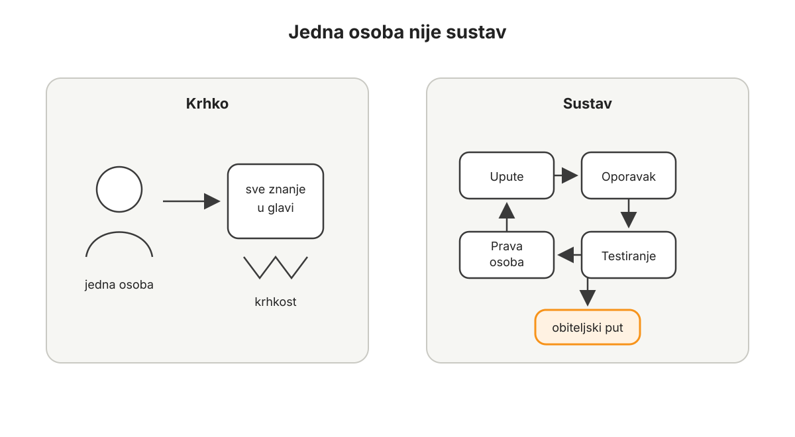

# Skrbništvo i sigurnost

Nakon proračuna, duga, davanja, ravnoteže imovine i razumijevanja Bitcoina kroz vrijeme dolazi pitanje koje se ne može preskočiti: kako čuvati novac koji sve više zauzima središnje mjesto u životu?

Bitcoin čovjeku daje rijetku mogućnost. Vrijednost može držati bez banke, bez dopuštenja, bez posrednika i bez tuđeg obećanja. Ali ista osobina koja ga čini snažnim čini ga i ozbiljnim. Ako možete sami držati novac, možete ga i sami izgubiti. Ako možete poslati vrijednost bez posrednika, pogrešna transakcija nema službu za poništenje. Ako nitko ne može zamrznuti vaš Bitcoin, nitko ga ne može vratiti umjesto vas ako izgubite pristup.

To nije razlog za strah. To je razlog za red.

Ovo poglavlje ne počinje uređajem. Ne počinje popisom novčanika. Ne počinje tvrdnjom da svaka osoba u svakom trenutku mora držati sav Bitcoin na isti način. Počinje jednostavnijim pitanjem: koji sigurnosni sustav odgovara stvarnoj osobi, stvarnom iznosu, stvarnoj obitelji, stvarnom poslu i stvarnom vremenskom horizontu?

Skrbništvo dolazi zadnje zato što veći Bitcoin saldo traži ozbiljniji sustav. Dok je iznos malen, dovoljno je učiti i ne raditi očite pogreške. Kada Bitcoin postaje primarni novac, pitanje više nije samo koji novčanik koristiti. Pitanje je tko ima put, kako se sustav oporavlja i kako obitelj postupa kada osoba koja najviše zna nije dostupna.

Sigurnost nije dogma. Sigurnost je sposobnost da vrijednost bude zaštićena od pogrešnih ljudi i dostupna pravim ljudima u pravom trenutku.

To je glavna rečenica ovog poglavlja.

## Zašto skrbništvo i sigurnost?

Većina ljudi u Bitcoin ulazi kroz cijenu, uvjerenje, znatiželju ili osjećaj da državni novac više nije dovoljno dobro mjesto za dugoročnu štednju. U prvim mjesecima najviše gledaju graf, kupnje, padove, rast i vlastitu neto imovinu. To je razumljivo.

Ali kada Bitcoin prestane biti samo pozicija u aplikaciji i počne postajati novac, pitanje se mijenja.

Više nije dovoljno pitati koliko ga imam.

Treba pitati gdje je, tko mu može pristupiti, što se događa ako mene nema i mogu li ga koristiti bez panike.

Stanje prije sigurnosti često izgleda bezazleno. Bitcoin je na mjenjačnici jer je ondje kupljen. Mali iznos je na telefonu jer je tako praktično. Početne riječi za oporavak nalaze se negdje u ladici. Fotografija početnih riječi možda je jednom bila poslana samome sebi, za svaki slučaj. E-pošta koristi lozinku koja se koristi i drugdje. Dvofaktorska provjera uključena je na nekim mjestima, ali ne svugdje. Partner zna da Bitcoin postoji, ali ne zna što bi napravio ako se dogodi hitna situacija. Djeca ne znaju ništa. Obiteljski dokumenti ne spominju ništa. Poslovni Bitcoin, ako postoji, stoji u sustavu koji razumije samo jedna osoba.

To stanje može trajati dugo bez problema.

Upravo zato je opasno.

Dok se ništa ne dogodi, izgleda kao da sustav radi. Ali zapravo nije testiran gubitak telefona. Nije testirana obnova novčanika. Nije testirano slanje većeg iznosa. Nije testirano pitanje što se događa ako je vlasnik bolestan, odsutan ili mrtav. Nije testirano što bi partner napravio kada bi primio lažnu poruku podrške. Nije testirano što bi poslovni partner napravio kada bi trebala hitna transakcija, a osoba koja sve zna nije dostupna.

Prije sigurnosti, čovjek često ima dvije lažne sigurnosti. Prva je tehnička ležernost: imam aplikaciju i lozinku, bit će dobro. Druga je tehnička oholost: moj sustav je toliko kompliciran da sam siguran. Obje mogu biti krhke. Ležeran sustav može pasti na krađi ili gubitku. Prekompliciran sustav može pasti na ljudskoj zbrci.

Dobar sigurnosni sustav ne mora biti savršen. Mora biti razumljiv, provjerljiv i prikladan iznosu koji čuva.

Mora imati slojeve. Mora imati pravila. Mora imati oporavak. Mora imati barem minimalan plan za obitelj ili ovlaštene osobe. Mora imati godišnju provjeru. I mora biti dovoljno jednostavan da ga prava osoba može provesti kada okolnosti nisu idealne.

## Jedna osoba nije sustav

Ako cijeli Bitcoin sustav postoji samo u glavi jedne osobe, tada obitelj nema sigurnosni sustav. Ima ovisnost o jednoj osobi.

To može izgledati dovoljno dok je iznos malen, osoba zdrava i život miran. Ali Bitcoin kao obiteljski novac mora moći preživjeti dan kada okolnosti nisu idealne.

Obitelj ne mora znati sve tehničke detalje. Ne mora svaka osoba znati potpisivati transakciju, razumjeti svaki uređaj ili znati svaku sigurnosnu odluku. Nije ni mudro da se sve tajne dijele svima. Sigurnost i privatnost i dalje su važne.

Ali mora postojati put.

Tko se zove? Gdje su upute? Što se ne smije napraviti? Što se smije otvoriti? Koji su rokovi? Gdje su dokumenti? Tko zna da sustav postoji? Kako se sprječava da panika postane sigurnosni propust?

To je razlika između tajnosti i sigurnosti.

*Ako cijeli Bitcoin sustav postoji samo u glavi jedne osobe, obitelj nema sustav nego ovisnost o toj osobi.*

Tajnost kaže: nitko ne smije znati ništa.

Sigurnost kaže: pogrešni ljudi ne smiju imati pristup, a pravi ljudi moraju imati put kada dođe pravi trenutak.

U mnogim obiteljima jedna osoba prva otkrije Bitcoin. Čita, sluša, kupuje, povlači, uči o novčanicima i sigurnosti. Druga osoba možda vjeruje, ali ne sudjeluje jednako. U početku je to normalno. Netko mora prvi naučiti. Ali ako Bitcoin postane važan dio obiteljske imovine, takav odnos ne smije ostati završno stanje.

Znati nešto nije isto što i izgraditi sustav.

Sustav počinje onda kada odgovornost više ne ovisi samo o memoriji, zdravlju, raspoloženju i dostupnosti jedne osobe.

## Slojevi skrbništva

Skrbništvo počinje pitanjem čemu određeni Bitcoin služi.

Ako je namjena različita, sigurnosni model treba biti različit.

Mali iznos za učenje i plaćanje ne treba isti sigurnosni sustav kao obiteljska imovina koju ne planirate pomicati godinama. Novac koji ćete možda koristiti ovaj mjesec ne treba isti pristup kao Bitcoin koji treba preživjeti bolest, smrt ili poslovnu promjenu. Ako sve držite u jednom sloju, ili praktičan sloj postaje prevelik, ili dugoročni trezor postaje prečesto otvaran.

Prvi sloj je dnevni sloj. To je mali iznos za učenje, plaćanje, Lightning, probne transakcije i osjećaj da Bitcoin nije samo apstraktna imovina. Dnevni sloj može biti na mobilnom novčaniku ili drugom jednostavnom alatu. Njegov glavni rizik je da na praktičnom mjestu ostane iznos koji čovjek ne može mirno izgubiti.

Drugi sloj je srednjoročni sloj. To je Bitcoin koji može služiti planiranim većim troškovima, poslovnoj likvidnosti, prijelaznim odlukama ili dijelu novca koji se povremeno miče. Taj sloj može biti u vlastitom posjedu, kod ozbiljnijeg skrbnika ili u hibridnom rješenju, ovisno o znanju, iznosu i namjeni.

Treći sloj je dugoročni trezor. To je Bitcoin koji nije tu za svakodnevnu praktičnost. On treba imati trenje. Ako ga je lako pomaknuti u pet minuta, možda nije dovoljno odvojen od impulsa, umora, prijevare ili pritiska. Dugoročni trezor može uključivati hardverske novčanike, višestruki potpis, profesionalno potpomognuto skrbništvo, pravnu dokumentaciju i jasne nasljedne upute.

Složenost nije znak zrelosti sama po sebi.

Prikladnost je znak zrelosti.

Početnik s manjim iznosom može imati jednostavan sustav koji je bolji od naprednog sustava koji ne razumije. Obitelj sa značajnijim iznosom možda treba hibridni model u kojem dio odgovornosti nosi vlastiti posjed, dio dokumentacija, a dio profesionalna pomoć. Poduzetnik s poslovnom riznicom mora razlikovati privatni i poslovni Bitcoin, pravne obveze i operativne ovlasti.

Ne bira se model iz ponosa.

Bira se model iz funkcije.

## Samostalno skrbništvo, skrbnik i hibridni modeli

Bitcoin omogućuje samostalno skrbništvo. To je jedna od njegovih najvažnijih osobina. Čovjek može držati privatne ključeve i ne ovisiti o posredniku. U povijesti novca rijetko je postojala mogućnost da obična osoba drži globalno prenosivu, teško zapljenjivu i digitalno salabilnu vrijednost bez računa kod institucije.

Ali mogućnost nije isto što i obveza za svaki iznos i svaku osobu u svakom trenutku.

Samostalno skrbništvo daje najveću kontrolu, ali i najveću odgovornost. Skrbnik može smanjiti dio tehničke odgovornosti, ali uvodi rizik druge strane: povjerenje, dostupnost, regulaciju, pravila platforme, poslovni rizik i mogućnost da pristup bude ograničen. Hibridni modeli mogu kombinirati prednosti i mane: dio je u vlastitom posjedu, dio kod skrbnika, dio u višestrukom potpisu, dio uz profesionalnu pomoć.

Povijest Bitcoina dala je dovoljno opomena da skrbnički rizik nije teorija. Ekosustav je danas zreliji nego prije, institucije su ozbiljnije, a alati bolji, ali sama činjenica da je skrbnik velik ili poznat ne uklanja potrebu za razumijevanjem rizika druge strane.

S druge strane, ni samostalni posjed nije magično rješenje ako je loše izveden. Početne riječi fotografirane mobitelom, zapisane u digitalnoj bilješci, poslane e-poštom ili spremljene u oblak nisu ozbiljan trezor. Hardverski novčanik nije cijeli sustav. On je alat. Sustav uključuje oporavak, sigurnosne kopije, digitalne račune, privatnost, obitelj, pravila transakcija i dokumentaciju.

Zrelost nije u tome da se ponosno držimo jednog modela bez obzira na okolnosti.

Zrelost je u tome da znamo zašto je određeni dio Bitcoina ondje gdje jest.

## Dvije strane dobre sigurnosti

Dobra sigurnost mora istodobno riješiti dvije suprotne stvari.

Mora otežati pristup pogrešnim ljudima i olakšati pristup pravim ljudima u pravom trenutku.

Ako sustav previše olakša pristup, rizik krađe raste. Ako je najveći dio Bitcoina dostupan iz jedne aplikacije, jedne lozinke, jednog uređaja ili jedne kopije početnih riječi, napadaču ne treba pobijediti cijeli sustav. Dovoljno je pronaći jednu slabu točku.

Ako sustav previše oteža pristup, rizik gubitka raste. Ako ni vlasnik ne zna mirno objasniti postupak, ako partner ne zna prvi korak, ako su lokacije nejasne, ako postoji previše tajnih elemenata i premalo dokumentacije, sustav može biti težak za napadača, ali jednako tako težak za obitelj.

To nije potpuna sigurnost.

To je složenost s lijepim imenom.

Dobar Bitcoin trezor nije samo težak za lopova. Dobar Bitcoin trezor je razumljiv pravoj osobi u pravom trenutku.

## Kako uspostaviti sigurnosni sustav?

Sigurnost se ne uspostavlja velikim skokom. Uspostavlja se nizom malih, provjerljivih koraka. Nakon svakog koraka trebate imati malo više jasnoće, malo manje panike i malo bolji sustav nego prije.

Najveća pogreška u ovom dijelu nije jednostavan sustav. Jednostavan sustav može biti potpuno prikladan za mali iznos i početnika. Najveća pogreška je neprovjeren sustav. Sustav koji izgleda dobro samo zato što nikada nije bio testiran.

Prvi korak je zapisati gdje je Bitcoin sada.

Ne treba zapisivati tajne. Ne treba zapisivati početne riječi. Ne treba sve staviti u isti dokument. Ovdje se zapisuje karta sustava, ne ključ sustava. Zapišite koji Bitcoin je na mjenjačnici ili kod skrbnika, koji je u mobilnom novčaniku, koji je u hardverskom novčaniku, koji je u dugoročnom trezoru, tko zna da to postoji i kada je zadnji put testiran pristup.

Kada prvi put vidite kartu, stres se obično smanji. Možda stanje nije idealno, ali više nije magla. Ono što je zapisano može se poboljšati.

Drugi korak je razdvojiti Bitcoin po namjeni.

Odredite što je dnevni sloj, što je srednjoročni sloj, a što je dugoročni trezor. Na praktičnim mjestima ne treba stajati iznos koji ne možete podnijeti izgubiti. Dugoročni trezor ne treba biti jednako brz kao novčanik za male transakcije.

Treći korak je odabrati model skrbništva za svaki sloj.

Mali iznos može ostati jednostavan. Obiteljski iznos možda traži jači vlastiti postav ili hibridno rješenje. Veći obiteljsko-poslovni sustav možda traži višestruki potpis, profesionalnu pomoć, pravne dokumente i odvojene ovlasti. Ne kopirajte tuđi sustav samo zato što zvuči napredno. Pitajte što vaš život stvarno može održavati.

Četvrti korak je testirati oporavak.

Ono što nije testirano nije sigurnosni sustav, nego pretpostavka. Testiranje ne mora uključivati veliki iznos. Dovoljno je s malim iznosom naučiti obnoviti novčanik iz sigurnosne kopije, poslati probnu transakciju, provjeriti adresu i razumjeti što znači da aplikacija nije isto što i vlasništvo.

Peti korak je zaštititi digitalne temelje.

E-pošta, lozinke, dvofaktorska provjera, računalo, telefon i pristup burzama ili skrbnicima dio su Bitcoin sigurnosti. Ako je e-pošta slaba, napadač možda ne mora pobijediti vaš trezor. Dovoljno je preuzeti račun koji služi kao ulaz u druge sustave. Dobra praksa ne mora biti dramatična: jedinstvene lozinke, kvalitetan upravitelj lozinki, dvofaktorska provjera koja nije samo SMS gdje je moguće, oprez s linkovima i jasna pravila za podršku.

Šesti korak je napisati upute za izvanrednu situaciju.

Te upute ne trebaju sadržavati privatne ključeve ili početne riječi. Njihova svrha nije dati lopovu pristup. Njihova svrha je pomoći pravoj osobi da ne napravi nepovratnu pogrešku. Upute trebaju reći što se ne smije napraviti: ne fotografirati početne riječi, ne slati ih nikome, ne upisivati ih na internet, ne vjerovati hitnim porukama podrške, ne žuriti. Trebaju reći koga kontaktirati, gdje su netajni dokumenti, koji su slojevi sustava i koji je prvi siguran korak.

Sedmi korak je uvesti godišnju provjeru.

Sigurnost nije jednokratni projekt. Jednom godišnje treba mirno proći kroz sustav. Jesu li uređaji dostupni? Znate li gdje su sigurnosne kopije? Jesu li e-pošta i lozinke pod kontrolom? Jesu li kontakti aktualni? Zna li partner prvi korak? Je li se Bitcoin iznos toliko promijenio da stari sloj više nije prikladan? Je li se poslovni rizik promijenio? Je li nešto postalo prekomplicirano?

Godišnja provjera ne postoji zato da stalno mijenjate sustav. Postoji zato da sustav ne zastari dok se život mijenja.

## Prvi potezi

Najprije napravite kartu, ne trezor. Zapišite gdje je Bitcoin sada: što je na mjenjačnici ili kod skrbnika, što je u mobilnom novčaniku, što je u hardverskom novčaniku, što je u dugoročnom sloju, tko zna da taj sloj postoji i kada je zadnji put provjeren pristup. U taj dokument ne stavljajte početne riječi, privatne ključeve ili lozinke. Karta nije ključ.

Zatim svaku lokaciju povežite s namjenom. Mali iznos za učenje i plaćanje može biti praktičan. Srednjoročni sloj mora biti dostupan, ali ne impulzivan. Dugoročni trezor mora imati trenje, oporavak i jasne upute za izvanrednu situaciju. Ako ne znate čemu neki sloj služi, ne znate ni kakva mu sigurnost treba.

Odmah uklonite očite pogreške. Početne riječi ne smiju biti fotografirane, poslane e-poštom, spremljene u oblak, u nezaštićenu bilješku ili u isti dokument u kojem opisujete sustav. Lozinke za račune povezane s Bitcoinom ne smiju biti ponovljene lozinke. Dvofaktorska provjera ne smije biti naknadna misao.

Napravite mali test oporavka ili barem jasnu proceduru za njega. Ako je iznos malen, testirajte obnovu novčanika s malim iznosom. Ako je sustav veći i složeniji, ne improvizirajte sami usred nervoze; definirajte tko provjerava postupak, kojim redom i bez otkrivanja nepotrebnih tajni.

Napišite upute za pravu osobu. Te upute ne daju pristup lopovu. One govore što se ne smije napraviti, koga kontaktirati, gdje su netajni dokumenti, koji slojevi postoje i koji je prvi siguran korak. Ako partner, član obitelji ili ovlaštena osoba ne zna ni prvi korak, sustav još nije obiteljski sustav.

Na kraju odredite godišnji datum provjere. Sigurnost ne treba živjeti u stalnoj napetosti. Treba imati miran ritam u kojem se provjeri jesu li uređaji, dokumenti, kontakti, lozinke, oporavak i obiteljsko znanje još uvijek u skladu sa stvarnim životom.

## Najčešće pogreške

Prva pogreška je držati previše Bitcoina na mjestu koje je napravljeno za praktičnost. Telefon je odličan za male iznose. Mjenjačnica je korisna za kupnju, prodaju i neke prijelazne situacije. Ali praktično mjesto nije dugoročni trezor.

Druga pogreška je pretjerano komplicirati prerano. Početnik koji odmah složi sustav koji ne razumije može biti u većoj opasnosti od početnika koji ima jednostavniji, ali testiran postav. Složenost treba zaraditi razumijevanjem.

Treća pogreška je vjerovati da hardverski novčanik rješava sve. Uređaj je alat. Sustav uključuje početne riječi, sigurnosne kopije, digitalne račune, privatnost, obitelj, pravila transakcija i oporavak.

Četvrta pogreška je tajiti sve od svih zauvijek. Privatnost je važna. Ali ako nitko ne zna da plan postoji, tada ni najpošteniji nasljednik ne može znati prvi korak.

Peta pogreška je donositi sigurnosne odluke usred tržišne euforije ili panike. Najbolji trenutak za poboljšanje sigurnosti je miran trenutak, ne trenutak kada vas tržište ili internet emocionalno gura.

## Nasljeđivanje

Bitcoin bez nasljednog puta nije dovršen obiteljski novac.

To ne znači da djeci, partneru ili rodbini treba dati sve tajne. Ne znači da obitelj mora imati pristup dok za to nema potrebe. Ne znači da se privatnost žrtvuje u ime udobnosti.

Ali znači da imovina ne smije nestati zato što je osoba koja ju je razumjela nestala prije nego što je sustav prenijela.

Nasljeđivanje počinje prije pravnih dokumenata. Počinje obiteljskim jezikom. Obitelj treba razumjeti da Bitcoin postoji, zašto postoji, koji dio imovine predstavlja i što se u izvanrednoj situaciji ne smije napraviti. Kasnije dolaze dokumenti, odvjetnici, oporuke, ovlaštene osobe, profesionalni skrbnici ili drugi modeli. Ali prvi sloj je uvijek isti: pravi ljudi moraju znati da postoji put.

Pravni dokument ne smije nepromišljeno otkrivati tehničke tajne. Tehnička tajna ne smije biti toliko odvojena od pravnog i obiteljskog konteksta da nitko ne zna da je važna. Dobar sustav odvaja pristup, upute i ovlasti. Jedan dokument može reći što postoji i koga kontaktirati. Drugi element može sadržavati tehnički dio. Treći element može zahtijevati više osoba ili koraka.

Nasljeđivanje je možda najmanje uzbudljiv dio Bitcoina.

Ali je jedan od najkonkretnijih izraza brige.

Sigurnost nije izraz nepovjerenja prema ljudima. Ona je izraz brige za ljude koji će možda jednoga dana morati čuvati ono što ste vi gradili.

## Tri zamišljene situacije

Isti sigurnosni princip izgleda drukčije na različitim razinama. Ana ne treba isti sustav kao Marin i Petra. Marko i Ivana ne trebaju kopirati napredni poslovni trezor, ali više ne smiju imati sustav koji razumije samo jedna osoba. Sigurnost mora rasti zajedno s iznosom, odgovornošću i životom.

### Ana: jednostavan postav koji prvi put ima red

Ana sada živi drukčije nego na početku knjige. Proračun joj više nije novost. Dug koji joj je visio nad plaćom zatvoren je. Davanje je počelo skromno, ali redovito. Bitcoin više ne kupuje iz panike, nego iz viška koji stvarno postoji. Njezin saldo još nije velik, ali dovoljno je velik da zaslužuje red.

Prije sigurnosnog pregleda imala je mali dio Bitcoina na mjenjačnici i mali dio u mobilnom novčaniku. Početne riječi imala je zapisane na papiru, ali nije bila potpuno sigurna gdje je najbolje držati taj papir. Jednom je napravila fotografiju, pa ju je kasnije obrisala, ali nije znala je li to dovoljno. Nije imala test oporavka. Njezina sestra znala je da Ana ima nešto Bitcoina, ali ne bi znala što napraviti ako bi se Ani nešto dogodilo.

Anin prvi korak nije bila kupnja najskupljeg uređaja. Prvo je napravila kartu. Zapisala je gdje je svaki dio Bitcoina, bez otkrivanja početnih riječi. Vidjela je da joj je dnevni sloj prevelik. Na telefonu je držala iznos koji bi je stvarno zabolio da izgubi. Taj iznos je smanjila. Na telefonu je ostavila samo malo za učenje i eventualna mala plaćanja.

Zatim je napravila testni novčanik s vrlo malim iznosom. Zapisala je početne riječi. Obrisala je novčanik. Vratila ga je. Poslala je mali iznos natrag. Prvi put je shvatila razliku između aplikacije i oporavka. Bitcoin više nije izgledao kao nešto što postoji samo zato što aplikacija pokazuje broj.

Najvažnija promjena dogodila se s obitelji. Ana nije sestri dala početne riječi. Nije joj dala pristup. Ali rekla joj je da postoji uputa za izvanrednu situaciju. U toj uputi nije bilo tajni za krađu. Pisalo je što se ne smije napraviti, koga kontaktirati i zašto se ne smije žuriti.

Anin sustav nije završni sustav za cijeli život. Ako joj Bitcoin saldo naraste, ako se uda, ako dobije veću imovinu ili ako njezino dijete odraste, sustav će se morati promijeniti. Ali sada ima nešto što prije nije imala: početni sigurnosni red koji odgovara njezinoj stvarnoj situaciji.

### Marko i Ivana: obiteljski sustav koji više ne ovisi o jednoj osobi

Marko i Ivana su nakon izlaska iz duga počeli sporije i urednije graditi Bitcoin poziciju. Proračun im je pokazivao stvarni višak. Davanje je postalo stalna kategorija. Ravnoteža imovine naučila ih je da ne smiju sve gurati u potrošna dobra. Bitcoin kroz vrijeme pomogao im je da cijenu gledaju kao signal, a ne kao svakodnevnu dramu.

Ipak, sigurnost je kod njih imala tihu pukotinu. Marko je znao gotovo sve, Ivana je znala premalo. Nije to bilo zato što Marko nije vjerovao Ivani. Bilo je zato što je on bio više zainteresiran za tehnički dio. On je kupovao Bitcoin, povlačio ga, čitao o novčanicima i pratio tržište. Ivana je podržavala smjer, ali bi u praksi rekla: ti to bolje znaš. Ta rečenica zvučala je normalno dok je iznos bio malen. S rastom imovine postala je rizik.

Prvo su razdvojili slojeve. Na telefonu je ostao mali dnevni iznos. Srednjoročni sloj stavili su u postav koji Marko zna koristiti, a Ivana može razumjeti kroz upute. Dugoročni dio počeli su seliti u sporiji model. Nisu odmah otišli u najkompliciranije rješenje. Napravili su plan prijelaza.

Najveća promjena nije bila tehnička. Bila je razgovor. Jednu večer, nakon što su djeca otišla spavati, Marko je Ivani objasnio sustav bez žargona. Nije joj pokazivao sve tajne. Objasnio je slojeve. Objasnio je što nikada ne smije napraviti. Objasnio je da početne riječi nisu nešto što se šalje, fotografira ili govori. Objasnio je da se u slučaju njegove smrti ne smije žuriti i da postoji dokument s prvim korakom.

Ivana je tada prvi put rekla da joj nije problem što ne zna sve. Problem je bio što nije znala ni što ne smije napraviti.

To je bila srž.

Obitelj ne treba odmah postati tehnički tim. Ali mora znati dovoljno da ne napravi nepovratnu štetu.

Napravili su dokument za izvanrednu situaciju. U njemu su bili kontakti, opis slojeva, popis institucija ili servisa, uputa da se ništa ne dira u panici i jasne zabrane. Početne riječi nisu stavili u taj dokument. Tehničke tajne ostale su odvojene. Ali dokument je Ivani dao mir: ako se nešto dogodi, nije sama u magli.

Uveli su i godišnju obiteljsku provjeru. Ne s djecom u punom tehničkom detalju, nego kao obiteljsko pravilo odgovornosti. Djeca su učila osnovno: privatnost, ne govoriti iznose, ne vjerovati internetu, ne klikati hitne poruke, ne fotografirati važne dokumente. Marko i Ivana nisu od djece stvarali čuvare trezora. Učili su ih kulturi sigurnosti.

To je obiteljski napredak: ne samo više Bitcoina, nego manje zbrke oko Bitcoina.

### Marin i Petra: veća imovina traži profesionalniji ritam

Marin i Petra imaju drukčiji problem od Ane. Njihov problem nije premalen iznos. Njihov problem je složenost. Nakon prvih poglavlja pojednostavili su dug, uredili proračun, počeli sustavno davati i jasnije razlikovati novac, potrošna dobra i proizvodnu imovinu. Bitcoin je postao ozbiljan dio njihove neto imovine. Uz privatnu imovinu postoji i poslovni kontekst: Marinova tvrtka ima novčani tok, opremu, zaposlenike i dio riznice u Bitcoinu.

Prije sigurnosnog pregleda sustav je izgledao impresivno, ali nije bio dovoljno uređen. Postojalo je nekoliko novčanika, više uređaja, jedan stari zapis početnih riječi, dio Bitcoina kod institucija, dio u vlastitom posjedu, dio vezan uz poslovne odluke i nekoliko dokumenata koji nisu govorili istim jezikom. Marin je znao mnogo. Petra je znala dovoljno da bude zabrinuta. Računovođa je znao da Bitcoin postoji, ali ne i kako su slojevi odvojeni. Odvjetnik nije imao ažuriranu sliku. Poslovni partner znao je da postoji riznica, ali ne i što se događa ako Marin nije dostupan.

To nije bila neodgovornost. To je bila prirodna posljedica rasta. Sustavi koji nastaju kroz godine često nose tragove prošlih odluka. Ono što je bilo dovoljno za mali iznos nije dovoljno za veliku obiteljsku i poslovnu imovinu. Ono što je bilo dovoljno za jednu osobu nije dovoljno za obitelj, posao i nasljeđivanje.

Prvi potez bio je odvajanje privatnog i poslovnog Bitcoina. Sve što pripada tvrtki mora imati vlastitu evidenciju, vlastita pravila i vlastite ovlaštene osobe. Privatni dugoročni trezor ne smije biti pomiješan s poslovnom likvidnošću. Poslovna likvidnost ne smije ovisiti o uređaju koji se nalazi u privatnoj ladici. Računovodstvo, pravne obveze i stvarni pristup moraju govoriti istim jezikom.

Zatim su složili slojeve. Privatni dnevni sloj je malen. Srednjoročni sloj pokriva planirane obiteljske potrebe i razdoblja kada Bitcoin možda treba koristiti za unaprijed pripremljene troškove. Dugoročni trezor postao je sporiji. Kod dijela imovine uveli su profesionalno potpomognuti model s višestrukim potpisom i jasnim dokumentima oporavka. Nisu sve predali jednoj instituciji. Nisu ni sve držali sami iz ponosa.

Kombinirali su modele prema funkciji.

Petra je inzistirala na jednom pravilu: ako sustav ne može objasniti normalna odrasla osoba u stresu, sustav je prekompliciran. To nije značilo da sve mora biti jednostavno. Značilo je da dokumentacija mora biti jasna, da su uloge definirane i da postupak ne ovisi o Marinovu pamćenju.

U poslovnom dijelu uveli su pravila odobravanja. Mali operativni iznosi imaju jednostavniji postupak. Veći iznosi traže dvije ovlaštene osobe ili unaprijed definiran proces. Dugoročna poslovna riznica ne dira se za kratkoročne potrebe bez odluke i dokumentiranog razloga. Ako tvrtka koristi financijske instrumente povezane s Bitcoinom, oni se vode kao financijski instrumenti s vlastitim rizicima, ne kao zamjena za Bitcoin u trezoru.

Marin je ranije volio sofisticiranost. Sada je naučio da sigurnost nije dokaz tehničke nadmoći. Sigurnost je upravljanje ljudskom stvarnošću. U njihovoj stvarnosti postoje djeca, zaposlenici, porezne obveze, poslovni partneri, pravni dokumenti, tržišna volatilnost, putovanja, umor, moguća bolest i smrt. Sustav koji ignorira te stvari nije sofisticiran. On je samo tehnički zanimljiv.

Za Marina i Petru sigurnost nije završila jednim projektom. Uveli su godišnji pregled. Ako im Bitcoin značajno naraste kao udio neto imovine, pregled će možda biti češći. Ako se pojavi novi skrbnički model, proučit će ga u mirnom razdoblju. Ako se promijeni obitelj, posao ili pravni okvir, sustav će se prilagoditi. Njihov cilj nije trajni postav. Njihov cilj je održiva sigurnosna arhitektura.

## Zaključak

Bitcoin sigurnost je odgovornost da vrijednost bude zaštićena i dostupna pravim ljudima u pravom trenutku.

To ne znači da sve mora biti savršeno. Znači da ne smije biti prepušteno slučaju.

Nakon čitanja nemojte odmah sve mijenjati. Najprije zapišite stanje. Gdje je dnevni sloj? Gdje je srednjoročni sloj? Gdje je dugoročni trezor? Tko zna što? Tko ne zna ništa? Koji je najveći rizik: krađa, gubitak, nesposobnost ili zbrka?

Tek kada vidite stanje, donesite jednu ili dvije razborite promjene.

Najbolji sigurnosni sustav nije onaj koji izgleda najnaprednije, nego onaj koji možete održavati kroz stvarni život.

Bitcoin bez sigurnosti može postati izvor straha. Bitcoin sa sigurnošću postaje novac koji može mirno čekati, služiti, prelaziti kroz vrijeme i ostati dostupan pravim ljudima kada je najpotrebnije.

## Kada je ovo poglavlje provedeno?

Ovo poglavlje je provedeno kada Bitcoin više nije samo u glavi jedne osobe.

- Postoji skrbnički model primjeren iznosu, obitelji i namjeni.
- Postoje upute za izvanrednu situaciju.
- Postoji put oporavka koji je testiran malim iznosom ili jasnom procedurom.
- Postoji godišnja provjera sustava.
- Partner, obitelj ili ovlaštene osobe imaju prvi korak bez otkrivanja nepotrebnih tajni.
- Zna se što se događa u slučaju bolesti, smrti, panike ili hitne transakcije.
- Znate gdje je svaki sloj Bitcoina i čemu služi.
- Početne riječi, privatni ključevi i lozinke nisu spremljeni u digitalnom obliku koji može lako procuriti.

## Ne idite dalje ako…

Ne idite dalje ako ne znate gdje je svaki dio Bitcoina. Ne idite dalje ako su početne riječi u oblaku, fotografiji, e-pošti, poruci ili nezaštićenoj bilješci. Ne idite dalje ako je najveći dio Bitcoina na mjestu koje je napravljeno za praktičnost.

Ne idite dalje ako nitko osim vas ne zna prvi korak. Tajnost nije isto što i sigurnost. Ako prava osoba u stvarnoj krizi ne zna što ne smije napraviti, sustav može pasti upravo onda kada treba raditi.

Ne idite dalje ako je sustav toliko kompliciran da ga ne možete mirno objasniti bez otkrivanja tajni. Složenost koja nije provjerena nije sigurnost. Ona je samo odgođena zbrka.

Skrbništvo je provedeno kada pogrešni ljudi nemaju pristup, a pravi ljudi nisu ostavljeni u magli.
